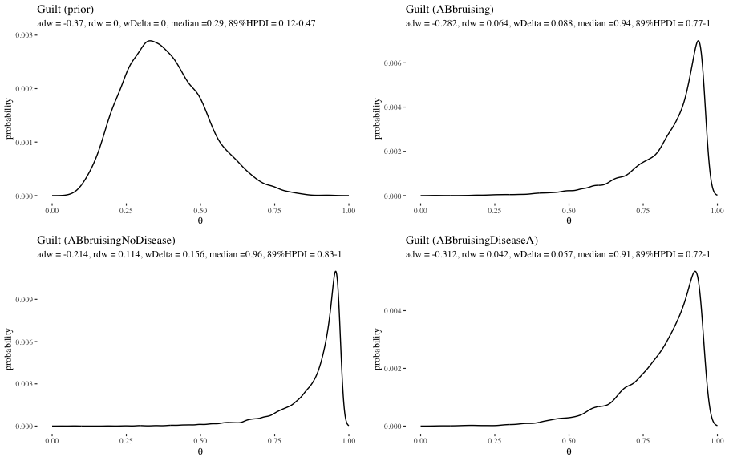

```{r setup, include=FALSE}
knitr::opts_chunk$set(echo = FALSE)
library(plot3D)
library(bnlearn)
library(dagitty)
library(Rgraphviz)
library(gRain)
library(ggplot2)
library(ggthemes)
library(gridExtra)
library(reshape2)
library(rethinking)
source("../scripts/cptCreate.R")
```


```{r,echo=FALSE,eval=TRUE,fig.align = "center",cache=TRUE, fig.show = "hold", out.width = "60%", warning=FALSE, message = FALSE, dpi = 800}
#create SC DAG
#define the structure of the Sally Clark BN
SallyClarkDAG <- model2network("[Abruising|Acause][Adisease|Acause][Bbruising|Bcause][Bdisease|Bcause][Acause][Bcause|Acause][NoMurdered|Acause:Bcause][Guilty|NoMurdered]")
SCdag <- model2network("[Abruising|Acause][Adisease|Acause][Bbruising|Bcause][Bdisease|Bcause][Acause][Bcause|Acause][NoMurdered|Acause:Bcause][Guilty|NoMurdered]")
#plot 
#graphviz.plot(SallyClarkDAG)


#CPTs as used in Fenton & al.
AcauseProb <-prior.CPT("Acause","SIDS","Murder",0.921659)
AbruisingProb <- single.CPT("Abruising","Acause","Yes","No","SIDS","Murder",0.01,0.05)
AdiseaseProb <- single.CPT("Adisease","Acause","Yes","No","SIDS","Murder",0.05,0.001)
BbruisingProb <- single.CPT("Bbruising","Bcause","Yes","No","SIDS","Murder",0.01,0.05)
BdiseaseProb <- single.CPT("Bdisease","Bcause","Yes","No","SIDS","Murder",0.05,0.001)
BcauseProb <- single.CPT("Bcause","Acause","SIDS","Murder","SIDS","Murder",0.9993604,1-0.9998538)

#E goes first; order: last variable through levels, second last, then first
NoMurderedProb <- array(c(0, 0, 1, 0, 1, 0, 0,1,0,1,0,0), dim = c(3, 2, 2),dimnames = list(NoMurdered = c("both","one","none"),Bcause = c("SIDS","Murder"), Acause = c("SIDS","Murder")))

#this one is definitional
GuiltyProb <-  array(c( 1,0, 1,0, 0,1), dim = c(2,3),dimnames = list(Guilty = c("Yes","No"), NoMurdered = c("both","one","none")))

# Put CPTs together
SallyClarkCPTfenton <- list(Acause=AcauseProb,Adisease = AdiseaseProb,
                      Bcause = BcauseProb,Bdisease=BdiseaseProb,
                      Abruising = AbruisingProb,Bbruising = BbruisingProb,
                      NoMurdered = NoMurderedProb,Guilty=GuiltyProb)

# join with the DAG to get a BN
SCfenton <- custom.fit(SallyClarkDAG,SallyClarkCPTfenton)
```

## The Sally Clark BN (Fenton)


```{r,echo=FALSE,eval=TRUE,fig.align = "center",cache=TRUE, fig.show = "hold", out.width = "90%", warning=FALSE, message = FALSE, dpi = 800}
graphviz.chart(SCfenton, type = "barprob", layout = "dot", draw.labels = TRUE,
  grid = FALSE, scale = c(0.75, 1.1), col = "black", 
  text.col = "black", bar.col = "black", main = NULL,
  sub = NULL)
```


## The Sally Clark BN (Fenton)

```{r,echo=FALSE,eval=TRUE,fig.align = "center",cache=TRUE, fig.show = "hold", out.width = "90%", warning=FALSE, message = FALSE, dpi = 800}

SCfJN <- compile(as.grain(SCfenton))

priorFenton <- querygrain(SCfJN, node = "Guilty")[[1]][1]

SCfJNAbruising <- setEvidence(SCfJN, nodes = c("Abruising"), states = c("Yes"))
AbruisingFenton <- querygrain(SCfJNAbruising, node = "Guilty")[[1]][1]

SCfJNAbruisingBbruising <- setEvidence(SCfJN, nodes = c("Abruising","Bbruising"),
                                states = c("Yes","Yes"))
AbruisingBbruisingFenton <- querygrain(SCfJNAbruisingBbruising, node = "Guilty")[[1]][1]

SCfJNAbruisingBbruisingNoDisease <- setEvidence(SCfJN, nodes = c("Abruising","Bbruising","Adisease","Bdisease"),
                                         states = c("Yes","Yes", "No", "No"))
AbruisingBbruisingFentonNoDiseaseFenton <-   querygrain(SCfJNAbruisingBbruisingNoDisease, node = "Guilty")[[1]][1]


SCfJNAbruisingBbruisingDiseaseA <- setEvidence(SCfJN, nodes = c("Abruising","Bbruising","Adisease","Bdisease"), 
                                               states = c("Yes","Yes", "Yes", "No"))
AbruisingBbruisingFentonDiseaseAFenton <- querygrain(SCfJNAbruisingBbruisingDiseaseA, node = "Guilty")[[1]][1]


SCfentonTable <- data.frame(stage = factor(c("prior", "bruising in A", "bruising in both",
                                      "bruising in both, no disease", "bruising in both, disease on A only"),
                                      levels = c("prior", "bruising in A", "bruising in both",
                                                 "bruising in both, no disease", "bruising in both, disease on A only")),
                            probability = c(priorFenton,AbruisingFenton,AbruisingBbruisingFenton,
                                            AbruisingBbruisingFentonNoDiseaseFenton,AbruisingBbruisingFentonDiseaseAFenton))
```


```{r SCfentonTable,echo=FALSE,eval=TRUE,fig.align = "center",cache=TRUE, fig.show = "hold", out.width = "100%", warning=FALSE, message = FALSE, dpi = 800}
ggplot(SCfentonTable) + geom_point(aes(x = stage, y = probability, size = probability))+
  scale_x_discrete(limits=rev, expand = c(0, 2)) +coord_flip()+theme_tufte(base_size = 14)+ scale_size(guide="none")+
  theme(plot.title.position = "plot")+ggtitle("Impact of evidence according to Fenton's BN for the Sally Clark case") +
  geom_text(aes(x = stage, y= probability, label= round(probability,2) ,hjust=-.4, vjust=-.4), size  = 4)+
  scale_y_continuous(breaks = seq(0,.7, by =.1), limits = c(0,.8))

```


## Sensitivity analysis? {.build}

### Precise probabilism

Run with a single probability measure

### Imprecise probabilism

Run with various measures, especially focusing on extreme plausible values


### The worries

- No clear principles for choosing ranges

- No weighting of options


## Probabilistic opinion pooling

<font size="3">


### Independence preservation failure on linear pooling

$p(X)   = p(Y)  = p(X\vert Y) = 1/3$

$q(X)   =  q(Y) = q(X\vert Y) = 2/3$ 

$r  =p/2+q/2$

$r(X\cap Y)  = 5/18 \neq r(X)r(Y)=1/4$


### Linear expert deference 

$\mathsf{P}(A=B)  <1$

$\mathsf{P}(r\vert A=a)  = a    \,\,\,\, \mathsf{P}(r\vert B=b)  = b$

$\forall a,b \, \mathsf{P}(r \vert A =a, B = b)  =  \alpha a + \beta b$


### The hard truth (Gallow)

 For any proposition $r$, if $A$ and $B$ are random variables taking  values in the unit interval,  there is no  probability measure  $\mathsf{P}$ for which these conditions hold


</font>


## Synergy

### The reasonable range assumption

  For any group of peers whose credences in a proposition $X$ range from $x$ to $y$, the aggregated  credence is within  $[x, y]$ 

### Example of synergy

   A doctor  is fairly confident that a treatment dosage for a patient is correct (.97) and considers the opinion of a colleague, whose credence  is   0.96


## Higher-order and honesty {.build}

 
### Precise estimate

This type of fiber occurs in 25% of carpets in this town...


### Estimate with uncertainty

...based on a random sample of 40/100/200 carpets.


## Higher-order and honesty {.build}


```{r carpets,echo=FALSE,eval=TRUE,fig.align = "center",cache=TRUE, fig.show = "hold", out.width = "90%", warning=FALSE, message = FALSE, dpi = 800}
ps <- seq(0,1,by = 0.01)

db40 <- dbeta(ps,11,31)
db101 <- dbeta(ps,26,76)
db201 <- dbeta(ps,51,151)

carpets <- data.frame(ps, db40, db101, db201)
carpetsLong <- melt(carpets, id.vars = ps, variable.name = "n")

ggplot(carpetsLong)+geom_line(aes(x = ps, y = value, group = n,  lty = n, color = n))+xlab(expression(theta))+ 
  ylab("density")+theme(plot.title.position = "plot")+theme_tufte(base_size = 12)+
  theme(legend.position="none")+labs(title = "Uncertainty about fiber frequency", subtitle = "(beta distributions)")+
  annotate("text", x = rep(.35, 3), y = c(12.5, 9, 5.5), label = paste("n = ", c(200, 100, 40), sep = ""))
```


## SC with HOP

```{r SCwithHOP, echo=FALSE,eval=TRUE,fig.align = "center",cache=TRUE, fig.show = "hold", out.width = "110%", warning=FALSE, message = FALSE, dpi = 800}
SCprobsFinal <- readRDS("../datasets/SCprobsFinal.rds")
attach(SCprobsFinal)
source("../scripts/SCfunctions.R")
source("../scripts/SCplotCPTs.R")
source("../scripts/SCplotDistros.R")


AsidsPriorPlotGrob <- ggplotGrob(AsidsPriorPlot+theme_tufte(base_size = 5))
BcauseSidsIfAsidsPlotGrob <- ggplotGrob(BcauseSidsIfAsidsPlot+theme_tufte(base_size = 5))
BcauseSidsIfAmurderPlotGrob<- ggplotGrob(BcauseSidsIfAmurderPlot+theme_tufte(base_size = 5)) 

AbruisingIfSidsPlotGrob <- ggplotGrob(AbruisingIfSidsPlot+theme_tufte(base_size = 5)) 
AbruisingIfMurderPlotGrob <- ggplotGrob(AbruisingIfMurderPlot+theme_tufte(base_size = 5)) 


AdiseaseIfSidsPlotGrob <- ggplotGrob(AdiseaseIfSidsPlot+theme_tufte(base_size = 5)) 
AdiseaseIfMurderPlotGrob <- ggplotGrob(AdiseaseIfMurderPlot+theme_tufte(base_size = 5)) 


BbruisingIfSidsPlotGrob <- ggplotGrob(BbruisingIfSidsPlot+theme_tufte(base_size = 5)) 
BbruisingIfMurderPlotGrob <- ggplotGrob(BbruisingIfMurderPlot+theme_tufte(base_size = 5)) 


BdiseaseIfSidsPlotGrob <- ggplotGrob(BdiseaseIfSidsPlot+theme_tufte(base_size = 5)) 
BdiseaseIfAmurderPlotGrob <- ggplotGrob(BdiseaseIfAmurderPlot+theme_tufte(base_size = 5)) 


ggplot(data.frame(a=1)) + xlim(1, 40) + ylim(1, 60)+theme_void()+
  annotation_custom(AsidsPriorPlotGrob, xmin = 9, xmax = 15, ymin = 49, ymax = 59)+
  geom_label(aes(label = "Bcause", x = 25, y = 41),
              size = 3 )+
  geom_label(aes(label = "Acause", x = 12, y = 48),
            size = 3 )+
  geom_curve(aes(x = 13.5, y = 48.2, xend = 25, yend = 42.5), curvature = -.18,size = .3,
             arrow = arrow(length = unit(.015, "npc")))+
  annotation_custom(BcauseSidsIfAsidsPlotGrob, xmin = 17, xmax = 23, ymin = 47, ymax = 57)+
  annotation_custom(BcauseSidsIfAmurderPlotGrob, xmin = 15, xmax = 21, ymin = 37, ymax = 47)+
  geom_label(aes(label = "Abruising", x = 2, y = 41),
             size = 3 )+
  geom_curve(aes(x = 10.5, y = 48.2, xend = 2, yend = 42.5), curvature = .2,size = .3,
             arrow = arrow(length = unit(.015, "npc")))+
  annotation_custom(AbruisingIfSidsPlotGrob, xmin = 2, xmax = 8, ymin = 47, ymax = 57)+
  annotation_custom(AbruisingIfMurderPlotGrob, xmin = 5, xmax = 11, ymin = 37, ymax = 47)+
  geom_label(aes(label = "Adisease", x = 6, y = 21),
             size = 3 )+
  geom_curve(aes(x = 13, y = 46.2, xend = 6, yend = 23), curvature = -.45,size = .3,
             arrow = arrow(length = unit(.015, "npc")))+
  annotation_custom(AdiseaseIfSidsPlotGrob, xmin = 4.5, xmax = 10.5, ymin = 27, ymax = 37)+
  annotation_custom(AdiseaseIfMurderPlotGrob, xmin = 9, xmax = 15, ymin = 17.5, ymax = 27.5)+
  geom_label(aes(label = "Bbruising", x = 14, y = 12),
             size = 3 ) +
  geom_curve(aes(x = 24, y = 39.5, xend = 15.5, yend = 13.5), curvature = -.2,size = .3,
                                    arrow = arrow(length = unit(.015, "npc")))+
  annotation_custom(BbruisingIfSidsPlotGrob, xmin = 15.5, xmax = 21.5, ymin = 25, ymax = 35)+
  annotation_custom(BbruisingIfMurderPlotGrob, xmin = 18.5, xmax = 24.5, ymin = 10, ymax = 20)+
  geom_label(aes(label = "Bdisease", x = 33, y = 18),
             size = 3 )  +
  geom_curve(aes(x = 26, y = 39.5, xend = 33, yend = 19.5), curvature = -.2,size = .3,
             arrow = arrow(length = unit(.015, "npc")))+
  annotation_custom(BdiseaseIfSidsPlotGrob, xmin = 31, xmax = 37, ymin = 27, ymax = 37)+
  annotation_custom(BdiseaseIfAmurderPlotGrob, xmin = 24.5, xmax = 30.5, ymin = 20, ymax = 30)

```


## SC with HOP

```{r SCwithHOP2, echo=FALSE,eval=TRUE,fig.align = "center",cache=TRUE, fig.show = "hold", out.width = "90%", warning=FALSE, message = FALSE, dpi = 800, warning = FALSE, message = FALSE, output = FALSE}
SCprobsFinal <- readRDS("../datasets/SCprobsFinal.rds")
attach(SCprobsFinal)
source("../scripts/SCplotDistros.R")
grid.arrange(GuiltPriorPlot, GuiltABbruisingPlot, GuiltABbruisingNoDiseasePlot, GuiltABbruisingDiseaseAPlot, ncol =2)
```


## SC with HOP: Likelihood ratios


```{r SClrs, echo=FALSE,eval=TRUE,fig.align = "center",cache=TRUE, fig.show = "hold", out.width = "90%", warning=FALSE, message = FALSE, dpi = 800, warning = FALSE, message = FALSE, output = FALSE}
SCprobsFinal <- readRDS("../datasets/SCprobsFinal.rds")
attach(SCprobsFinal)
AbruisingLR <- AbruisingIfMurder / AbruisingIfSids

AbruisingLRPlot <- plotSample(AbruisingLR,title = "LR: Abruising",  paste("median =", 
                                                            round(median(AbruisingLR),2), ", 89%HPDI = ", 
                                                            round(HPDI(AbruisingLR),2)[1],"-",round(HPDI(AbruisingLR),2)[2],
                                                            sep = "") )+xlim(0,30)

AdiseaseLR <- AdiseaseIfMurder / AdiseaseIfSids

AdiseaseLRPlot <- plotSample(AdiseaseLR,title = "LR: Adisease",  paste("median =", 
                                                                           round(median(AdiseaseLR, na.rm = TRUE),2), ", 89%HPDI = ", 
                                                                           round(HPDI(AdiseaseLR),2)[1],"-",round(HPDI(AdiseaseLR),2)[2],
                                                                           sep = "") )+xlim(0,3)
 grid.arrange(AbruisingLRPlot, AdiseaseLRPlot, ncol =2)
```


## Weight of evidence

<font size="3">

### Basic intuitions

- Items of evidence leading to different expected values should be able to have the same weight

-  Items of evidence leading to the same value should be able to have different weights

-  In simple set up, such as Bernoulli trials, weight should increase with the number of observations

-  For unimodal distributions, the wider the distribution associated with a given piece of evidence, the less weight this evidence has


### Modular approach

-  weights as associated with distributions 

- weight of evidence results from distribution weight comparison

</font>


## Shannon information

```{r shannon1,echo=FALSE,eval=TRUE,fig.align = "center", cache=TRUE, fig.show = "hold", out.width = "40%",   message = FALSE, warning = FALSE, results = FALSE}

entDAG <- dagitty("
    dag{
        A -> B
        A -> x
        B -> C
        B -> y
        C -> D
        C -> z
      }")


coordinates(entDAG) <- list( x=c(A = 1, B = 2, x = 2, C = 3, y = 3, D = 4, z = 4),
                            y=c(A = 2, B = 3, x = 1, C = 2, y = 3, D = 2, z = 3) )
drawdag(entDAG, shapes =  list(A = "c", B = "c", C = "c", D = "c"), cex = 1.5, radius = 6)
```

<font size="3">

-  The right path is:  011. 

- There are $m=8$ possible
destinations  by  decisions at
$\log_2(8)=3$ forks

- Initially you thought the probability that it is the
right one was .5

- Now you know it is the right one. Surprise: $\frac{1}{.5}=2$


- One *bit* of information: $\log_2\left(\frac{1}{.5}\right)=1$ 

- Complete instruction:  $\log_2\left(\frac{1}{.5^3}\right)=3$


 - Notice that $\log_2\left(\frac{1}{a}\right)= - \log_2(a)$, so: $h(x)  = - \log_2 \mathsf{P(x)}$
 


</font>

## Entropy: average Shannon information

$H(X)   = \sum \mathsf{P}(x_i) \log_2 \frac{1}{\mathsf{P}(x_i)} = - \sum \mathsf{P}(x_i) \log_2 \mathsf{P}(x_i)$


### Conceptualization

The expected amount of information you receive once you learn  the value of $X$.


## Weight of evidence: explication

### Absolute distribution weight (adw)

The more informative a piece of evidence is, as compared to the uniform distribution, the more weight it
has, on scale 0 to 1.

$\mathsf{adw(posterior)}  = 1 - \left( \frac{H(\mathsf{posterior})}{H(\mathsf{uniform})}\right)$

### Relative distribution weight (rdw)

$\mathsf{rdw(posterior, prior)}  = 1 - \left( \frac{H(\mathsf{posterior})}{H(\mathsf{prior})}\right)$
 
### Weight of evidence (wDelta)

$\mathsf{wDelta}(\mathsf{posterior, prior}) = \vert \mathsf{adw}(\mathsf{posterior}) - \mathsf{adw}(\mathsf{prior})\vert$


## Weights of beta distributions

```{r fig:betas,echo=FALSE,eval=TRUE,fig.align = "center", cache=TRUE, fig.show = "hold", out.width = "90%",   message = FALSE, warning = FALSE, results = FALSE}
n <- 1000 #parameters 
s <- 1e5  #sample size
ps <- seq(from=0 , to=1 , length.out=n)
a <- seq(1,100,1)
b <- seq(1,100,1)
abs <- expand.grid(a=a,b=b)
densitiesBeta <- list()

for(i in 1:nrow(abs)){
densitiesBeta[[i]] <- dbeta(ps,abs[i,1], abs[i,2])
densitiesBeta[[i]] <- densitiesBeta[[i]]/sum(densitiesBeta[[i]])
abs$entropy[i] <- H(densitiesBeta[[i]])
}


kld <- function(p,q) kullback_leibler_distance(p,q, testNA = TRUE, unit = "log2",
                                               epsilon = 0.00001)
klds <- numeric(length(densitiesBeta))
for (i in 1:length(densitiesBeta)){
  klds[i] <-   kld(densitiesBeta[[1]],densitiesBeta[[i]])
}
abs$klds <- klds


eucs <- numeric(length(densitiesBeta))
for (i in 1:length(densitiesBeta)){
  eucs[i] <-   euclidean(densitiesBeta[[1]],densitiesBeta[[i]], testNA = TRUE)
}

abs$eucs <- eucs

unif <-dbeta(ps,1,1)
unif <- unif/sum(unif)
hunif <- H(unif)
entProp <- function(X) 1 - ( H(X)/hunif )  

entProps <- numeric(length(densitiesBeta))
for (i in 1:length(densitiesBeta)){
  entProps[i] <-   entProp(densitiesBeta[[i]])
}
abs$entProps <- entProps


entropiesBetaPlot <- ggplot()+theme_tufte()+xlab("parameter values")+
  ylab("probability")+theme(plot.title.position = "plot")+ylim(0,1)+
  ggtitle("Examples of beta distributions with their entropies and weights")+
geom_line(aes(x = ps,y = densitiesBeta[[1]]), lty = 1)+annotate("text", x = .45, y = 0.007,
                                            label = "beta(1,1) \n h = 9.96, w = 0", size = 3)+
  geom_line(aes(x = ps,y = densitiesBeta[[100]]), alpha = .6,  lty = 2)+
  annotate("text", x = .87, y = 0.05, label = "beta(100,1) \n h = 4.75, w = .52", size = 3)+ylim(0,0.1)+
  geom_line(aes(x = ps,y = densitiesBeta[[940]]), alpha = .6, lty = 3 )+
  annotate("text", x = .79, y = 0.012, label = "beta(40,10)\n h = 7.83, w = .21", size = 3)+
  geom_line(aes(x = ps,y = densitiesBeta[[8410]]), alpha = .6, lty = 4)+
  annotate("text", x = .15, y = 0.018, label = "beta(10,85)\n h = 6.98, w = .3", size = 3)

entropiesBetaPlot
```


## Weights of beta distributions


```{r fig:entropies,echo=FALSE,eval=TRUE,fig.align = "center", cache=TRUE, fig.show = "hold", out.width = "100%",   message = FALSE, warning = FALSE, results = FALSE}
scatter3D(abs$a,abs$b,abs$entropy,
          pch=.1,cex=0.05,byt="g",alpha=0.4,theta=120,
          phi=20,xlab="a", ylab="b",zlab="entropy", 
          main="Entropies of beta distributions",
          colvar=NULL,cex.main =0.6, cex.lab = .7, cex.axis = .5, ticktype = "detailed", border = NA,
          nticks = 5)
```


## Weights of beta distributions


```{r fig:weights,echo=FALSE,eval=TRUE,fig.align = "center", cache=TRUE, fig.show = "hold", out.width = "90%",   message = FALSE, warning = FALSE, results = FALSE}
weightsNo <-   ggplot(abs, aes(x = a + b, y = entProps, color = abs(a/(a+b)-.5)))+
    geom_point( alpha = .9, size = .3)+theme_tufte()+
  xlab("a+b")+ylab("Weight")+ggtitle("Weight increases with the number of observations")+
  labs(color = TeX("$|\\, \\frac{a}{a+b}   -.5 |$"),
       subtitle = "(faster if proportions are more extreme)")+
  theme(plot.title.position = "plot")+
scale_color_gradient(low="yellow1", high="dodgerblue4")


weightsProp <- ggplot(abs, aes(x = a /(a + b), y = entProps, color = a + b))+
  geom_point(size  = .4, alpha = .9)+theme_tufte()+
  xlab("a/(a+b)")+ylab("Weight")+ggtitle("Range of weights available at various proportions")+
  scale_color_gradient(low="yellow1", high="dodgerblue4")+
  labs(subtitle = "(higher if the number of observations higher)")+
  theme(plot.title.position = "plot",axis.title.y=element_blank(),
       axis.text.y=element_blank(),
        axis.ticks.y=element_blank())

ggarrange(weightsNo,weightsProp)
```


## Weights of beta distributions

```{r weightsWeird,echo=FALSE,eval=TRUE,fig.align = "center", cache=TRUE, fig.show = "hold", out.width = "80%",   message = FALSE, warning = FALSE, results = FALSE}
beta44 <-  densitiesBeta[[304]]
unif5 <- c(rep(0, n/2),rep(1 , n/2)) #uniform from .5 
unif5 <- unif5/sum(unif5)
unif6 <- c(rep(0, .6 * n),rep(1 , n * .4)) #uniform from .6 
unif6 <- unif6/sum(unif6)
A <- dnorm(ps, .4, .05)
B <- dnorm(ps, .6, .05)
C <- ifelse(ps <= .5, A, B) 
bimodal <- C / sum(C)
centered <-   dnorm(ps, .5, .05)
centered <- centered/sum(centered)
twoEven <- rep(0,1000)
twoEven[abs(ps -.4)  == min(abs(ps -.4))] <- .5
twoEven[abs(ps -.6)  == min(abs(ps -.6))] <- .5
twoUneven <- rep(0,1000)
twoUneven[abs(ps -.4)  == min(abs(ps -.4))] <- .3
twoUneven[abs(ps -.6)  == min(abs(ps -.6))] <- .7
single5 <- rep(0,1000)
single5[abs(ps -.5)  == min(abs(ps -.5))] <- 1
single7 <- rep(0,1000)
single7[abs(ps -.7)  == min(abs(ps -.7))] <- 1


distributions <- c("beta(4,4)","unif(.5,1)", "unif(.6,1)", "bimodal(.4,.6,s=.05)", "norm(.5,.05)",
                   "evenPoints(.4,.6)","unevenPoints(.4(.3),.6(.7)","single(.5)", "single(.7)")

entPropSeq <- c(entProp(beta44),entProp(unif5),entProp(unif6),
             entProp(bimodal),entProp(centered),entProp(twoEven),
             entProp(twoUneven),entProp(single5),entProp(single7))


hSeq <- c(H(beta44),H(unif5),H(unif6),
          H(bimodal),H(centered),H(twoEven),
          H(twoUneven),H(single5),H(single7))
  
  
entPropTable <- data.frame(distributions, hSeq, entPropSeq)

plotDistro <- function(distro, distroList) {
plot <-  ggplot()+theme_tufte()+xlab("parameter values")+
  ylab("probability")+theme(plot.title.position = "plot")+ylim(0,1)+
  ggtitle(paste(entPropTable$distributions[distroList]))+
  geom_line(aes(x = ps,y = distro))+annotate("text",
    x = ps[which(distro == max(distro))][1],
    y = max(distro) * 1.14,
    label = paste("h =",round(entPropTable$hSeq[distroList],3), ", w = ",
            round(entPropTable$entPropSeq[distroList],3)), size = 2)+
  ylim(c(0,1.2 * max(distro)))
return(plot)
}


multipleDistros <- ggarrange(plotDistro(beta44,1),
plotDistro(unif5,2),
plotDistro(unif6,3),
plotDistro(bimodal,4),
plotDistro(centered,5),
plotDistro(twoEven,6),
plotDistro(twoUneven,7),
plotDistro(single5,8),
plotDistro(single7,9), nrow = 9, ncol  = 1, heights  = 1)
```


```{r fig:weightsWeird,echo=FALSE,eval=TRUE,fig.align = "center", cache=TRUE, fig.show = "hold", out.width = "90%",   message = FALSE, warning = FALSE, results = FALSE}
ggarrange(plotDistro(beta44,1),plotDistro(unif5,2), plotDistro(unif6,3),plotDistro(bimodal,4),plotDistro(centered,5),
plotDistro(twoEven,6),plotDistro(twoUneven,7),
plotDistro(single5,8),plotDistro(single7,9), ncol = 3, nrow = 3)
```


## Weight in SC with HOP

{#id .class width=90% height=90%}


## Expected weight and completeness


```{r SCexpectedWeights, echo=FALSE,eval=TRUE,fig.align = "center",cache=TRUE, fig.show = "hold", out.width = "100%", warning=FALSE, message = FALSE, dpi = 800, warning = FALSE, message = FALSE, output = FALSE}
SCprobsFinal <- readRDS("../datasets/SCprobsFinal.rds")
attach(SCprobsFinal)
source("../scripts/SCexpectedWeights.R")
```

```{r SCexpectedWeights2, echo=FALSE,eval=TRUE,fig.align = "center",cache=TRUE, fig.show = "hold", out.width = "100%", warning=FALSE, message = FALSE, dpi = 800, warning = FALSE, message = FALSE, output = FALSE}
SCweightsPlot 
```


## Back to synergy


```{r synergy, echo=FALSE,eval=TRUE,fig.align = "center",cache=TRUE, fig.show = "hold", out.width = "90%", warning=FALSE, message = FALSE, dpi = 800, warning = FALSE, message = FALSE, output = FALSE}
expectedValue <- function (distro){
  sum ( ps * distro)
}

n <- 1000
ps <- seq(0,1,  length.out =n)
d1 <- dbeta(ps,98,4)
d1 <- d1/sum(d1)
d2 <- dbeta(ps,97,5)
d2 <- d2/sum(d2)

#expectedValue(d1)
#expectedValue(d2)


weightsDoctors <- c(.7,.3)
pooled <- weightsDoctors[1] * d1 + weightsDoctors[2] * d2

#expectedValue(pooled)

doctorsBetas <- dbeta(ps,98+97, 4+5)
doctorsBetas <- doctorsBetas/sum(doctorsBetas)

#expectedValue(doctorsBetas)

ggplot()+theme_tufte()+xlab("parameter values")+ xlim(0.9,1)+
  ylab("probability")+theme(plot.title.position = "plot")+ 
  geom_line(aes(x = ps, y = d1), color = "grey")+
  geom_line(aes(x = ps, y = d2), lty = 2, color = "grey")+  
  geom_line(aes(x = ps, y = doctorsBetas), color = "skyblue", lty = 3)+ #POOLED
  annotate(geom = "label", label = "beta(194,8), exp.=.955, mode=.96", x = .957, y = .028, color = "skyblue", fill = "white", size = 3) +
  geom_line(aes(x = ps, y = pooled), color = "skyblue", lty = 4)+ #POOLED
  annotate(geom = "label", label = "pooled (.7,.3), exp.=.957, mode = .966, eff. n = 85", x = .982, y = .0205, color = "skyblue", fill = "white", size = 3)+
  ggtitle("Dr Alban and Dr Dre: credal states with the result of linear pooling and expansion")+
  annotate(geom = "label", label = "Dr Alban, beta(98,4), exp. = .96, mode = .97", x = .973, y = .0225, fill = "white", size = 3)+
  annotate(geom = "label", label = "Dr Dre, beta(97,5), exp.=.95, mode = .96", x = .94, y = .019, fill = "white", size = 3)+theme_tufte(base_size = 9)
```


## Back to synergy


```{r seuss, echo=FALSE,eval=TRUE,fig.align = "center",cache=TRUE, fig.show = "hold", out.width = "90%", warning=FALSE, message = FALSE, dpi = 800, warning = FALSE, message = FALSE, output = FALSE}
d3 <- dbeta(ps,36,66)
d3 <- d3/sum(d3)


weightsDoctors <- c(.7,.3)
pooled2 <- weightsDoctors[1] * d1 + weightsDoctors[2] * d3

doctorsBetas2 <- dbeta(ps,98+36, 4+66)
doctorsBetas2 <- doctorsBetas2/sum(doctorsBetas2)

ggplot()+theme_tufte()+xlab("parameter values")+
  ylab("probability")+theme(plot.title.position = "plot")+ 
  geom_line(aes(x = ps, y = d1), color = "grey") +
  geom_line(aes(x = ps, y = d3), lty = 2, color = "grey")+
  geom_line(aes(x = ps, y = pooled2), color = "skyblue", lty = 3)+ #POOLED+  
  geom_line(aes(x = ps, y = doctorsBetas2), color = "skyblue", lty = 4)+
  annotate(geom = "label", label = " expanded, beta(134,70), exp.=.656, mode=.659",
           x = .653, y = .0112, color = "skyblue", fill = "white", size = 3)+ #POOLED
  annotate(geom = "label", label = "pooled (.7,.3), exp.=.778, modes = (.35,.969)",
           x = .35, y = .0015, color = "skyblue", fill = "white", size = 3)+
  annotate(geom = "label", label = "Dr Alban, beta(98,4), exp. = .96, mode = .97", x = .8, y = .02, fill = "white", size = 3)+
  annotate(geom = "label", label = "Dr Seuss, beta(36,66), exp.=.352, mode = .35", x = .34, y = .007, fill = "white", size = 3)+
ggtitle("Dr Alban and Dr Seuss: credal states with the result of linear pooling and expansion")
```


## Pooling vs expansion: simulated accuracy

```{r fig:inaccuraciesSimulation,echo=FALSE,eval=TRUE,fig.align = "center", cache=TRUE, fig.show = "hold", out.width = "90%",   message = FALSE, warning = FALSE, results = FALSE}
ps <- seq(0,1,  length.out =1000)
point <- function (value) ifelse(abs(ps - value) == min(abs(ps - value)), 1, 0)
indicator <- function(pointf) ifelse( ps >= ps[min(which(pointf != 0))], 1,0  )

populationSize <- 100
n <- 20
m <- 20

inaccuraciesList <- list()

for(i in 1:100){
averageIn <- numeric(101)
newDensIn <- numeric(101)
chanceHyps <- seq(0,1, by = 0.01)

for (c in 1:101){
realChance <- chanceHyps[c]
population <- rbinom(populationSize, 1, realChance)

sample1 <- sample(population, n, replace = FALSE)
sample2 <- sample(population, m, replace = FALSE)

dens1 <- dbeta(ps,sum(sample1)+1, (n-sum(sample1))+1)
dens1 <- dens1/sum(dens1)

dens2 <- dbeta(ps,sum(sample2)+1, m - sum(sample2)+1)
dens2 <- dens2/sum(dens2)

average <- .5 * dens1 + .5 * dens2

overlaps <-seq(0,n, by = 1)
overlapProbs <- dhyper(overlaps, m = n, n = populationSize - n, k = m)

newAlpha <- numeric(n)
newBeta <- numeric(n)
for(ol in 0:n){
newAlpha[ol+1] <- sum(sample2) - ol * mean(sample1)
newAlpha[ol+1] <- newAlpha[ol+1] + sum(sample1)+1
newBeta[ol+1] <- (m - sum(sample2)) - (ol - ol * mean(sample1))
newBeta[ol+1] <- newBeta[ol+1] + (n - sum(sample1))+1
}

expAlpha <- weighted.mean(newAlpha,overlapProbs)
expBeta <- weighted.mean(newBeta,overlapProbs)

newDens <-   dbeta(ps,expAlpha, expBeta)
newDens <- newDens/sum(newDens)

chance <- point(realChance)

averageIn[c] <- kld(chance,average)
newDensIn[c] <- kld(chance,newDens)
}


inaccuraciesList[[i]] <- data.frame(chanceHyps, averageIn, newDensIn)
}


inaccuraciesDF <- do.call("rbind", inaccuraciesList)
inaccuraciesDFlong <- melt(inaccuraciesDF, id.vars = "chanceHyps")
colnames(inaccuraciesDFlong) <- c("chance","method","inaccuracy")

ggplot(inaccuraciesDFlong, aes(x = chance, y = inaccuracy, color = method, group = method, lty = method))+
  theme_tufte()+ylim(4.5,15)+ggtitle("Inaccuracies of linear averaging and expansion")+
  scale_color_manual(name = "method", labels = c("averaging", "expansion"), values = c("dodgerblue4","yellow1"))+
  theme(plot.title.position = "plot",legend.position = c(0.9, 0.9))+
  geom_jitter(size = .1, alpha = .2)+
  geom_smooth(se = TRUE, size = 1)+
 guides(lty = FALSE)

```


## Wrapping up

The higher-order approach

> - Leads to more honesty in uncertainty assessment
    
>  - Is more sensible than sensitivity analysis
    
>  - Integrates with Bayesian data analysis

> - Leads to an information-theoretic account of evidential weight

> - Is computationally feasible


