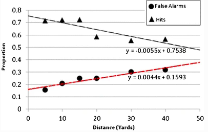

```{r setup, include=FALSE}
library(ggthemes)
library(ggplot2)
library(gridExtra)
library("ggpubr")
library(knitr)
library(kableExtra)
library(gRain)
library(reshape2)
library(plyr)
library(rje)
library(bnlearn)
library(utils)
library(latex2exp)
library(useful)
library(tidyverse)
library(stringr)
library(plot3D)
knitr::opts_chunk$set(echo = TRUE)

source("utils//CptCreate.R")  
source("utils//kableCPTs.R")  
```


```{r}
```


<!---\tableofcontents--->

The fallacies we considered earlier in the book \todo{add crossref}---such as the base rate fallacy,  the prosecutor's fallacy, and the  defense attorney's fallacy---show how the posterior probability of a hypothesis can be overestimated or underestimated. The posterior probability should reflect all the evidence bearing on the hypothesis, but should not be identified with the probative value or strength of the evidence. The Federal Rule of Evidence, rule 401, underscores that an item evidence has probative value if it `has any tendency to make a fact more or less probable than it would be without the evidence'. The emphasis here is not so much on the posterior probability of the hypothesis given the evidence, $\pr{H \vert E}$, but rather, on the extent to which an item of evidence changes---or has any tendency to change---the probability of the hypothesis. This distinction is crucial.  

<!--- can be misjudged, upwards or downwards, even if the subject gets the likelihoods right. These examples illustrate that   the assessment of the  posterior probability of a hypothesis given the  evidence depends also on the prior probability of the hypothesis. The correctness of such an assessment therefore requires that the priors are chosen sensibly (or that a range of sensible priors is considered) and appropriately put together with the likelihoods involved. Quite crucially, the posterior probability given a piece of evidence should not be confused with the probative value of a given piece of  evidence itself with respect to the hypothesis in question.
--->

Suppose the prior probability of a given hypothesis $H$ is low, say $\pr{H}=.001$, but taking evidence $E$ into account brings this probability up to $.35$, so  $\pr{H \vert E}=.35$.   This is a dramatic upward shift. Even though the posterior probability of $H$ given $E$ is low, $E$ strongly favors $H$.^[Here is a more concrete example.  Suppose an expert testifies that the blood found at the crime scene matches the defendant’s and it is $.5$ probable that a person unrelated to the crime would match by coincidence. Disregarding the match, the prior probability that the defendant is the source of the blood should be set rather low, say $.01$. Absent other evidence to the contrary, the defendant, as anyone else, had little to do with the crime <!---Absent other evidence to the contrary, it should initially be very likely that the defendant, as anyone else, had little to do with the crime. Say, for illustrative purposes, that he prior probability is , and let the probability of a match if the suspect is the source be approximately 1.---> By running Bayes' theorem, the posterior probability that the defendant is the source is roughly $.17$. We are assuming that the probability of a match if the suspect is the source is approximately 1. This might seem unimpressive, but it does not mean that the match evidence has no probative value. While the match  did not make it very likely  that the defendant was the source of the traces, the posterior probability is  seventeen times larger than the prior.] <!---  Similarly, in the Collins case, the posterior probability jumped from the $\nicefrac{1}{6 \times 10^6}$ prior to $.7$ after taking the match into account. Still not enough for a conviction, but a remarkable increase nonetheless. ---> Conversely, suppose the prior probability of $H$ is extremely high, say $\pr{H}=.999$, but taking evidence $E$ into account brings this probability down to $.75$, that is, $\pr{H \vert E}=.75$. This is a dramatic downward shift. Even though the posterior probability of $H$ given $E$ is high, $E$ speaks strongly against $H$. These examples illustrate that measuring the strength or probative value of an item of evidence solely by posterior probabilities leaves out something crucial.

<!---\mar{R:Revised this passage in light of Sophie's comments, check}
So how do we capture  the strength of an item of evidence that  reflects the impact the evidence   on the posterior probability? --->

The overall, global value of the evidence should be distinguished from local and incremental support [@di2018evidential]. 
<!---The former is more directly connected with the ultimate decision: --->
If $E_1, \dots, E_n$ is the total evidence obtained and $H$ is the hypothesis of interest, the global value of the total evidence is simply the posterior probability of the hypothesis, $\pr{H \vert E_1, \dots, E_n}$. This notion, however, is not useful for evaluating the impact of an individual piece of evidence on the probability of the hypothesis. If a piece of evidence shifts the probability of the hypothesis say, from $.00007$ to $.007$, the posterior is still low, but the impact of the evidence is  strong. Moreover, when lay witnesses and experts testify at trial, the assessment of the evidential value of their individual testimonies should precede the aggregation of their testimonies into a whole, complex body of evidence. Hence, a local and incremental notion of evidential strength or probative value is needed. 

This chapter articulates a probabilistic account of probative value or evidential strength that is incremental (it tracks changes in probability) and local (it is limited to individual pieces of evidence).  We prefer the expression 'evidential strength' because it coveys the fact that evidential value comes in degrees, as items of evidence may support hypotheses more or less strongly. Another expression we will sometimes use is 'evidential support'. This expression highlights that an item of evidence has value as it supports, more or less strongly, a hypothesis. We will argue that the likelihood ratio is the best measure of evidential value (or strength, support) that is incremental as well as local.  

The plan is as follows. Section \ref{sec:lr} explains why the likelihood ratio fares better than another popular measure of evidential strength, the Bayes factor. <!---Our goal is to offer a fair-minded discussion about the pros and cons of the likelihood ratio as a measure of evidential strength. ---> Appendix \ref{sec:confirmation} broadens the discussion to probabilistic measures of confirmation drawing from the literature in formal epistemology, but concludes that these measures are unsuited for evidence evaluation in legal fact-finding. We then offer several illustrations of how likelihood ratios can be fruitfully deployed. Section \ref{sec:fp} shows that they allow for a nuanced assessment of the strength of quantitative evidence, for example, DNA match evidence. <!---, when the risk of false positive and false negative errors should be factored in.--->  <!---We explain the reasons to take the risk of false positives in DNA identification seriously and use likelihood ratio to illustrate the impact of such a risk on the value of DNA evidence. ---> To strengthen this point, Appendix \ref{sec:coldHitConfusion} and \ref{sec:cold-hit} show how the value of cold-hit DNA matches can be correctly assessed using likelihood ratios, a hotly debated topic among forensic scientists.
<!---^[In principle, it would be possible to go over analogous considerations in terms of \textsf{BF}, however, as we already argued, there are reasons to prefer the use \textsf{LR}, and calculations in terms of \textsf{LR} are simpler and assume that less information is available to the agent than those in terms of \text{BF}.]
--->  Section \ref{sec:eyewitness} examines how likelihood ratios can help to evaluate eyewitness evidence. This should dispel the impression that likelihood ratios are only suited for explicitly quantitative evidence. 

 While helpful for evaluating many forms of evidence,
likelihood ratios should be deployed with care. They can be hard to interpret in practice, as they depend on the choice of two competing hypotheses. This choice is, to some extent, subjective, as we discuss in Section \ref{sec:hchoice}. This interpretative problem arises partly because the competing hypotheses admit of different levels of specificity: we discuss this phenomenon in Section \ref{sec:lhTwoSTain}, using the two-stain problem as an illustration. In Section \ref{sec:relevance} we discuss evidential relevance, a topic closely related to that of evidential value.^[An item of evidence is relevant to a hypothesis whenever it positively or negatively supports the hypothesis.] Likelihood ratios may categorize an item of evidence as irrelevant while intuitively the item is relevant. We explain away this problem by insisting that likelihood ratios are \textit{local} measures of evidential value. 
<!---The general lesson from these two sections is that likelihood ratio, while a very useful measure of evidential value, when presented alone without proper attention paid to hypothesis formulation and the impact of the choice of the hypotheses on the likelihood ratio itself, might be misleading.--->
<!---Finally,  However, the discussion leads us to another reason why likelihood ratio when presented alone might be unhelpful.---> Indeed, a piece of evidence might be irrelevant with respect to a certain pair of competing hypotheses, but relevant to another.
<!---and all of these hypotheses might play an important role in the fact-finding process.---> The moral is that the value of an item of evidence is to be established both locally (relative to specific hypotheses) and globally (relative to the case as a whole). <!---Instead of a single likelihood ratio, one should consider various likelihood ratios for different plausible selections of hypotheses. ---> This suggests the need of formulating a more complex theory. We undertake this task in later chapters. 
<!---and so a readable representation of such complexities involved in  a given case would be useful for putting various likelihood ratios to a proper use.--->


<!---The chapter also contains a number of appendices. To illustrate the utility of thinking in terms of likelihood ratios in theorizing about the value of evidence, we spend some time in the appendix to go over a debate about  the value of cold-hit DNA matches in which various agencies studying  or performing  DNA evaluation have still failed to reach agreement (Appendix  \ref{sec:coldHitConfusion}), and argue that a proper use of likelihood ratios leads to a fairly clear resolution (Appendix \ref{sec:cold-hit}). --->


<!---Finally, a more philosophically minded reader, who might recall that there are quite a few probabilistic confirmation measures in the vicinity and might wonder why almost none of them were discussed in the chapter,  in Appendix \ref{sec:confirmation} we explain why we think these other measures are not fit for the particular purpose at hand:  evidence evaluation in legal-fact finding.--->


# The likelihood ratio outperforms the Bayes factor 
\label{sec:lr}


One measure of the strength of evidence  is the likelihood of the evidence---the probability of the evidence given the hypothesis of interest, $\pr{E \vert H}$---divided by the probability of the evidence $\pr{E}$. This measure is often called the \emph{Bayes factor}: 
\begin{align}\label{eq:BF}
\tag{BF}
\mathsf{BF}(E,H) & = \frac{\pr{E \vert H}}{\pr{E}}.
\end{align}
\noindent The Bayes factor seems a plausible measure of evidential strength 
as it appropriately deviates from one, its point of neutrality. Since, by Bayes' theorem,
$\pr{H \vert E} = \mathsf{BF}(H, E) \times \pr{H}$,
<!---
\vspace{-3mm}


\begin{align*}
\pr{H \vert E} & = \mathsf{BF}(H, E) \times \pr{H},
\end{align*}
--->
the Bayes factor is greater than one if and only if
the posterior probability $\pr{H \vert E}$ is higher than the prior probability $\pr{H}$, $\pr{H}<\pr{H\vert E}$. So $E$ \textit{positively} supports $H$ whenever the Bayes factor is greater than one. 
The greater the Bayes factor (for values above one), the greater the upward shift from prior to posterior probability, the more strongly $E$ positively supports $H$.
As expected, the posterior probability of $H$ given $E$ could still be low even if the Bayes factor is significantly above one. Conversely, again by Bayes' theorem,  the probability of $H$ given $E$ is lower than the probability of $H$, $\pr{H}>\pr{H\vert E}$, just in case the Bayes factor is less than one. So $E$ \textit{negatively} supports $H$ whenever the Bayes factor is less than one. The smaller the Bayes factor (for values below one), the greater the downward shift from prior to posterior probability, the more strongly $E$ negatively supports $H$. If $\pr{H}=\pr{H\vert E}$, the Bayes factor equals one and the evidence  has no impact on the  probability of $H$. 

So far so good. Unfortunately, the Bayes factor as a measure of evidential strength suffers from three shortcomings. The first is that it changes depending on the prior probability of the hypothesis. To see why, consider the denominator $\pr{E}$. It can be unpacked following the law of total probability:

\vspace{-3mm}

\begin{align} \label{eq:lotpSimple}
\pr{E}= \pr{E \vert H} \pr{H}+\pr{E \vert \neg H} \pr{\neg H}.
\end{align}
<!---\noindent The catch-all alternative hypothesis $\neg H$ can be replaced by a more fine-grained set of alternatives, say $H_1, H_2, \dots H_k$, provided $H$ and  these  alternatives are exclusive and  cover the entire space of possibilities (that is, they form a partition). The law of total probability would then read:
\begin{align} \label{eq:lotpLong}
\pr{E} & = \pr{E\vert H}\pr{H} +\sum_{i=1}^k \pr{E\vert H_i}\pr{H_i}. 
\end{align}
--->
<!---\noindent For simplicity, let's stick to \eqref{eq:lotpSimple} for now, and use it to rewrite \eqref{eq:BF}:--->
\noindent 
So the Bayes factor can be written in a longer form, as follows:
\begin{align}\label{eq:BFlotp}
\mathsf{BF}(E,H) & = \frac{\pr{E \vert H}}{\pr{E \vert H} \pr{H}+\pr{E \vert \neg H} \pr{\neg H}}.
\end{align}
\noindent What should be clear from this formulation is that the Bayes factor depends on the prior probabilities $\pr{H}$ and
$\pr{\neg H}$. Indeed, suppose $\pr{E \vert H} = 1$ and $\pr{E \vert \neg H} = .1$. If $\pr{H}=.1$, $\pr{E}$,  the denominator, is $.19$,  and so the Bayes factor is approximately $5.26$. If, however, $\pr{H} =.2$, the denominator is $.28$ and the Bayes factor is approximately $3.57$. In fact, a more general look (Figure \ref{fig:BayesFactorPrior}) shows the prior probability can have larger impact on the Bayes factor than the likelihood $\pr{E \vert \n H}$.

This is a strike against the Bayes factor as a measure of evidential strength in the context of legal fact-finding. For suppose an expert who is testifying in court is tasked with assessing the value of an item of evidence, say a DNA or fingerprint match. This assessment should not to depend on the expert's prior convictions about the plausibility of the hypothesis. Further, judges and lay jurors should be in a position to understand  the expert's assessment in the same way, even if they assign different prior probabilities to the hypothesis.^[The requirement of prior independence is also in line with an objectivity requirement [@bickel2012strength], say, that the strength of evidence should not vary from one researcher to another.]

\footnotesize
```{r bfcalculations,echo=FALSE,eval=FALSE,fig.align = "center",cache=TRUE, fig.show = "hold", out.width = "100%"}

EifH <- 1
EifNH <- .1
H <- .1
E <- EifH * H + EifNH * (1-H)
E
BF <- EifH/E
BF

H2 <- .2
E2 <- EifH * H2 + EifNH * (1-H2)
E2
BF2 <- EifH/E2
BF2
```
\normalsize 
 

\begin{figure}

```{r fig-BayesFactorPrior,echo=FALSE,eval=TRUE,fig.align = "center", cache=TRUE, fig.show = "hold",out.width = "100%"}
library(plot3D)
pH <- seq(0,.05, by = 0.001)
EifNH <- seq(0,.05, by = 0.001)
EifH <- 1
options <- expand.grid(pH = pH, EifNH = EifNH)
options$E <- EifH * options$pH + options$EifNH * (1-options$pH)
options$BF <- EifH/options$E
options <- options[-1,]

scatter3D(options$pH,options$EifNH,options$BF,pch=3,cex=0.3,byt="g",alpha=0.8,theta=50, phi=8,xlab="P(H)", ylab="P(E|~H)",zlab="Bayes Factor",main="Bayes factor as a function of prior and P(E|~H).",colvar=NULL, zlim = c(0,250),cex.main =0.8)
```
\caption{Impact of the prior and likelihood of E given ~H for probabilities in (0, 0.05) and Bayes Factor restricted to (0, 250) for visibility.}
\label{fig:BayesFactorPrior}
\end{figure}

 

A second reason to worry about the Bayes factor is its complexity. Whoever is tasked with assessing  the strength of evidence---lay jurors, judges, or expert witnesses---would face too great a cognitive burden. To see why, the catch-all alternative hypothesis $\neg H$ in the denominator $\pr{E}$ can be replaced by a more fine-grained set of alternatives,  $H_1, H_2, \dots H_k$, provided $H$ and these alternatives are exclusive and cover the entire space of possibilities (that is, they form a partition). So, the denominator $\pr{E}$ can be unpacked, as follows:
\begin{align} \label{eq:lotpLong}
\pr{E} & = \pr{E\vert H}\pr{H} +\sum_{i=1}^k \pr{E\vert H_i}\pr{H_i}. 
\end{align}

\noindent
Estimating $\pr{E}$ now looks quite difficult. It would require one to sift through the entire space of possibilities, as well as coming up with a sensible selection of priors probabilities for the several alternative hypotheses on hand. 


A third reason to hesitate about the Bayes factor comes from  an observation by @Gillies1986defense, also discussed by @Fitelson1999plurality.  Consider the  hypothesis $H =$ "the suspect is guilty" and suppose it is a fact that $E =$ "the suspect killed the victim". Fact $E$ does not establish guilt with certainty since guilt requires both \emph{actus reus}, the killing, and \emph{mens rea}, the intention. But clearly $E$ provides positive support for $H$. 
<!---Clearly, $H$ entails $E$, and .---> Now consider a composite hypothesis $H'=$ "the suspect is guilty \textit{and} we live in a simulation built by aliens." Presumably, the support $E$ provides for $H'$ should be weaker than the support it provides for $H$. After all, the addition of a far-fetched hypotheses should decrease evidential support. This weakening of evidential support, however, cannot be captured by the Bayes factor since both $H$ and $H'$ deductively entail $E$. In general, suppose $H\models E$ (and so, also, $H \et X \models E$). Then both $\pr{E\vert H}$  and $\pr{E \vert H \et X}$ equal 1. But this means that $\mathsf{BF}(H,E) = \mathsf{BF}(H \et X, E) = \nicefrac{1}{\pr{E}}$. So the Bayes factors for the two support relations are equal. This is the problem of irrelevant conjuncts.^[The same point can be made using irrelevant hypotheses that are not so far-fetched. For instance, suppose one hypothesis of interest is whether the victim was running in the park on a certain night, and the relevant piece of evidence is her footprints in the park. Perhaps, another hypothesis is whether she had wine at dinner later on. Clearly, whether she did is not obviously relevant to whether she was running in the park beforehand. However, one should be very hesitant to say that the evidential strength of the presence of footprints is the same relative to \emph{she was running in the park} and  \emph{she was running in the park and had wine at dinner later on}. But this is what the Bayes factor would commit one to.]

<!-- There is a similar problem that suggests that Bayes factor is sub-optimal for the task at hand, if you have the intuition that if the evidence supports a certain hypothesis to a certain level, it also supports its logical consequences to at least that level. Let's go through an example, inspired by @bickel2012strength.  Suppose there are  101 distinct cosmological -->
<!-- hypotheses $H_1, \dots, H_{101}$, assumed to be pairwise incompatible and jointly exhaustive, each providing a different physical explanation of astronomical observations represented by $E$. Say they all have equal prior probability $\approx .0099$. The first one is the Bing Bang hypothesis, and its likelihood ($\pr{E \vert H_1}$) is .5. The likelihood corresponding to other hypotheses is .1 (that is, for $i>1$ we have $\pr{E\vert H_i} = .1$). The prior of the evidence is $\sum_{i = 1}^{100} \pr{E \vert H_i}\pr{H_i} \approx .103$, and the Bayes factor for $H_1$ is $\nicefrac{\pr{E \vert H_1}}{\pr{E}} \approx 4.809$. Now consider the disjunction $H_1 \vee H_2$, which logically follows from $H_1$. Since the hypotheses are exclusive, the prior of the disjunction  is the sum of the two separate priors $\pr{H_1} + \pr{H_2} \approx .0198$. Let's derive the likelihood for this disjunction:  -->
<!-- \begin{align*} -->
<!-- P(E | H_1 \vee H_2) & = \frac{\pr{E \wedge ( H_1 \vee H_2)} }{\pr{H_1 \vee H_2}} \\ -->
<!-- &  = \frac{\pr{(E \et H_1) \vee ( E \et  H_2)} } -->
<!-- {\pr{H_1 \vee H_2}} \\ -->
<!-- &  = \frac{\pr{E \et H_1} + \pr{E \et  H_2} } -->
<!-- {\pr{H_1 \vee H_2}}  \\ -->
<!-- &  = \frac{\pr{E \vert H_1}\pr{H_1} + \pr{ E \vert  H_2}\pr{H_2} } -->
<!-- {\pr{H_1 \vee H_2}} \\ -->
<!-- & \approx \frac{.0049 + .00099 }{.0198} \approx  .3 -->
<!-- \end{align*} -->
<!-- So, the Bayes factor for the disjunction is $\approx \nicefrac{.3}{.103} \approx 2.88$, which is less than the Bayes factor for the first hypothesis.   -->


So suppose we are after a measure of evidential stregth that (i) does not depend on priors, (ii) places no unreasonably heavy cognitive requirements, and (iii) is sensitive to the addition of irrelevant conjuncts.  We will argue that a measure that satisfies these desiderata is the likelihood ratio, the ratio between $\pr{E \vert H}$ (the probability of the evidence given the hypothesis is true) and $\pr{E \vert \neg H}$ (the probability of the evidence given the hypothesis is false). Before showing that this measure satisfies the three desiderata, we address a preliminary questions. Why use such a ratio in the first place? 

For one thing, $\pr{E \vert H}$ by itself would not be a fine-grained enough measure. In some cases, this conditional probability may be close to one. For instance, the probability that the blood from the crime matches the accused, if the accused is the source, $\pr{\textsf{blood match} \vert \textsf{source}}$, may be close to one. Similarly, the probability that the DNA from the crime scene matches the accused, if the accused is the source, $\pr{\textsf{DNA match} \vert \textsf{source}}$, may also be close to one. But obviously a DNA  match is not on par with a blood type match. The DNA match should be stronger incriminating evidence than the blood type match because a specific DNA profile typically is less frequent than a specific blood type. And yet, a quantity such as $\pr{E \vert H}$, by itself, would fail to distinguish the two cases. <!---A similar argument could be run for the other conditional probability, $\pr{E \vert \neg H}$.---> So, besides $\pr{E \vert H}$, the other conditional probability $\pr{E \vert \neg H}$ also matters. If the accused is \textit{not} the source, the probability of a blood type match, while relatively small, should be higher than the probability of a DNA profile match. Hence, the likelihood ratio for the DNA match should be higher than that for the blood match.^[Specifically, $\nicefrac{\pr{\textsf{DNA  match} \vert \textsf{source}}}{\pr{\textsf{DNA  match} \vert \neg \textsf{source}}} > \nicefrac{\pr{\textsf{blood match} \vert \textsf{source}}}{\pr{\textsf{blood match} \vert \neg \textsf{source}}}$.] This would explain why a DNA match is stronger evidence than a blood type match. 

Could the strength of evidence be measured by the probability $\pr{E \vert \neg H}$ alone? As before, relying solely on this quantity would leave out crucial information. Consider an example by @triggsCommentWhyEffect. In a child abuse case, the prosecutor offers \label{text:rock} evidence that a couple's child rocks and that only 3\% of non-abused children rock, $\pr{\textsf{child rocks} \vert \neg \textsf{abuse}}=.3$. If it is unlikely that a child who is not abused would rock, that this child rocks might seem evidence of abuse. But this interpretation is mistaken. It could also be that 3\% of abused children rock, $\pr{\textsf{child rocks} \vert \textsf{abuse}}=.3$. After all, the two conditional probabilities need not add up to 1. If rocking is equally unlikely under either hypothesis, rocking cannot count as evidence of abuse. <!---Similarly, learning that $\pr{\textsf{child rocks} \vert \textsf{abuse}}=.3$ does not provide enough information  for evidence evaluation. One also needs information about  $\pr{\textsf{child rocks} \vert \neg \textsf{abuse}}$. Neither of the two conditional probabilities, viewed in isolation, makes this salient.---> 


So, both the probability of the evidence given the hypothesis and the probability of the evidence given an alternative hypothesis should be part of any good measure of evidential strength [@Royall1997; @triggsCommentWhyEffect; @enfs2015].<!---And even when $\pr{E \vert H}$ is not close to one, there are other reasons not to use it as a measure of evidential strength. For consider --->
The Bayes factor includes both probabilities, but---as seen before---it falls prey to several difficulties. A more promising measure that that keeps track of both probabilities is the \textbf{likelihood ratio}:
\begin{align}
\label{eq:LR}
\tag{LR}
\mathsf{LR}(E,H,H') & = \frac{\pr{E \vert H}}{\pr{E \vert H'}},
\end{align}

\noindent where $H'$ is a hypothesis that is taken to be a competing alternative to $H$. If the evidence is more likely given $H$ than $H'$, the ratio would be above one, and if the evidence is more likely given $H'$ than $H$, the ratio would be below one. As with the Bayes factor, support levels correspond to deviations from one.  The greater the likelihood ratio (for values above one), the stronger the evidence in favor of $H$ as contrasted with $H'$. The smaller the likelihood ratio (for values below one), the stronger the evidence in favor of the competing hypothesis $H'$ as contrasted with $H$. 

Because of its simplicity, the likelihood ratio is sometimes used in practice by experts who testify about the strength of an item of evidence.  An expert, for instance, may testify that the blood-staining on the jacket of the defendant is ten times more likely to be seen if the wearer of the jacket hit the victim (prosecutor's hypothesis) rather than if he did not (defense's hypothesis) [@aitken2010fundamentals, p. 38].  This apparent simplicity, however, can often give rise to errors in the assessment of the evidence, especially if the two hypotheses are not chosen carefully. The choice of the hypotheses that are conditioned upon is crucial. In the most straightforward case, $H'$ is simply the negation of $H$. But the competing hypotheses $H$ and $H'$ need not be one the negation of the other, a point to which we will return later. <!---This is both a strength and weakness of the likelihood ratio.---> 

Let's now examine why the likelihood ratio satisfies our three desiderata. First, unlike the Bayes factor, the likelihood ratio does not depend on the prior probability of the hypothesis. It allows for a clearer separation of the impact of the priors from the impact of the evidence on the posterior probability.  The relationship between likelihood ratio $\nicefrac{\pr{E \vert H}}{\pr{E \vert H'}}$, and prior and posterior odds  is apparent in the odds version of Bayes' theorem:
\begin{align}\label{eq:BTodds}
\frac{\pr{H \vert E}}{\pr{H' \vert E}}= \frac{\pr{E \vert H}}{\pr{E \vert H'}}\times \frac{\pr{H}}{\pr{H'}}.
\end{align}
\noindent If the likelihood ratio is greater (lower) than one, the posterior odds will be greater (lower) than the prior odds of $H$. The likelihood ratio, then, is a measure of the upward or downward impact of the evidence on the prior odds of two hypotheses $H$ and $H'$. 

<!--The division of labor in legal fact-finding  also recommends the likelihood ratio over the Bayes factor.--> 
This feature of the likelihood ratio fits nicely with the division of labor common in legal fact-finding between experts and decision-makers, judges or lay jurors. A prominent forensic scientist recommends that 'in criminal adjudication, the values of the prior odds and the posterior odds are matters for the judge and jury, in accordance with the normal division of labor in forensic fact-finding' [@aitken2008fundamentals, p. 194]. Experts should  `not trespass on the province of the jury by commenting directly on the accused's guilt or innocence, \dots and should generally confine their testimony to presenting the likelihood of their evidence under competing propositions' [@aitken2010fundamentals, p. 42].  If, however, experts were to report the Bayes factor, this would mean they are competent to estimate $\pr{E}$ directly, which is unlikely, or that they implicitly estimate it relying on their estimation of $\pr{H}$ in the background (if they use the law of total probability). <!---Instead, the likelihood ratio  describes the value of evidence and abides by these constraints. --->

Second, the likelihood ratio is less cognitively burdensome than the Bayes factor. It does not require one to think about the probability of the evidence in general, $\pr{E}$. Think, for example, of blood match evidence. To calculate the Bayes factor, we need two things: $\pr{E\vert H}$ (which here, say, can be assumed to approximate one) and $\pr{E}$ (which is the probability of a blood match under any possible scenarios, whether or not the the suspect is the source). Yet, direct and reliable estimation of the probability $\pr{E}$ is difficult. One can use the law of total probability from equation \eqref{eq:lotpSimple}. This would require, besides an assessment of the conditional probabilities $\pr{E\vert H}$ and $\pr{E\vert \neg H}$, an assessment of the prior probabilities of $\pr{H}$ and $\pr{\neg H}$. Instead, the likelihood ratio would only require an assessment of the conditional probabilities. In this sense, its calculation  requires less information. 

<!---^[Note however that, as we will argue in another chapter, the likelihood ratio for conjunctive hypotheses might depend on the priors for the individual conjuncts, so some dependency on the priors does lurk in the background.]--->

Finally, unlike the Bayes factor, the likelihood ratio is not susceptible to the problem of irrelevant hypotheses. For suppose $\pr{E\vert H} = \pr{E\vert H \et X} = 1$, where $X$ is an additional hypothesis that is irrelevant to $H$. 
Note that $\mathsf{LR}(E,H) = \nicefrac{1}{\pr{E \vert \n H}}$, while $\mathsf{LR}(E, H \et X) =  \nicefrac{1}{\pr{E \vert \n H \vee \n X}}$. Unlike with the Bayes factor, here the two denominators might differ. For example, suppose a fair coin is tossed three times. Let $H=$ "two first tosses resulted in two heads", let $E=$ "at least one of the two first tosses resulted in a head", and let $X=$ "the third toss resulted in heads". Then $\pr{E \vert H} =1$, $\pr{E\vert \n H} = \nicefrac{2}{3}$, $\mathsf{LR}(E,H) = \frac{1}{\nicefrac{2}{3}} = 1.5$. However, $\pr{E\vert H \et X} =1$, $\pr{E \vert \n (H \et X)} \approx .71$, so $\mathsf{LR}(E,H \et X) \approx \frac{1}{.71} = 1.4$. Thus, the support, as measured by the likelihood ratio, can drop by adding a conjunct that is probabilistically irrelevant to the  original hypothesis. In fact, this weakening of evidential support by adding an irrelevant conjunct holds in general for the likelihood ratio given sensible assumptions.^[@Fitelson2002irrelevance proved a general claim about irrelevant conjunctions. @HawthorneFitelson2004re-solving later strengthened this claim. The claim is that, if $\mathsf{LR}(E,H,\n H)>1$, $\pr{E \vert X \et H} = \pr{E \vert H}$, and $\pr{X \vert H} \neq 1$, then $\mathsf{LR}(E,H,\n H) > \mathsf{LR}(E,H \et X,\n(H \et X))$. @CrupiTentori2010irrelevant raised a related problem. They point out that if $\mathsf{LR}(E,H)\leq 1$ and $X$ is confirmationally irrelevant conjunct to $H$ with regard to $E$, then $E$ will have the same negative or null impact on $H \et X$, that is $\mathsf{LR}(E,H \et X ) \leq \mathsf{LR}(E,H)$. They find this counter-intuitive and argue that this can be avoided by switching to the $\mathsf{Z}$ confirmation measure [@crupi2007BayesianMeasuresEvidential]. As we argue in Appendix \ref{sec:confirmation}, the $\mathsf{Z}$ measure is prior-sensitive and therefore not fit for our purpose. Further, the phenomenon might not be deeply troubling either. If the likelihood ratio tracks how strongly the evidence supports a hypothesis, it should be no surprise that a more complex hypothesis---one obtained by adding an irrelevant proposition----enjoys a lower support from the same evidence.]


\vspace{1mm}
\footnotesize
```{r,echo=FALSE,eval=FALSE,fig.align = "center",cache=TRUE, fig.show = "hold", out.width = "100%"}
#E = at least one coin toss in 1,2 is heads
#H = both tosses 1,2 are heads

EifH <- 1

toss1 <- c("H", "T")
toss2 <- c("H", "T")

twoTosses <- expand.grid(toss1 = toss1, toss2 = toss2)

twoTosses

notH <- twoTosses[!(twoTosses$toss1 == "H" & twoTosses$toss2 == "H"),]
notH

EifNH <- 2/3


#X = third toss is H


LR1 <- EifH / EifNH

LR1


EifHX <- 1

threeTosses <- expand.grid(toss1 = toss1, toss2 = toss2, toss3 = toss2)

threeTosses
notHX <- threeTosses[!(threeTosses$toss1 == "H" & threeTosses$toss2 == "H" & threeTosses$toss3 == "H"),]

notHX$E <- notHX$toss1 == "H" | notHX$toss2 == "H"

EifNHX  <- mean(notHX$E)

EifNHX

EifHX/EifNHX

```
\normalsize

All in all, the likelihood ratio outperforms the Bayes factor on several respects. But, of course, there could be other measures of evidential strength that fare even better. Other measures 
worth considering come from the literature in formal epistemology on confirmation theory. The expression 'confirmation' is more commonly in this literature instead of 'strength' (or value, support). A discussion of these measures, however, would detract us from the main task at hand, namely the examination of the pros and cons of the likelihood ratio. We therefore relegate this discussion to Appendix \ref{sec:confirmation}. The upshot is that two questions should be distinguished. (1) To what extend does  a piece of evidence change our beliefs about a given hypothesis? Call this the question about confirmation. (2) What is the strength (value, support) of a piece of evidence relative to a hypothesis? Call this the question about evidential strength. The two questions overlap to some extent. But the difference is that confirmation depends on prior probabilities, while evidential strength should be kept separate from prior probabilities.  Confirmation measures are concerned with (1) rather than (2), and thus they are unsuitable 
for the evaluation of legal evidence in trial proceedings.


# Match evidence and error probabilities \label{sec:fp}


The two conditional probabilities that make up the likelihood ratio---$\pr{E \vert H}$ and $\pr{E \vert \neg H}$---should be used in the evaluation of any form of evidence, both quantitative and non-quantitative. This section examines how a DNA match, the most widely used form of quantitative evidence, should be evaluated by means of the likelihood ratio. The argument formulated here can be generalized to any form of 'match evidence'. <!------a statement by an expert that the defendant matches the physical material found at the crime scene.---> The match can be between genetic profiles, fingerprints, blood types, bite marks, etc. 


Consider an expert testimony that there is a genetic, DNA match between the traces at the crime scene and a sample from the defendant. This statement is evidence that the defendant was the \textit{source} of the traces---that the materials found at the scene originated from the defendant.  The match can also be evidence that the defendant was present at the scene or committed the crime, but these claims are more questionable, as the chain of inferences is weaker. We will discuss these complications later in section \ref{sec:lhTwoSTain}. For simplicity, let us now focus on the source hypothesis. 

The likelihood ratio we should be concerned with is the following:
\[\frac{\pr{\textsf{match} \vert \textsf{source}}}{\pr{\textsf{match} \vert \neg \textsf{source}}}.\]

\noindent
How strongly does a match favor the hypothesis that the defendant is the source? 
<!---In accordance with the likelihood ratio, two conditional probabilities should be compared here, $\pr{\textsf{match} \vert \textsf{source}}$ and $\pr{\textsf{match} \vert \neg \textsf{source}}$. --->
To answer this question, the simplest analysis relies on the \textbf{random match probability}, the probability that a random person, unrelated to the crime, would coincidentally match the crime scene profile.  This probability coincides (roughly) with the denominator of the likelihood ratio, that is, the probability that someone who is not the source would match. <!---A low random match probability indicates it is  unlikely two people could share the same DNA profile.--->  When experts testify about a DNA match, they often only provide the random match probability as an indicator of evidential strength. The format recommended by the likelihood ratio would instead include both conditional probabilities, $\pr{\textsf{match} \vert \neg \textsf{source}}$ as well as $\pr{\textsf{match} \vert \textsf{source}}$. The random match probability, however, is often an impressively low number, say 1 in 100 million. If this number is low, that is enough to ensure that the likelihood ratio is significantly above one provided the numerator, $\pr{\textsf{match} \vert \textsf{source}}$, is close to one.  For practical purposes, then, the lower the random match probability, the more strongly incriminating the match. <!---The theoretical point still stands, however.---> <!---$\pr{\textsf{match} \vert \textsf{source}}$ was significantly different from one, reporting only   $\pr{\textsf{match} \vert \neg \textsf{source}}$ would be misleading.--->

This analysis is simple, but lacks precision in at least two respects. First, it assumes that $\pr{\textsf{match} \vert \textsf{source}}$ is close to one. Is this true? There could well be false negative matches. A DNA match need not track with 100\% probability the fact that the suspect is the source. In addition---and more importantly---equating the denominator $\pr{\textsf{match} \vert \neg \textsf{source}}$ with the random match probability ignores the risk of false positive matches. This risk is not negligible [@Shaer2016False]. So two distinct errors are at issue here, a false positive match and a coincidental match. For suppose two individuals---say the perpetrator and the defendant---happen to share the same DNA profile by coincidence. If an expert states that the crime scene sample and the defendant's sample match, this would be a coincidental match, not a false positive match. This risk of error is captured by the random match probability. But if the two samples do not actually match, and yet the expert says that they do, this would count as a false positive match, not a coincidental match. This risk of error is not captured by the random match probability. <!---The two individuals, coincidentally, possess the same profile.--> <!---So the sources of error that should be included in the denominator $\pr{\textsf{match} \vert \textsf{source}}$ are twofold: a coincidental match as well as a false positive match. Before we detail how this can be done formally, it pays to comment on the reality of false positive matches.--->

 <!---^[For instance, Houston Police Department Crime Laboratory, a large public forensic center in Texas, handles around 500 cases a year. In 2016, KHOU 11, a local television station, sent dozens of profiles processed by the lab to independent experts. The results were not optimistic: police technicians quite systematically misinterpreted samples.] ---> 
<!--- How can do false positive DNA matches occur?--->
<!---One notorious case is that of  Josiah Sutton (then 16) and Gregory Adams (then 19), who were arrested for a rape of a 41-year-old woman. The victim was abducted in a parking lot and assaulted in a driving car (Ford Expedition). A few days after the incident, the victim spotted Sutton and Adams walking down a street, flagged down a patrol car, and accused them of the assault. Both Sutton and Adams had alibis, neither of them matched the victim's original description of the perpetrators. Sutton and Adams agreed to a DNA test to clear their names.  A Houston lab analyst Christy Kim compared their results with DNA obtained from a  vaginal swab, which  contained a mixture of genetic material from at least three contributors, including the victim herself. The lab report did not report a match for Adams, but concluded that Sutton's DNA was consistent with the mixture DNA. In result, in 1999, Sutton was sentenced to 25 years in prison. Later on, a re-examination by prof. William Thompson, indicated that the three DNA profiles typed by Kim (two from blood, one from saliva) varied, despite reportedly coming from a single source. Moreover, Kim failed to report that the DNA from the semen found on the car seat did not match that of Sutton. When the DNA evidence was reprocessed, no DNA match was found, and in 2003 Sutton was released from prison.^[Christy Kim later sued her employer for firing her after the fact and prevailed. Her mistakes were attributable to systemic failures and inadequate supervision.]
--->
<!---This is only one example of quite a few cases of DNA evidence going awry.---> 

Unlike  a coincidental match, a false positive match is often caused by a human error in a 
number of circumstances [see @thompson2012forensic for a more exhaustive treatment and multiple examples]:

\raf{A: Bib references are missing here, is it on purpose?}
- \textbf{Cross-contamination of samples.} For instance, in Dwayne Johnson (2003) samples were accidentally swapped. In Lukis Anderson (2012), the genetic material was carried over by the paramedics. In one case, German police invested a considerable amount of time and effort searching for the so-called Phantom of Heilbronn, whose DNA profile was associated with many crimes. A bounty of EUR 300,000  was placed on her head. It turned out she was an innocent employee involved in the production of cotton swabs used across the country.

- \textbf{Mislabeling of samples.} For instance, in 2011 the Las Vegas Metropolitan Police Department acknowledged that samples of two men suspected of a 2001 robbery were switched, leading to the exclusion of the perpetrator and four years of incarceration for the other suspect. The mistake came to light only because the perpetrator was later on arrested for another crime. <!---In a high-profile case of a serial rapist, the notorious Night Stalker who committed more than 140 sexual assaults in London, the actual perpetrator came to the attention of the police relatively soon, but a DNA test excluded him (falsely so, because the samples  had been mistakenly switched), and so his spree continued for months. --->

- \textbf{Misinterpretation of test results.}  Single-source sample comparison is not easily prone to misrepresentation, but evidence mixtures---often needed in sexual assault cases---are complicated to interpret. For example, @Dror2011subjectivity re-examined a 2002 Georgia rape trial in which two forensic scientists had concluded that the defendant could not be excluded as a contributor of the crime traces. <!--- to the mixture of sperm from inside the victim (the defendant was found guilty).---> The evidence <!--- ---DNA mixture and the DNA profiles of the victim and three suspects together those pieces of information that were highly relevant (such as the DNA amplification conditions) --->  was sent to  17  lab technicians for re-examination.  One of them agreed that the defendant could not be excluded as a contributor. Twelve considered the DNA exclusionary, and four found it  inconclusive. If the quantity of DNA is limited, there is uncertainty about the number of contributors and about whether any alleles are missing. <!---Determining which alleles to assign to which contributor  requires educated guesses on the part of the analyst.--->  Ultimately, there is an element of subjectivity in mixed DNA interpretation.

<!---
these errors that were caught, and so one might argue that they show that labs are pretty good at catching their own errors. This, however, is an optimistic interpretation. These errors have been discovered due to unusual circumstances that led to the double-checking of the results. These circumstances, however, do not normally arise. It is not always the case that when a mistake is made the result implicates a staff member or an unknown person who was too young at the time of the crime to have committed it, for instance. Crucially, a match with a person whom  the analyst might  already know is a suspect is not an outcome that would raise an eyebrow and lead to a double-check. 
--->


```{r pre-fpp,echo=FALSE,eval=FALSE,fig.align = "center",cache=FALSE, fig.show = "hold", out.width = "70%", warning= FALSE, message = FALSE}
library(plotly)
library(htmlwidgets)
library(webshot)
library(data.tree)

reportedMatch <- Node$new(" reportedMatch ")
trueMatch <- reportedMatch$AddChild(" trueMatch ")
randomMatch <- trueMatch$AddChild(" randomMatch ")
source <- trueMatch$AddChild("source")
falsePositive <- reportedMatch$AddChild(" falsePositive ")
error <- falsePositive$AddChild("error")
crossContamination <- error$AddChild(" cross-contamination ")
misinterpratation <- error$AddChild(" misinterpretation ")
mislabelling <- error$AddChild(" mislabelling ")
rest <- error$AddChild("...")

SetNodeStyle(reportedMatch, style = "filled,rounded", shape = "box",
             fontname = "helvetica", tooltip = GetDefaultTooltip)

saveWidget(plot(reportedMatch), "img/fpp.html")
webshot("img/fpp.html", "img/fpp.png", zoom = 5)
```

\begin{center}
\begin{figure}
\includegraphics[width = 12cm]{img/fpp.png}
\caption{Dependencies between variables in the false positive problem.}
\label{fig:fpp}
\end{figure}
\end{center}

<!---So DNA match evidence is prone to errors besides the random match probability.---> 
We should now incorporate the risk of false positive and false negative matches into our assessment of the strength of a DNA match. This can be done using the likelihood ratio,  following @aitken2003probability.
<!---in investigating  its impact on the likelihood ratio of the DNA match. We just add a bit more details to the derivation they present for the sake of clarity. For simplicity, we still assume that the false negative probability is 0, that is, that if the match is real, it will be reported with certainty. --->
False positives are usually more worrisome than false negatives as they increase the risk of a mistaken conviction. That is also why we devoted to them more space in the foregoing discussion. But, for the sake of completeness, we will examine both. To this end, we abbreviate:

\begin{center} \hspace{10mm}
\begin{tabular}{lp{9cm}}
$S$ & The specimen comes from the suspect (source). \\
$R$ & A match is reported (reported match). \\
$M$ & There is a true match (true match).
\end{tabular}
\end{center}

\noindent A true match is the fact that two samples actually carry the same genetic profile, while a reported match is a statement made by an expert that two samples match. 
A true match will exist not only if the suspect is the source, but also if, even though the suspect is not the source, the profiles are in fact the same due to a random, coincidental match. Similarly, a reported match might arise not only if there is a true match, but also if a false positive error has been made. These possibilities are represented in Figure \ref{fig:fpp}. 

In this set-up, the evidence whose strength is to be assessed is the \textit{reported} match relative to the pair of hypotheses $S$ and $\neg S$. So the likelihood 
ratio we are after has the form: 
\[\frac{\pr{R \vert S}}{\pr{R \vert \neg S}}.\] 

\noindent
With a few manipulations and assumptions, the likelihood ratio can be written as:^[By the law of total probability, the denominator $\pr{R \vert \neg S}$ can be unpacked as $\pr{R \wedge M \vert \neg S} + \pr{R \wedge \neg M | \neg S}$. The latter, by the chain rule, is equivalent to $\pr{R \vert  M \wedge \neg S}\pr{ M \vert \n S} + \pr{R \vert \n M \wedge \neg S}\pr{\n M \vert \n S}$. A similar reasoning applies to the numerator. So we have:
\[\frac{\pr{R \vert S}}{\pr{R \vert \neg S}} = \frac{\pr{R \vert M \et S}\pr{M \vert S} + \pr{R \vert \n M \et S}\pr{\n M \vert S}} {\pr{R \vert M \et \n S}\pr{M \vert \n S} + \pr{R \vert \n M \et \n S}\pr{\n M \vert \n S}}
\]
Both numerator and denominator can be simplified because a reported match ($R$), given a true match obtains ($M$), is independent of whether the suspect is the source ($S$):
\[\pr{R \vert M \et S} = \pr{R \vert M \et \n S} = \pr{R \vert M}\]
\[\pr{R \vert \n M \et S} = \pr{R \vert\n M \et \n S} = \pr{R \vert \n M}\]
Finally, in the numerator, let the probability of a true match if the suspect is the source be one:
\[\pr{M\vert S} = 1  \,\,\, \mbox{ so also } \,\,\, \pr{\n M \vert S}=0.\]
This assumption holds in virtue of the meaning 
of the statements involved. That the suspect is the source of the crime sample entails, almost analytically, that the two samples must carry the same genetic profile.]
<!---\begin{align}
\label{eq:LRfp2}
\frac{\pr{R \vert S}}{\pr{R \vert \neg S}} & = \frac{
\pr{R \vert M}\pr{M \vert S} + \pr{R \vert \n M}\pr{\n M \vert S}
}{
\pr{R \vert M }\pr{M \vert \n S} +
\pr{R \vert \n M}\pr{\n M \vert \n S}
}
\end{align}
--->
\begin{align}
\label{eq:LRfp4}
\frac{\pr{R \vert S}}{\pr{R \vert \neg S}} & = \frac{
\pr{R \vert M}
}{
\pr{R \vert M }\pr{M \vert \n S} +
\pr{R \vert \n M}\pr{\n M \vert \n S}
}
\end{align}

\noindent
The numerator $\pr{R \vert M}$ can be different from one because a false negative match can occur (or, which is the same, a true match need not always occur). The denominator reflects the fact that there are two ways misleading evidence can arise:  there is a true match and the suspect is not the source (because of  a random, coincidental match), or there is no true match, and a false positive error has been made in the identification process. To make the different sources of error more salient---false negative matches, false positive matches and random or coincidental matches---the likelihood ratio can be written, as follows:

\begin{align}
\label{eq:LRfp4b}
\frac{\pr{R \vert S}}{\pr{R \vert \neg S}} & = \frac{1-FNP}{[(1-FNP)\times RMP] + [ FPP \times (1-RMP)]}
\end{align}

\noindent
This is the same as the formulation above. The expression FNP stands for the false negative probability $\pr{\neg R \vert M}$, so $1-FNP=\pr{R \vert M}$. The expression FPP stands for the false positive probability $\pr{R \vert \n M}$. The expression RMP stands for the random match probability $\pr{M\vert \n S}$. A false positive or false negative probability track a human error, the possibility that a match may be reported ($R$) even without a true match ($\neg M$) or that a match may \textit{not} be reported ($\neg R$) even with a true match ($M$).  The random match probability, instead, tracks a coincidence of nature, the possibility that someone who is not the source ($\neg S$) could still be---coincidentally---a true match ($M$). 


<!---

Now, let us rewrite the numerator of the LR by extending the conversation, rewriting the probabilities of conjunctions in terms of conditional probability and simplifying: 

\begin{align}
\label{eq:numer}
\pr{R\vert S} & = \frac{\pr{R\et S}}{\pr{S}} \\ \nonumber
& = \frac{\pr{R \et M \et S} + \pr{R \et \n M \et S}}
{\pr{S}}  \\ \nonumber
& = \frac{\pr{R \vert M \et S}\pr{M \vert S}\pr{S} + \pr{R \vert \n M \et S}\pr{\n M \vert S}\pr{S}}
{\pr{S}}  \\ \nonumber 
& = \pr{R \vert M \et S}\pr{M \vert S} + \pr{R \vert \n M \et S}\pr{\n M \vert S}
\end{align}

\noindent  Analogously, we can rewrite the denominator:
\begin{align}
\label{eq:denom}
\pr{R \vert \n S} & = \pr{R \vert M \et \n S}\pr{M \vert \n S} +
\pr{R \vert \n M \et \n S}\pr{\n M \vert \n S}
\end{align}

Putting \eqref{eq:numer} and \eqref{eq:denom} together, we have that:
\begin{align}
\label{eq:LRfp1}
\mathsf{LR}(R,S, \n S) & = \frac{\pr{R \vert M \et S}\pr{M \vert S} + \pr{R \vert \n M \et S}\pr{\n M \vert S}}
{\pr{R \vert M \et \n S}\pr{M \vert \n S} +
\pr{R \vert \n M \et \n S}\pr{\n M \vert \n S}}
\end{align}


Then, use \eqref{eq:ifSthenM} in the numerator:
\begin{align}
\label{eq:LRfp3}
\mathsf{LR}(R,S, \n S) & = \frac{
\pr{R \vert M} \times 1 + \pr{R \vert \n M}\times 0
}{
\pr{R \vert M }\pr{M \vert \n S} +
\pr{R \vert \n M}\pr{\n M \vert \n S}
}
\end{align}


\noindent and let the probability that a true match is reported also be one:
\begin{align}
\label{eq:fnNull}
\pr{R \vert M} & = 1.
\end{align}

\noindent
Finally, using \eqref{eq:ifSthenM} and \eqref{eq:fnNull} in the 
numerator yields the desired formula:

\begin{align}
\frac{\pr{R \vert S}}{\pr{R \vert \neg S}} & = \frac{1}
{\pr{R \vert  M}\pr{ M \vert \n S} + \pr{R \vert \n M}\pr{\n M \vert \n S}}
\end{align}


In addition, for simplicity, take the probability of a false negative to be zero. We will consider the case in which it is not zero later on. In fact, the reasons for taking false positives seriously are also reasons for taking false negatives seriously, but let's deal with one problem at a time. 

--->

Let's now examine the impact of the two error probabilities on the likelihood ratio, 
holding fixed certain values of the random match probability. Figure \ref{fig:fpplr} shows the impact of the false positive probability FPP (for values between 0 and .05) assuming random match probabilities in the order of $10^{-9}$ (often reported in the case of two single-source samples over ten or more loci) and $10^{-3}$ (sometimes obtained by means of less discriminating tests when the comparison involves a mixed sample). Even a small increase in the false positive probability can lower the likelihood ratio dramatically. Interestingly, however, the additional impact of the false negative probability is negligible, as shown in Figure \ref{fig:fpfnplr}.


<!--- which is yet another reason not to ignore FPP in DNA evidence evaluation.---> <!---In our illustration, we look at two pieces of DNA evidence with the two RMP rates at  $1*10^8$  and $100$, respectively. If the false positive probability reaches 0.02, they fall down to $\approx 49.99$ and $\approx 33.55$, and they get fairly close to each other already at $FPP=0.05$, where they are  $\approx 20$ and   $\approx 16.8$.---> 


\begin{figure}
```{r fig-fpplr,echo=FALSE,eval=TRUE,fig.align = "center",cache=TRUE, fig.show = "hold", out.width = "100%", message = FALSE, warning = FALSE}
rmp9 <- 10e-9
rmp3 <- 10e-3
fpp <- seq(0,0.05, by = 0.001)

lr9 <- 1/(rmp9 + (fpp * (1-rmp9)))
lr3 <- 1/(rmp3 + (fpp * (1-rmp3)))

fppTable <- data.frame(fpp,   lr9,  lr3, ref = rep(16.8, length(fpp)))

library(tidyr)
fppTableLong <- gather(fppTable,line,value,c(lr9,lr3,ref), factor_key=TRUE)


ggplot(fppTableLong, aes(x=fpp,y=value, lty = line))+  geom_line()+ylim(c(0,400))+theme_tufte()+ylim(c(0,400))+ylab("Likelihood ratio")+xlab("False positive probability") +scale_linetype_manual(values = c(1,2,3),labels = 
              c(expression(paste("RMP=",10^{-9})),expression(paste("RMP=",10^{-3})),"reference at 16.8"))+ggtitle("Impact of false positive probability on likelihood ratio")+ 
  theme(legend.position = c(0.85,.7))+ labs(lty = "RMP") 
```
\caption{Impact of the false positive probability on the likelihood ratio for two values of RMP. The horizontal reference line is at 16.8, the likelihood reached at RMP=$10{^-3}$ for FPP=0.05. At the same value of FPP, the LR for RMP $10{^-9}$ is 20.}
\label{fig:fpplr}
\end{figure}


\begin{figure}
```{r fig-fpfnplr,echo=FALSE,eval=TRUE,fig.align = "center",cache=TRUE, fig.show = "hold", out.width = "100%", message = FALSE, warning = FALSE}
rmp9 <- 10e-9
rmp3 <- 10e-3
err <- seq(0,0.05, by = 0.001)

lr9 <- 1/(rmp9 + (err * (1-rmp9)))
lr9b <- (1-err)/((1-err)*rmp9 + (err * (1-rmp9)))
lr9c <- (1-10*err)/((1-10*err)*rmp9 + (err * (1-rmp9)))


fppTable <- data.frame(err, lr9,  lr9b, lr9c)

library(tidyr)
fppTableLong <- gather(fppTable,line,value,c(lr9,lr9b,lr9c), factor_key=TRUE)


ggplot(fppTableLong, aes(x=err,y=value, lty = line))+  geom_line()+ylim(c(0,400))+theme_tufte()+ylim(c(0,400))+ylab("Likelihood ratio")+xlab("False positive/negative probability") +scale_linetype_manual(values = c(1,2,3),labels = 
              c(expression(paste("FFP only and RMP=",10^{-9})),expression(paste("same FFP and FNP, and RMP=",10^{-9})),expression(paste("FNP ten times greater than FPP and RMP=",10^{-9}))))+ggtitle("Impact of false positive/negative probability on likelihood ratio")+ 
  theme(legend.position = c(0.6,.7))+ labs(lty = c(expression(paste("Error probabilities given RMP=",10^{-9})))) 
```
\caption{Impact of the false positive and false negative probability on the likelihood ratio RMP=$10{^-9}$. The impact of FNP is negligible.}
\label{fig:fpfnplr}
\end{figure}

A similar analysis can be used to study the impact of error probabilities on the value of exculpatory DNA evidence, corresponding to a \textit{negative} (reported) match $\neg R$. 
By replacing $R$ with $\neg R$ in formula (\ref{eq:LRfp4}), the likelihood ratio becomes:
\begin{align}
\label{eq:LR-match-exc}
\frac{\pr{\neg R \vert S}}{\pr{\neg R \vert \neg S}} & = 
\frac{\pr{\neg R \vert M}}{\pr{\neg R \vert M }\pr{M \vert \n S} + \pr{\neg R \vert \n M}\pr{\n M \vert \n S}}\\
& = \frac{FNP}{FNP\times RMP + [(1-FPP) \times (1-RMP)]}
\end{align}

\noindent Keep in mind that the negative reported match $\neg R$ is evidence \textit{against} the source hypothesis $S$ so long as the likelihood ratio is below one. At the extreme, if the false negative probability FNP is zero,  the numerator is zero. Thus, the likelihood ratio will be zero, as it should. In such a case, the negative match is completely exculpatory, and the posterior probability that the suspect is the source will also be zero.  If the false negative probability is not zero, the likelihood ratio will be greater than zero. The greater the likelihood ratio (for values between 0 and 1), the weaker the value of the exculpatory match. As Figure \ref{fig:fpfnplr-exc} shows, the likelihood ratio progressively moves away from zero as the false negative error probability increases. Interestingly, however, the impact of the false \textit{positive} probability FFP on the likelihood ratio is essentially null, especially if the random match probability is low (as is usually the case). 

\begin{figure}
```{r fig-fpfnplr-exc,echo=FALSE,eval=TRUE,fig.align = "center",cache=TRUE, fig.show = "hold", out.width = "100%", message = FALSE, warning = FALSE}
rmp9 <- 10e-9
rmp3 <- 10e-3
err <- seq(0,0.05, by = 0.001)

lr9 <- err/(err*rmp9 + ((1-0*err) * (1-rmp9)))
lr9b <- err/(err*rmp9 + ((1-err) * (1-rmp9)))
lr9c <- err/(err*rmp9 + ((1-10*err) * (1-rmp9)))


fppTable <- data.frame(err, lr9,  lr9b, lr9c)

library(tidyr)
fppTableLong <- gather(fppTable,line,value,c(lr9,lr9b,lr9c), factor_key=TRUE)


ggplot(fppTableLong, aes(x=err,y=value, lty = line))+  geom_line()+ylim(c(0,400))+theme_tufte()+ylim(c(0,0.3))+ylab("Likelihood ratio")+xlab("False positive/negative probability") +scale_linetype_manual(values = c(1,2,3),labels = 
              c(expression(paste("FNP only and RMP=",10^{-9})),expression(paste("FNP and FPP the same and RMP=",10^{-9})),expression(paste("FPP is ten times greater than FNP, FNP and RMP=",10^{-9}))))+ggtitle("Negative match: Impact of false positive/negative probability on likelihood ratio")+ 
  theme(legend.position = c(0.3,.7))+ labs(lty = c(expression(paste("Error probabilities given RMP=",10^{-9})))) 
```
\caption{Negative (exculpatory) DNA match. Impact of the false positive and false negative probability on the likelihood ratio RMP=$10{^-9}$. The impact of FPP is negligible.}
\label{fig:fpfnplr-exc}
\end{figure}


<!---
A puzzling phenomenon is worth pointing out. The risk of a false positive match (or FPP) has a significant impact on the value of a positive, incriminating DNA match. Even a small false positive probability can cause the likelihood ratio to drop significantly, as Figure \ref{fig:fpplr} and \ref{fig:fpfnplr} show. On the other hand, the risk of a false negative match (or FNP) appears to have a minimal impact on the value of a negative, exculpatory DNA match. Figure \ref{fig:fpfnplr-exc} shows that even a false negative probability as high as 5\% has a minor effect on the likelihood ratio, which remains relatively close to zero. How can this be explained? Is there an asymmetry between exculpatory and incriminating DNA matches? Not quite. The difference is just an artifact of using the likelihood ratio as a measure of evidential strength. Error probabilities for a positive or negative match affect the posterior probability of the source hypothesis equally strongly. It suffices to perform the calculations for the relevant posterior probabilities to convince oneself this is in fact the case. As expected, a positive match followed by a negative match, each subject to the same error probabilities, would have no impact on the posterior probability of the source hypothesis.^[Suppose the random match probability is $10^{-3}$ and the prior probability of $S$ is .5. Without taking into account the error probabilities, a positive match would bring the probability of $S$ from .5 to .99. Instead, taking into account a false positive probability of 0.05, a positive match would bring the probability of $S$ from .5 to just about .94. What about a negative match? Without taking into account the error probabilities, a negative match would bring the probability of $S$ from .5 to 0. Instead, taking into account a false negative probability of 0.05, a negative match would bring the probability of $S$ from .5 to just about .04. But if we were to combine positive and negative matches, their combined impact on the probability of $s$ would be null.]  While the likelihood ratio is helpful for assessing the value of items of evidence, it should be interpreted carefully, a point to which we will return later in this chapter. 
--->

<!---
```{r}
rmp <- 10e-3
rmp0 <- 0
err <- 0.05

1/rmp
odd <- 1/rmp
odd/(1+odd)
(1-0*err)/((1-0*err)*rmp + ((err)*(1-rmp)))
odd <- (1-0*err)/((1-0*err)*rmp + ((err) * (1-rmp)))
odd/(1+odd)
err/(err*rmp + ((1-0*err) * (1-rmp)))
odd <- (err/(err*rmp + ((1-0*err) * (1-rmp))))
odd/(1+odd)

odd <- (err/(err*rmp + ((1-0*err) * (1-rmp))))*(1-0*err)/((1-0*err)*rmp + ((err)*(1-rmp)))
odd/(1+odd)
```
--->

<!---Let us take stock. Likelihood ratios are useful in the evaluation and comparison of the impact of positive and negative error rates. --->
So, even a seemingly small error probability trumps the random match probability. If there are good reasons to worry about random matches, there are even better reasons to worry about error probabilities. <!--- While they have not been studied systematically, --->
In addition, our analysis shows which error probabilities we should be concerned about and in which circumstances. <!---the above application of likelihood ratio to investigate the potential impact of hypothetical error rates is still useful in guiding further research, as it clearly suggests that error rates may have serious impact on the value of various types of evidence, and so require attention. --->
The impact of error probabilities is not uniform, contrary to what one might intuitively think.
The false positive probability has a marked impact on the value of incriminating DNA evidence (positive matches), while the false negative probability has a marked impact on the value of exculpatory DNA evidence (negative matches).^[The behavior of false positive and false negative error is not perfectly symmetric when evidential value is measured by the likelihood ratio. Even a small false positive probability can cause the likelihood ratio to drop significantly, as Figure \ref{fig:fpplr} and \ref{fig:fpfnplr} show. But the risk of a false negative match (or FNP) appears to have a minimal impact on the value of a negative, exculpatory DNA match. Figure \ref{fig:fpfnplr-exc} shows that even a false negative probability as high as 5\% has a minor effect on the likelihood ratio, which remains relatively close to zero. But the asymmetry is just an artifact of using the likelihood ratio as a measure of evidential strength. Error probabilities for a positive or negative match affect the posterior probability of the source hypothesis equally strongly. For suppose the random match probability is $10^{-3}$ and the prior probability of $S$ is .5. Without taking into account the error probabilities, a positive match would bring the probability of $S$ from .5 to .99. Instead, taking into account a false positive probability of 0.05, a positive match would bring the probability of $S$ from .5 to just about .94. What about a negative match? Without taking into account the error probabilities, a negative match would bring the probability of $S$ from .5 to 0. Instead, taking into account a false negative probability of 0.05, a negative match would bring the probability of $S$ from .5 to just about .04.
Furthermore, a positive match followed by a negative match, each subject to the same error probabilities, would have no impact on the posterior probability of the source hypothesis. All in all, the likelihood ratio should be interpreted carefully, a point to which we will return later in this chapter.] Conversely, a false negative probability has a negligible impact on the value of incriminating DNA evidence, while a false positive probability has a negligible impact on the value of exculpatory DNA evidence. 

<!---So, both error probabilities should be studied, even though they are most relevant in different circumstances.---> 
But, no doubt, these claims are still rather hypothetical. <!-- False positive DNA matches are not easy to detect for practical and theoretical reasons. Since DNA evidence carries so much weight in court, it is  unusual to proceed with further DNA tests that are costly and time-consuming. It is also unusual that a defendant or their family could afford to pay for further DNA tests. For instance, an additional test exonerated Timothy Durham, sentenced to 3000 years for the rape of a young girl in Oklahoma City. So far there are two more cases known in the US where re-testing exonerated the accused: Josiah Sutton, whose case we already mentioned, and Gilbert Alejandro.---> <!--- Even more troubling is that errors from contamination or mislabeling of samples often cannot be detected with further DNA testing, because they will replicate the same mis-identification. ---> Unfortunately,  no serious attempt has been made to systematically quantify the relevant error probabilities. Sometimes, a lab discovers its own errors and reports them, but this is rare [@thompson2012forensic]. Anecdotal information suggest that false positive matches take place more often than coincidental matches would entail, but how often remains unclear [@thompson2012forensic]. Regular proficiency tests used in accredited DNA laboratories involve comparison of samples from known sources, but they are criticized for being unrealistically easy (yet, it happens that analysts fail them). Sometimes, corrective action files are made available. They usually show relatively few false positive errors.^[For instance, the Santa Clara County district attorney's crime laboratory between 2003 and 2007 caught 14 instances of evidence cross-contamination with staff DNA, three of contamination by unknown person, and six of DNA contamination from other samples, three cases of DNA sample switch, one mistake in which the analyst reported an incorrect result, and three errors in the computation of the statistics to be reported.] But because of the fragmentary data available, it is premature to conclude there is no reason for concern. 

More data should be collected for plugging in the right values of false positive and false negative probabilities in the likelihood ratio. As some have suggested \todo{add references}, the relevant error probabilities should be case-specific. The objective is to assess the risk of error for \textit{this} match, not a match in general. To this end, the data should be fine-grained enough to track the performance of laboratories or technicians who adopt specific procedures, safeguards or protocols. Say three scenarios could occur: scenario 1 (all safeguards are followed); scenario 2 (almost all safeguards are followed); and scenario 3 (half of the safeguards are followed). Data should indicate the match error probabilities in each scenario. In addition, as experts who testify about a match (or lack thereof) are cross-examined, this process should elicit the case-specific information necessary to know which safeguards were followed and which weren't. The information elicited during cross-examination can be combined in the likelihood ratio together with data about false positive and false negative error probabilities. This would yield a case-specific assessment of the value of match evidence.  This process of gathering individualized information paired with performance data about error probabilities under different scenarios is no  different from what is needed to correctly assess the value of eyewitness testimony, our next topic. 


<!---

Interestingly, there is a sense in which the  situation is not symmetric when we compare FPP to FNP. With FPP, the LR is 50 when $e=0.01$ for RMP$=10^{-3}$, while for the same $e$ and RMP it is $0.01$ for FNP, an hundredfold decrease. This illustrates that the exculpatory value of DNA evidence is higher than its incriminating value, even if the error rates and random match probabilities are the same. 


Some conceptual symmetry can be regained though. Suppose $RMP$ is really low as compared to $FPP$ and let's ignore it in our approximation. Then, the likelihood ratio of the incriminating evidence becomes $\nicefrac{1}{FPP}$ and the likelihood ratio of exculpatory evidence becomes $\nicefrac{FNP}{1}$. However, the change rate of these differ. While $\nicefrac{d}{dx}(\nicefrac{1}{x}) = \nicefrac{d}{dx} (x^{-1}) = - \nicefrac{1}{x^2}$, $\nicefrac{d}{dx}(\nicefrac{x}{1})=1$, and the derivatives look quite different (Figure \ref{fig:der})

\begin{figure}[h]
```{r fp-derivatives,echo=FALSE,eval=TRUE,fig.align = "center",cache=TRUE, fig.show = "hold", out.width = "100%"}
x <- seq(0, 1, by = 0.01)
dfn <- rep(1, length(x) )
dfp <- -1/(x^2)

ggplot()+geom_line(aes(x=x,y=dfp, color = "incriminating"))+geom_line(aes(x=x,y=dfn, color = "exculpatory"))+ylim(c(-10,2))+theme_tufte()+
  theme(legend.position = c(0.8, 0.2), legend.title = element_blank())+ylab("likelihood ratio")+xlab("error rate")
```
\caption{Derivatives of incriminatory and exculpatory likelihood ratios, range restricted to (-10,2).}
\label{fig:der}
\end{figure}

--->

Before we move on, however, it is worth noting that the formula for 
the likelihood ratio of a DNA match in (\ref{eq:LRfp4}) and (\ref{eq:LR-match-exc}) 
was derived, in a more general form, by @buckleton2018forensic. We briefly go through their derivation.
First, they make the conceptual distinction between the probability that an error occurs, $\pr{ERR}$, and the probability that a match is reported if an error occurs, $\pr{R \vert ERR}$. <!--- Mind your head: here $E$ stands for error, not for evidence! In terms of our notation, we have:--->
Let $err$ denote the probability of error, and we assume it to be independent of the source hypothesis:  
\begin{align*}
err & = \pr{ERR} = \pr{ERR \vert S} = \pr{ERR \vert \n S}
\end{align*}
\noindent 
Separately, let $k$ denote the probability of a reported match if an error occurs, also assumed to be independent of whether the source hypothesis is true:
\begin{align*}
k & = \pr{R \vert ERR} = \pr{R \vert ERR, S} = \pr{R \vert ERR, \n S}
\end{align*}
\noindent 
Now the derivation:
\begin{align*}
LR & = \frac{\pr{R\vert S}}
{\pr{R \vert \n S}}\\
& = \frac{\pr{R \vert \n ERR, S}\pr{\n ERR \vert S} + \pr{R \vert ERR, S}\pr{ERR \vert S}}
{\pr{R \vert \n ERR, \n S}\pr {\n ERR \vert \n S} + \pr{R \vert ERR, \n S}\pr{ERR \vert \n S}}\\
& = \frac{1\times (1-err) + k\times err}
{RMP\times (1-err)+k\times err}  = \frac{1-err+k\times err}{RMP  - err\times RMP + k \times err} \\
& = \frac{1 - (1-k)err}{RMP\times (1-err)+k\times err}
\end{align*}
\noindent
As before, the likelihood ratio is the ratio of the probabilities of a reported match if the suspect is the source  and if the suspect is not the source.  The numerator $\pr{R\vert S}$ can be split into two possible scenarios: an error has not been made, or an error has been made. Accordingly, the numerator in the second line uses the law of total probability to split $\pr{R\vert S}$ into these two options. Similarly, the numerator $\pr{R\vert \n S}$ can be split into two cases: the suspect is not the source, but we are dealing with a random match, or the suspect is not the source, and an error has been made. An application of the law of total probability in the denominator mirrors this. The rest of the argument is just rewriting in terms of abbreviations, and algebraic manipulation. The probability of a reported match $R$ if no error occurs \textit{and} the source hypothesis is false is the random match probability RMP, so $\pr{R \vert \n ERR, \n S}=RMP$.
The probability that a reported match occurs when the source hypothesis is true and no error has made is assumed to be one, so $\pr{R \vert S, \n ERR} =1$.

\todo{this bit still needs polishing}

Finally, if you think of an error as something that guarantees a mistaken reported match, $k$ becomes $1$ and $e$ becomes the false positive rate. On this assumption straightforward algebraic manipulation gives:
\begin{align*}
 \frac{1 - (1-k)\times err}{RMP\times (1-err)+k\times err} & = \frac{1-err+err}{RMP(1-err)+err}\\
 & = \frac{1}{RMP - e\times RMP + err} = \frac{1}{1 + err\times(1-RMP)}
\end{align*}
\noindent which is the same as the formula obtained by  @aitken2003probability if we take $e$ to be FPP, as we should on the assumption that $k=1$.


<!---Consider the probability of no match being reported if an error has been made, analogous to $k$ above:
\begin{align*}
l & = \pr{\n R \vert E, S} = \pr{\n R \vert E, \n S} = \pr{\n R\vert E}
\end{align*}
\noindent Now, the likelihood ratio calculations, assuming $l = 1$, go as follows:

\begin{align*}
\mathsf{LR}(\n R, S, \n S) & = \frac{\pr{\n R \vert S}}{\pr{\n R \vert \n S}} \\
& = \frac{\pr{\n R \vert \n E, S}\pr{\n E \vert S} + \pr{\n R \vert E, S}\pr{E \vert S}}
{\pr{\n R \vert \n E, \n S}\pr{\n E \vert \n S} + \pr{\n R \vert E,\n S}\pr{E \vert \n S}} \\
& = \frac{0 (1-e) +  le}
{(1-RMP)(1-e) + le} \\
& = \frac{le}
{1- RMP - e + eRMP + le} = \frac{le}{1-RMP + e(l + RMP -1)}\\
& = \frac{e}{1 - RMP + eRMP} = \frac{e}{1+(e-1)RMP}
\end{align*}

--->

<!---
\noindent If the error rate is 0, then the numerator is 0 and so is the \textsf{LR}, as it should. In such a case, the evidence is completely exculpatory, the posterior probability that the suspect is the source will be also 0. If the error rate is not 0, the numerator simply is the probability of error, and the numerator takes values between $1-RMP$ and $1$, depending on the value of $e$.
Quite crucially, 1 in the denominator is decreased by $(1-e)RMP$, which with usually very low RMP in the case of DNA evidence is a very small change as compared to one, so the denominator stays very close to 1 even if $e$ is very high, and the \textsf{LR} effectively simply is $\approx \nicefrac{e}{1} = e$. The lines in Figure \ref{fig:fnplr}, strictly speaking, do not overlap, but the difference between them (with $RMP$ being fairly low) is negligible.
--->


<!---
\begin{figure}
```{r fig-fnplr,echo=FALSE,eval=TRUE,fig.align = "center",cache=FALSE, fig.show = "hold", out.width = "100%", message = FALSE, warning = FALSE}
rmp9 <- 10e-16
rmp3 <- 10e-3
fnp <- seq(0,0.5, by = 0.001)

lr9n <- fnp/(1 + ((fnp -1) * rmp9))
lr3n <- fnp/(1 + ((fnp -1) * rmp3))

fnpTable <- data.frame(fnp,   lr9n,  lr3n)


library(tidyr)
fnpTableLong <- gather(fnpTable,line,value,c(lr9n,lr3n), factor_key=TRUE)


ggplot(fnpTableLong, aes(x=fnp,y=value, color = line))+  geom_line()+theme_tufte()+ylab("Likelihood ratio")+xlab("False negative probability") +scale_color_manual(values = c(1,2),labels =
              c(expression(paste("RMP=",10^{-16})),expression(paste("RMP=",10^{-3}))))+ggtitle("Impact of false negative probability on likelihood ratio")+ theme(legend.position = c(0.9,.7))+ylim(c(0,0.5))+ labs(color = "RMP") 
```
\label{fig:fnplr}
\caption{Impact of the false negative probability on the likelihood ratio of exculpatory evidence for two values of RMP.}
\end{figure}
--->


# Eyewitness identification and likelihood ratio \label{sec:eyewitness}

So far we paid attention to DNA evidence, a form of quantitative evidence widely used in trial proceedings. But the question arises whether evidence that is not explicitly quantitative, for example, eyewitness testimony, can also be evaluated by means of the likelihood ratio.  We show that the answer is affirmative. In fact, there is no sharp divide between quantitative and non-quantitative evidence. A statement in court by an expert witness that the crime scene DNA matches the defendant is qualitative information, but its value is best assessed by means of numerical information, such as error rates and the random match probability. Similarly, a witness testifying 'I saw him!' carries a lot of weight in a court of law, but again, its value is best assessed by means of numerical information about the risks of a false identification. These risks should not be downplayed nor exaggerated. As we will show, empirical research can be used to this effect and combined in a principled manner in the likelihood ratio. 


<!---We will argue that a quantitative perspective on eyewitness evidence is not only available, but also useful. First, it teaches us  that intuitive evaluation of such evidence  leads us astray more often than we tend to think. Second, it provides us with better tools of eyewitness evidence evaluation, as it allows us to study factors that impact its reliability. Next, we will sketch how such a quantitative perspective clears the path to a likelihood ratio treatment of such evidence:   (i) in  likelihood ratio evaluation of a stand-alone piece of eyewitness evidence, (ii)  in combination of eyewitness evidence with a piece of quantitative incriminating evidence, and (iii) in adjudication when different pieces of evidence collide.--->


<!---The perspective we take here is that there is no magical barrier between quantitative and qualitative evidence. A certain type of evidence can become numerical if sufficient amount of evidence about its reliability has been collected and statistically analyzed. Eyewitness testimony is not only no exception, but also a good example of this. We will now go over the main quantitative findings regarding the reliability of eyewitness evidence. Next, we will show how insights from such findings can be used in a likelihood ratio analysis of the impact of eyewitness evidence.
-->

To start, there is plenty of quantitative information about the risks of a false eyewitness identification. Consider first statistics about false convictions.  <!---Eyewitness testimony has gotten a lot of bad press in the literature on false convictions. ---> The rate of false convictions in death penalty cases in the United States is estimated at about 4\% [@gross2014RateFalseConviction]. How much can be attributed to false eyewitness identifications is hard to say exactly, but presumably quite a bit. <!--- but the 4.1\% is a conservative estimates since death penalty cases often comprise multiple lines of evidence, not a single eyewitness testimony. ---> In fact, a study of 340 exonerations in the years 1989-2003 showed that around 90\% of false convictions in rape cases resulted from a false eyewitness identification. This percentage comes close to 100% in rape convictions in which the victim and the defendant were of difference races. In murder cases,  43\%  of false convictions resulted from a false identification by one or multiple eyewitnesses. \todo{REFERENCE MISSING}

Field studies offer a more precise picture.  These studies show that, in line-up identifications, eyewitnesses select filler individuals at a rate of 20-24\% [@klobuchar2006improving] . That is, around 20-24\% of the time, an innocent person in a police line-up is incorrectly identified as the perpetrator. <!---(To be sure, the data are more complicated; more on this later.)---> <!---What else is quantitatively known about the reliability of eyewitness testimony?---> Similarly, a field study <!---of line-ups in 1561 witnesses and 616 suspect in real cases --> in Greater London [@Wright1996ComparingSystemEstimator]  and another study <!---of 689 identification attempts in 271 real identification cases---> in Sacramento, California [@behrman2001EyewitnessIdentificationActual] indicate that the false identification rate is around 20\%. Even in experimental settings---where witnesses are less emotionally taxed---eyewitnesses identify a filler individual from a line-up in approximately 20\% of the cases [@thompson2007beyond].

<!---witnesses within conditions as measured by subjects' trust in witnesses.--->

In light of these empirical results and similar studies, 
the justice system has grown suspicious of eyewitness evidence over the last twenty years. <!--- especially doubting whether the eyewitness confidence is predictive of  accuracy.---> This skepticism is welcome but should not lead to discounting relevant evidence. Some may caution that the risks of mistaken identification should be assessed in the individual circumstances, and that blanketed statements that eyewitnesses are unreliable---even when backed up by well-researched statistics---are unhelpful. <!---It may be that, on average, eyewitness identifications are unreliable, but \textit{this} particular identification can be perfectly reliable.---> After all, judges and jurors should make determinations about the reliability of a specific eyewitness identification, not in general. 

Cross-examination is often thought to be the tool for an individualized assessment of the risk of error. The evidence law scholar Henry Wigmore in his monumental treatise on the law of evidence famously asserted that 'cross-examination is greatest legal engine ever invented for the discovery of truth.' This assertion, however,  has been subject to little empirical testing. \todo{reference missing} In fact, empirical studies suggest that cross-examination is ineffective at detecting false identifications. <!--- and that there is a clear relation between witness' confidence and accuracy. --->   In a series of experiments, subjects were asked to cross-examine eyewitnesses to determine whether they made accurate or mistaken identifications. Subjects showed little or no ability to make such discrimination  [@wells2003EyewitnessTestimony, 285]. In another experiment, a  representative sample of $48$ witnesses  was cross-examined. Subjects ($n = 96$) viewing the cross-examination showed little ability to distinguish accurate from false identifications [@Lindsay1981CanPeopleDetect].

The ineffectiveness of cross-examination at detecting errors might stem from its reliance on an intuitive, folk assessment of the risks of error, not on well-researched quantitative data. To remedy this, empirical research has identified a few canonical factors that affect the ability of a witness to correctly identify faces. These factors are typically divided into system variables and estimator variables [@behrman2001EyewitnessIdentificationActual; @wells2003EyewitnessTestimony]. The former refer to how the identification took place in a regimented setting, say whether it was a line-up or a show-up;\footnote{A show-up refers to the observation of a single suspect by a witness in the field, typically at the crime scene. A line-up refers to the presentation of the suspect and several foils, either live or via photographs.} whether the line-up was simultaneous or sequential; whether the witness identified someone prior to the line-up. Instead, estimator variables refer to environmental conditions. The ability of a witness to make correct identifications is impaired by brief exposure, poor visibility (bad lighting or long distance) and a long interval between the first exposure and the moment of recollection. Other estimator variables include race
(cross-racial identifications tend to be less reliable), stress (high stress can lead to worse memory), and weapon focus (the presence of a weapon weakens one's ability to make a correct identification). 

A few examples can illustrate how data about estimator and system variables 
can be incorporated in the likelihood ratio. <!---A growing body of research in psychology has began to quantify the effects of estimator variables on people's ability of recognizing faces. --->
Consider a recent study about the correlation between distance and eyewitness reliability (see Figure \ref{eyewitness-distance}).  It shows that the ratio of correct identifications (hits) to false identifications (false alarms)  is  75\% to 15\% at 0 yard distance; 70\% to 20\% at 10 yard distance; 65\% to 25\% at 20 yard distance; 60\% to 30\% at 30 yard distance; 55\% to 35\% at 40 yard distance \citep{lampinen2014}. \todo{add reference} These numbers can be used to fill in the conditional probabilities in the  likelihood ratio for an eyewitness identification. Let $\textsf{id}$ be the statement that the witness identifies the defendant as the person present at the scene, and let $\textsf{presence}$ denotes the fact that the witness was actually at the scene. The likelihood ratio of interest would look like this:
\[\frac{\pr{\textsf{id} \vert \textsf{presence}}}{\pr{\textsf{id} \vert \neg \textsf{presence}}}\]

\noindent
Depending on distance, different numbers can be plugged in the numerator and the denominator. If, for example, the distance is 10 yards, the numerator should be .7 and the denominator .2. Thus, the likelihood ratio would be 3.5, an indication that the eyewitness identification is probative but its value is somewhat limited. This analysts is, of course, rather elementary and it is offered as merely illustrative.  More-fine grained quantitative data are needed so that the other estimator variables besides distance can be taken into consideration, such as lighting, stress level, weapon focus, etc.

<!---
\begin{figure}
\begin{center}
\includegraphics[scale=1]{eyewitness-distance.png}
\end{center}
\caption{Hits and false alarms in eyewitness identification 
as distance increases.}
\label{eyewitness-distance}
\end{figure}
--->

\begin{figure}
```{r eyewitnessDistance,echo=FALSE,eval=TRUE,fig.align = "center",cache=TRUE, fig.show = "hold", out.width = "50%", warning = FALSE, message = FALSE}

```
\caption{Hits and false alarms in eyewitness identification 
as distance increases.}
\label{eyewitness-distance}
\end{figure}

Research has also tackled the impact of system variables, especially in connection to another 
factor, witness confidence in the identification. It is a point of contention whether or not confidence is positively correlated with accuracy. A meta-analysis by @wixted2017RelationshipEyewitnessConfidence offers a nuanced but overall optimistic picture. Their analysis focuses on identifications under \emph{pristine conditions}, which require a certain set-up of system variables. Pristine conditions require, for example,  a double-blind line-up containing one suspect and at least five fillers <!---no fillers who don't look like the perpetrator at all, from among which the suspect doesn't stand out as obviously fitting the description which the eyewitness is familiar with, ---> with no resemblance to the suspect. The witness is cautioned that the offender might not be in the line-up and there is no expectation that they identify someone.
<!---and the confidence statement needs to be collected at the time of first identification.---> Needless to say, very few police departments run their line-ups in pristine conditions. But, as it turns out, if the identification occurs under pristine conditions, the high confidence of the witness is strongly predictive of an accurate identification.  <!---Interestingly, pristine conditions paired with high confidence trump the role of estimator variables.---> Most interestingly, witnesses with high confidence under pristine conditions should be around 90\% accurate, a rather encouraging figure.^[The extent to which initial  high  confidence under pristine conditions is indicative of accuracy depends on the base rate of target-present lineups. In lab studies the base rate is about 50\%, but in real-life circumstances, the best estimate is about 35\%.] 

<!---- With time, and especially in the contexts in which a witness expects a cross-examination, witness confidence loses its predictive power.  Preparations for the trial are known to inflate witness confidence, especially if they received a positive feedback from anyone after the initial identification.--->

<!---
Moreover, there are various factors that have impact on the reliability of eyewitness testimony, and here is where the quantitative analysis shines. Several of the eyewitness quality issues  have been studied by means of experimental methods.Some of them are systemic variables (simultaneous/sequential lineups, showups, presence of prior identification, culprit present/culprit absent, frequency of witnesses per suspect),--->

Consider now two scenarios in which an expert is tasked with assessing the value of an eyewitness identification made during a police line-up. In one scenario, suppose the identification conditions are pristine. In line with the research we just discussed, the expert should testify: the probability of the testimony if the suspect was present at the scene---$\pr{\textsf{id} \vert \textsf{presence}}$---is $.9 \pm .05$, and the probability of a false identification---$\pr{\textsf{id} \vert \neg \textsf{presence}}$---is $.1\pm .03$. In the second scenario, suppose the conditions are not pristine. The expert should testify that the probability of a correct identification is $.8 \pm .05$ and false identification is $=.2 \pm .05$. These numbers are taken from the earlier research we cited about a 20-24% filler identification rate in police line-ups. \raf{R: check and explain these numebers}{We get two different \emph{ranges} of likelihood ratios, $lr_1$ and $lr_2$. In the first scenario, the minimum and the maximum are as follows:
\begin{align*}
\mathsf{min}(lr_1) = \nicefrac{.95}{.07} \approx 13.57  & \,\,\,\,\,\,\,\,  \mathsf{max}(lr_1) = \nicefrac{.85}{.13} \approx 6.53  
\end{align*}
\noindent The likelihood ratio is in the range of  6.5-13.5.
In the second scenario, the minimum and the maximum are as follows:
\begin{align*}
\mathsf{min}(lr_1) = \nicefrac{.85}{.2} =  4.25 &  \,\,\,\,\,\,\,\,   \mathsf{max}(lr_1) = \nicefrac{.75}{.3} \approx 2.5  
\end{align*}
\noindent So the likelihood ratio is in the range of  2.5-4.25.  Figure \ref{fig:eyewitness3b} gives a compact illustration of the strength of an eyewitness identification under the two scenarios. 


<!---
Now, suppose further evidence is put forward to the effect that the suspect blood type matches the crime scene sample. Say the probability of a match if the suspect is the source is simply 1, while the probability of a random match is .05. The likelihood of this evidence alone is $\nicefrac{1}{.05}= 20$. Assuming independence, the joint likelihood for total evidence is obtained by multiplying separate likelihood ratios.  Now, without any commitment to the priors, the impact of likelihood ratio ranges on any prior probability can be  quantified and visualized, as in Figure \ref{fig:eyewitness3}. 

What about conflicting evidence? Suppose this time the conditions were pristine, the expert's evaluation of the eyewitness evidence in pristine conditions is as before, but the witness identified   someone else than the suspect (evidence $E$), while DNA evidence (evidence $D$) supports the prosecution hypothesis $H$ with \textsf{LR} = 300 (this is, say, because we take the false positive probability seriously). Then, the range of plausible likelihood ratios for eyewitness evidence alone is:

\begin{align*}
\left[\frac{.07}{.95}, \frac{.13}{.85}    \right ]  & \approx [.073,.15]
\end{align*}

In contrast, if the eyewitness is a friend of the suspect, so that you estimate $\pr{E \vert H}$ to be .6, while the conditions were sub-optimal, so that $\pr{E\vert \n H} = .8\pm .05$, the likelihood ratio range is $.7-.8$ and the impact of such eyewitness evidence is quite different.


--->

```{r eyewitness1,echo=FALSE,eval=TRUE,fig.align = "center",cache=TRUE, fig.show = "hold", out.width = "100%", warning = FALSE, message = FALSE}


prior <- seq(0,1,0.01)
priorOdds <- prior/(1-prior)

posteriorOddsMinS1 <- priorOdds * 6.5
posteriorMinS1 <- posteriorOddsMinS1  / (1+ posteriorOddsMinS1 )
posteriorOddsMaxS1 <- priorOdds * 13.5
posteriorMaxS1 <- posteriorOddsMaxS1/(1+posteriorOddsMaxS1)
scenario1 <- data.frame(prior,priorOdds,posteriorOddsMinS1,posteriorMinS1, posteriorOddsMaxS1, posteriorMaxS1)
s1 <- ggplot(scenario1)+
  geom_ribbon(aes(x = prior, ymin=posteriorMinS1,ymax=posteriorMaxS1), fill="skyblue", alpha=0.5)+theme_tufte()+
  ggtitle("Eyewitness testimony", subtitle = ("pristine conditions"))+ylab("posterior")


posteriorOddsMinS2 <- priorOdds * 2.5
posteriorMinS2 <- posteriorOddsMinS2  / (1+ posteriorOddsMinS2 )
posteriorOddsMaxS2 <- priorOdds * 4.25
posteriorMaxS2 <- posteriorOddsMaxS2/(1+posteriorOddsMaxS2)
scenario2 <- data.frame(prior,priorOdds,posteriorOddsMinS2,posteriorMinS2, posteriorOddsMaxS2, posteriorMaxS2)
s2 <- ggplot(scenario2)+geom_ribbon(aes(x = prior, ymin=posteriorMinS2, ymax=posteriorMaxS2), fill="skyblue", alpha=0.5)+
  theme_tufte()+ggtitle("Eyewitness testimony", subtitle =  ("suboptimal  conditions"))+ylab("posterior")


posteriorOddsBlood <- priorOdds * 20
posteriorBlood <- posteriorOddsBlood  / (1+ posteriorOddsBlood )
scenario3 <- data.frame(prior,priorOdds,posteriorOddsBlood,posteriorBlood)
s3 <- ggplot(scenario2)+geom_line(aes(x = prior, y= posteriorBlood))+
  theme_tufte()+ggtitle("Blood evidence")+ylab("posterior")


posteriorOddsMinS4 <- priorOdds * 20 * 6.5
posteriorMinS4 <- posteriorOddsMinS4  / (1+ posteriorOddsMinS4 )
posteriorOddsMaxS4 <- priorOdds * 20 * 13.5
posteriorMaxS4 <- posteriorOddsMaxS4/(1+posteriorOddsMaxS4)
scenario4 <- data.frame(prior,priorOdds,posteriorOddsMinS4,posteriorMinS4, posteriorOddsMaxS4, posteriorMaxS4)
s4 <- ggplot(scenario4)+
  geom_ribbon(aes(x = prior, ymin=posteriorMinS4,ymax=posteriorMaxS4), fill="skyblue", alpha=0.5)+theme_tufte()+
  ggtitle("Joint evidence", subtitle = ("pristine conditions"))+ylab("posterior")

posteriorOddsMinS5 <- priorOdds * 20 * 2.5
posteriorMinS5 <- posteriorOddsMinS5  / (1+ posteriorOddsMinS5 )
posteriorOddsMaxS5 <- priorOdds * 20 * 4.25
posteriorMaxS5 <- posteriorOddsMaxS5/(1+posteriorOddsMaxS5)
scenario5 <- data.frame(prior,priorOdds,posteriorOddsMinS5,posteriorMinS5, posteriorOddsMaxS5, posteriorMaxS5)
s5 <- ggplot(scenario5)+
  geom_ribbon(aes(x = prior, ymin=posteriorMinS5,ymax=posteriorMaxS5), fill="skyblue", alpha=0.5)+theme_tufte()+
  ggtitle("Joint evidence", subtitle = ("subobptimal conditions"))+ylab("posterior")

```

<!---
\begin{figure}[h]
```{r eyewitness2,echo=FALSE,eval=TRUE,fig.align = "center",cache=TRUE, fig.show = "hold", out.width = "100%", warning = FALSE, message = FALSE}
ggarrange(ggarrange(s1+theme_tufte(base_size=8),s2+theme_tufte(base_size=8), ncol =2 ),
s3+theme_tufte(base_size=8),
ggarrange(s4+theme_tufte(base_size=8),s5+theme_tufte(base_size=8), ncol = 2), ncol = 1)
```
\caption{Impact of converging items of  evidence on the posteriors.}
\label{fig:eyewitness3}
\end{figure}
--->

\begin{figure}[h]
```{r eyewitness2b,echo=FALSE,eval=TRUE,fig.align = "center",cache=TRUE, fig.show = "hold", out.width = "100%", warning = FALSE, message = FALSE}
ggarrange(s1+theme_tufte(base_size=8),s2+theme_tufte(base_size=8), ncol =2 )
```
\caption{Impact of an eyewitnss identification on the prior probability of the presence hypothesis under pristine and non-pristine conditions.}
\label{fig:eyewitness3b}
\end{figure}


\vspace{1mm}
\footnotesize
```{r jointImpact,echo=FALSE,eval=TRUE,fig.align = "center",cache=TRUE, fig.show = "hold", out.width = "100%"}
prior <- seq(0,1,0.001)
priorOdds <- prior/(1-prior)

posteriorOddsMinNeg1 <- priorOdds * .073
posteriorMinNeg1 <- posteriorOddsMinNeg1  / (1+ posteriorOddsMinNeg1 )

posteriorOddsMaxNeg1 <- priorOdds * .15
posteriorMaxNeg1 <- posteriorOddsMaxNeg1/(1+posteriorOddsMaxNeg1)

scenarioNeg1 <- data.frame(prior,priorOdds,posteriorOddsMinNeg1,posteriorMinNeg1,
                            posteriorOddsMaxNeg1, posteriorMaxNeg1)

sNeg1 <- ggplot(scenarioNeg1)+
  geom_ribbon(aes(x = prior, ymin=posteriorMinNeg1,ymax=posteriorMaxNeg1), fill="skyblue", alpha=0.5)+theme_tufte()+
  ggtitle("Exculpating eyewitness testimony", subtitle = ("pristine conditions"))+ylab("posterior")


posteriorOddsMinNeg2 <- priorOdds * .6/.85

posteriorMinNeg2 <- posteriorOddsMinNeg2  / (1+ posteriorOddsMinNeg2 )
posteriorOddsMaxNeg2 <- priorOdds * .6/.75

posteriorMaxNeg2 <- posteriorOddsMaxNeg2/(1+posteriorOddsMaxNeg2)
scenarioNeg2 <- data.frame(prior,priorOdds,posteriorOddsMinNeg2,posteriorMinNeg2,
                           posteriorOddsMaxNeg2, posteriorMaxNeg2)

sNeg2 <- ggplot(scenarioNeg2)+
  geom_ribbon(aes(x = prior, ymin=posteriorMinNeg2,ymax=posteriorMaxNeg2), fill="skyblue", alpha=0.5)+theme_tufte()+
  ggtitle("Exculpating eyewitness testimony", subtitle = ("suboptimal conditions"))+ylab("posterior")


posteriorOddsDNA <- priorOdds * 300
posteriorDNA <- posteriorOddsDNA  / (1+ posteriorOddsDNA )


scenarioDNA <- data.frame(prior,priorOdds,posteriorOddsDNA,posteriorDNA)
sDNA <- ggplot(scenarioDNA)+geom_line(aes(x = prior, y= posteriorDNA))+
  theme_tufte()+ggtitle("DNA evidence (LR=300)")+ylab("posterior")+xlim(c(0,.4))


posteriorOddsMinJoint1 <- priorOdds * .073 * 300


posteriorMinJoint1 <- posteriorOddsMinJoint1  / (1+ posteriorOddsMinJoint1 )

posteriorOddsMaxJoint1 <- priorOdds * .15 * 300
posteriorMaxJoint1 <- posteriorOddsMaxJoint1/(1+posteriorOddsMaxJoint1)

scenarioJoint1 <- data.frame(prior,priorOdds,posteriorOddsMinJoint1,posteriorMinJoint1,
                           posteriorOddsMaxJoint1, posteriorMaxJoint1)


sJoint1 <- ggplot(scenarioJoint1)+
  geom_ribbon(aes(x = prior, ymin=posteriorMinJoint1,ymax=posteriorMaxJoint1), fill="skyblue", alpha=0.5)+theme_tufte()+
  ggtitle("Joint impact of conflicting evidence", subtitle = ("pristine conditions"))+ylab("posterior")+xlim(c(0,0.9))


posteriorOddsMinJoint2 <- priorOdds * .7 * 300
posteriorMinJoint2 <- posteriorOddsMinJoint2  / (1+ posteriorOddsMinJoint2 )

posteriorOddsMaxJoint2 <- priorOdds * .8 * 300
posteriorMaxJoint2 <- posteriorOddsMaxJoint2/(1+posteriorOddsMaxJoint2)

scenarioJoint2 <- data.frame(prior,priorOdds,posteriorOddsMinJoint2,posteriorMinJoint2,
                             posteriorOddsMaxJoint2, posteriorMaxJoint2)

sJoint2 <- ggplot(scenarioJoint2)+
  geom_ribbon(aes(x = prior, ymin=posteriorMinJoint2,ymax=posteriorMaxJoint2), fill="skyblue", alpha=1)+theme_tufte()+
  ggtitle("Joint impact of conflicting evidence", subtitle = ("suboptimal conditions"))+ylab("posterior")+xlim(c(0,0.9))

```
\normalsize


<!---
\begin{figure}[h]
```{r eyewitness4,echo=FALSE,eval=TRUE,fig.align = "center",cache=TRUE, fig.show = "hold", out.width = "100%", warning = FALSE, message = FALSE}
library(ggpubr)
ggarrange(ggarrange(sNeg1+theme_tufte(base_size=8),sNeg2+theme_tufte(base_size=8), ncol =2 ),
sDNA+theme_tufte(base_size=8),
ggarrange(sJoint1+theme_tufte(base_size=8),sJoint2+theme_tufte(base_size=8), ncol = 2), ncol = 1)
```
\caption{Impact of conflicting items of  evidence on the posteriors.}
\label{fig:eyewitness4}
\end{figure}
--->

The examples could continue, but the general point is this. A case-specific assessment of the risks of a false eyewitness identification can be carried out  by taking into account estimator and system variables, as well as other relevant factors such as eyewitness confidence.  Ideally, properly formatted data  about all the factors we discussed could be used to develop a multivariate model. This model would allow an assessment of the risks of a false identification under a variety of relatively well-specified circumstances. We are far from reaching this state of maturity, but even with the current research, an expert who is aware of the literature we have cited and of the specific circumstances of the case could assess the risks of a false identification quantitatively.  An untrained jury member unaided by numerical data---even after viewing cross-examination---is unlikely to arrive at a better assessment of the risks of error involved. 

Note that the approach we are advocating is continuous with the practice of cross-examination as a tool to detect false identifications. Questions that are routine during cross-examination about time of day, distance, stress level, lighting conditions etc.\ elicit information about estimator variables as well as system variables.  Empirical research will help to determine how much poor visibility, long distance, heightened tress, etc.\ increase the risk of a false identification. As noted before, the reason why cross-examination is ineffective at detecting mistaken identifications might well that it does not rely on data about the magnitude of the risks of error under various circumstances. So, by combing numerical information in the likelihood ratio, the effectiveness of cross-examination is likely to improve. A word of caution is necessary at this point, however. The mechanics of cross-examination is quite complex. While in general  it is meant to elicit further information that would guide the evaluation of the evidence, there are a few different ways the situation might develop, and several argumentative moves that can be made in such a context.^[On one hand, the additional evidence obtained can \textit{rebutt} the eyewitness evidence, if it supports a hypothesis incompatible with the original one, as  might happen when the eyewitness makes a statement contradicting something they have said previously. On the other, the new evidence might \textit{udercut} the eyewitness testimony if it leads to the re-evaluation of the witness's reliability without leading to a new hypothesis, as  might happen when the eyewitness provides new evidence about the lightning conditions.] This complexity cannot be satisfactorily modeled by using likelihood ratios only. It requires a more complex formalism, Bayesian networks  [@Bello2021probabilisticCrossexamination]. We will examine the mechanics of cross-examination more closely in another chapter.\todo{refer to other chpater}  


We conclude this section by addressing the question whether an eyewitness identification 
is stronger or weaker evidence than a DNA match. This is not only a question that is often a source of confusion, but also a good opportunity to illustrate the applications of what we have learned about match evidence (previous section) as well as eyewitness testimony (this section). 

So suppose the eyewitness evidence in a case is exculpatory but there is also an incriminating DNA match. Which should prevail? It is tempting to take a clear-cut position. For example, one could reason that DNA is more reliable and thus should trump eyewitness evidence. 
<!---
The reader might be disappointed: simply saying "it depends" does not seem to help much. However, keep in mind that there are well known items in the literature, on one hand, in psychology, illustrating that human jurors tend to value eyewitness evidence over statistical evidence [@wells1992naked; @niedermeierEtAl1999; @wells2003EyewitnessTestimony], and, on the other hand, in epistemology, attempting to explain this intuition in a philosophically principled manner [@thomson1986liability; @Smith2018evidence; @bolinger2020individualized].\mar{R: try to come up with  more references in this passage, think about this.} In line with a more balanced view  [@redmayne2008exploring], our approach suggests that while the psychological effect exists, there are multiple cases in which the preference for eyewitness evidence is mistaken, and relegates the identification and evaluation of  factors that contribute to its proper evaluation to actual empirical research. If the situation is complicated, the best that can be done is take its complexity seriously, and quantitative methods are much more fit for this task than juror's intuitions or general philosophical statements.
--->
Interestingly, an appellate court in New York took a similar stance in People v. Rush, 165 Misc. 2d 821 (N.Y.\ Sup.\ Ct.\ 1995) <!-- [@Rush1995]--->. A rape victim identified the defendant from a photograph a few weeks after the event. She also identified the defendant in a line-up two weeks later. At trial, however, she identified a spectator as her assailant, not the defendant. So, the eyewitness evidence was mixed but ultimately exculpatory.<!---\footnote{Interestingly, Articles 60.25 and 60.30 of the \emph{Rules of Evidence and Related Matters} referred to at this point by the court do not say anything about mixed eyewitness evidence of this sort: they only define eyewitness evidence as requiring recognition after the event in a proper  procedure (not at trial).}---> On the other hand, the defendant was seen in the vicinity of the crime scene three days prior. A DNA expert testified to a positive match between the crime scene genetic material and the defendant. The expert also testified that the random match probability was 1 in 500 million. <!---The court found the DNA evidence alone to legally sufficient to support the guilty verdict.---> 
Confronted with the question whether to believe the exculpatory eyewitness testimony or the incriminating DNA match, the court wrote:

\begin{quote}
There can be little doubt, however, that the perils of eyewitness identification testimony far exceed those presented by DNA expert testimony ... This court is, therefore, satisfied that the testimony of even one DNA expert that there is a genetic match between the semen recovered from the victim of a rape and the blood of the defendant, a total stranger, and the statistical probability that anyone else was the source of that semen are 1 in 500 million is legally sufficient to support a guilty verdict.
\end{quote}

\noindent
Such blanketed statements are unwarranted. Whether exculpatory eyewitness testimony is sufficient to acquit in light of incriminating DNA evidence depends on the particulars: on the quality of the eyewitness testimony as well as on a careful assessment of the likelihood ratio for the DNA match (incorporating the probability of false positives). The devil is in the details. 
<!---This decision is puzzling.  The specific circumstances of the first eyewitness identifications are not examined by the court in sufficient detail. 
We would need to know how much the two identifications departed from pristine conditions and in what respects.
The same applies to the third testimony, when the defendant identifies a person the courtroom as her perpetrator. Perhaps we should give little weigh to this testimony. Without any further details, it is hard to make a determination. --> <!--- The court seems to give almost no weight to the eyewitness testimony.
whether they are incriminating or exculpatory. For the sake of argument, let's follow the court in this exercise. --->

The court framed the question as one of whether a DNA match \textit{alone} can sustain a conviction. It gave no weight to the exculpatory testimony. But, even under this assumption, a random match probability of 1 over 500 million corresponds to a likelihood ratio of 20 (if the false positive error probability is .05) and 99 (if the false positive error probability is .01).^[We applied formula (\ref{eq:LRfp4b}), assuming a zero false negative probability FNP.] Are these numbers enough to convict? Assume the DNA match speaks directly to the hypothesis of guilt, a generous assumption in favor of the prosecution. By Bayes' theorem, if the prior probability of the the guilt hypothesis is about .01, the posterior guilt probability would be .5  (if the false positive probability is .01) and  .16  (if the false positive probability reaches .05).  These low numbers do not even take into account the exculpatory testimony.  Say the exculpatory testimony is assigned a likelihood ratio of .5. This would bring the posterior guilt probability to .33 and .09 respectively, a far cry from what is needed to convict an individual.^[We multiplied the DNA match likelihood ratio by the exculpatory testimony likelihood ratio and then computed the posterior probability with Bayes' theorem. We examine how to combine different lines of evidence together in another chapter.] \todo{refere to other chapter]}
\raf{M: Check calculations}

<!---
```{r}
priorOdds <- 1/100
rmp <- 1/500000000
fpp <- 0.01
1/((rmp+fpp*(1-rmp)))
lr <- 1/((rmp+fpp*(1-rmp)))

postOdds <- lr*priorOdds
posteriorProb <- postOdds/(1+postOdds)
posteriorProb
postOdds <- 0.5*lr*priorOdds
posteriorProb <- postOdds/(1+postOdds)
posteriorProb

fpp <- 0.05
1/((rmp+fpp*(1-rmp)))
lr <- 1/((rmp+fpp*(1-rmp)))
postOdds <- lr*priorOdds
posteriorProb <- postOdds/(1+postOdds)
posteriorProb
postOdds <- 0.5*lr*priorOdds
posteriorProb <- postOdds/(1+postOdds)
posteriorProb
```
--->

<!---
Moreover, it is known that the quality of testimony decreases with time, and is even less reliable in a stressful situation such as the trial. So, overall, the three testimonies jointly still constituted positive identifying evidence, albeit weakened by the mistake (made in the most stressful conditions and with much more time between the crime and the identification), but without further details, it is hard to judge the extent or estimate the joint reliability quantitatively. Second, while the random match probability has been fairly low, some doubts remain as no estimates of false positive probability are available, and so it is difficult to estimate its impact on the final likelihood ratio of the DNA evidence. 
--->

These numbers are merely illustrative, but they convey an important lesson. The random match probability was fairly low, but to exclusively rely on it was a mistake.  As the previous section has shown, the false positive probability can have a significant, negative impact on the value of an incriminating match.  In addition, it is true that eyewitness testimony is fraught with problems. Its value might be low, especially if the identification was not conducted under pristine conditions. But without further details about estimator or system variables, it is hasty to make sweeping statements that an eyewitness testimony is essentially worthless. This cautionary remark applies even more so to \textit{exculpatory} testimony. The court reasoned that since the balance of the evidence tipped markedly against the accused---because (incriminating) DNA evidence outweighs (exculpatory) eyewitness evidence---this was enough to convict. This is not quite right. Even if it has a low value, an exculpatory eyewitness testimony can in principle weaken an incriminating DNA match and create a reasonable doubt.^[A more detailed discussion of standards of proof can be founding Chapter XXX]. The value of eyewitness testimony should neither be exaggerated nor underestimated. 
As suggested in this section, a balanced assessment can be achieved by incorporating---as part of the likelihood ratio---numerical data about the risks of a false identification under different circumstances. \todo{ref to other chapter}.


<!---Again, this might be disappointing, if the reader expected a precise numerical evaluation. However, this is still far from useless: it suggests that the eyewitness evidence preclusion was over-cautions, that more attention should have been paid to the detailed circumstances of the first two identifications, and that more reliable research is needed on false positive probabilities in DNA identifications for such cases to facilitate the handling of such unusual cases. If these elements had been in place, one could, in principle, be more specific about the value of the joint evidence. 
--->


<!---
The discussion in this section points towards an approach that we will be developing in other chapters.$\,$\todo{crossref} The evaluation of eyewitness testimony turns out to be quite complicated and depends on various factors. This multivariate nature of the problem makes Bayesian networks a plausible tool for the representation of the factors at play and for the assessment of how they interact. Moreover, eyewitness evidence is often subject to cross-examination. While    in general  it is meant to elicit further information that would change the evaluation of the evidence, there are a few different ways the situation might develop, and several argumentative moves that can be made in such a context. On one hand, the additional evidence obtained can \textbf{rebutt} the eyewitness evidence, if it supports a hypothesis incompatible with the original one, as  might happen when the eyewitness makes a statement contradicting something they have said previously. On the other, the new evidence might \textbf{udercut} the eyewitness testimony if it leads to the re-evaluation of the witness's reliability without leading to a new hypothesis, as  might happen when the eyewitness provides new evidence about the lightning conditions. Such moves, again, can be suitably modeled in terms of Bayesian networks [@Bello2021probabilisticCrossexamination]. Here we just mention this connection to Bayesian networks, and it will be explored more extensively later on.
--->


# Hypothesis choice \label{sec:hchoice}


The point so far is  that the likelihood ratio is a fruitful conceptual framework for assessing the strength of the evidence. However, its use is not devoid of challenges, and we move to a discussion of how they arise. 

Now, we turn to a difficulty with the use of likelihood ratio in the context of legal fact-finding: likelihood ratios is sensitive to the hypothesis choice. We discuss this problem in general in this section, (i) showing how an ad hoc hypothesis can always lead to a useless likelihood ratio, (ii) discussing a real case in which the choice of hypothesis was fairly confusing and had impact on evidence evaluation, (iii) indicating that the problem doesn't arise if the hypotheses as exclusive and exhaustive, and (iv) arguing that this theoretical resolution may be unhelpful in practice, as there seem often to be good reasons why experts do not use such pairs of hypotheses. Further, in Section \ref{sec:lhTwoSTain} we further illustrate how large shifts in the likelihood ratio can take place even if the hypotheses chosen seem reasonable, and argue that another clear source of variability of likelihood ratio is the choice of hypothesis levels. The two sections taken together paint a difficulty with using likelihood ratio alone as a measure of evidential strength and suggest that a more elaborate framework, employing likelihood ratios, but not restricted to their reporting, would be more useful. 


One major difficulty, however,  is the choice of  the hypotheses $H$ and $H'$ that should be compared. Generally speaking, the hypotheses should in some sense compete with one another---say, in a criminal trial, $H$ is the hypothesis put forward by the prosecution and $H'$ is the hypothesis put forward by the defense.  Presumably, the two hypotheses should be something that the two parties disagree about.  But this minimal constraint offers too little guidance and leaves open the possibility for manipulations and misinterpretations of the evidence. What follows outlines some of the main arguments in the literature on this topic. 

Consider a stylized DNA evidence case. Suppose the prosecutor puts forward the hypothesis that the suspect left the traces found at the crime scene. This hypothesis is well supported by laboratory analyses showing that the defendant genetically matches the traces. 

The defense, however, responds by putting forward the following \textit{ad hoc} hypothesis:  `The crime stain was left by some unknown person who happened to have the same genotype as the suspect.' Since the probability of the DNA match given either hypothesis is 1, the likelihood ratio equals 1 [@evett2000MoreHierarchyPropositions]. The problem generalizes. For any item of evidence and any given prosecutor's hypothesis $H$, there is an \textit{ad hoc} competing hypothesis $H^*$ such that $\nicefrac{\pr{E \vert H}}{\pr{E \vert H^*}}=1$.

Hypothesis $H^*$ is simply a just-so hypothesis, one that is selected only because it explains the evidence just as well as hypothesis $H$ does [@mayo2018]. If no further constraints are placed on the choice of the competing hypotheses---it would seem---no evidence could ever  incriminate a defendant. This is  unsettling. 


One reply might be that  this phenomenon need not be so damning in practice. 
Judges and jurors, after all, will often recognize \textit{ad hoc} hypotheses for what they are---artificial theories that should not be taken seriously. Perhaps, the reasonable expectations of the participants in a trial will suffice to constrain the choice of hypotheses in just the right way. 

One issue with this reply is that it is not principled. Fair enough, maybe in practice fact-finders will avoid ad-hoc hypotheses. But why should they avoid them, other than because otherwise the resulting likelihood ratio will be useless?  Moreover, as we will soon see, hypothesis choice has impact on likelihood ratio even if no ad hoc hypothesis seems to be used. Moreover,
real cases tend to be quite complex, and it is not always obvious whether a certain choice of competing hypotheses, none of which are is obviously \textit{ad hoc}, is legitimate or not. In what follows we will illustrate some of these issues, and argue that due to this sensitivity, likelihood ratio alone is not informative enough, if not supplied by careful considerations of hypothesis choice. 

Here is an example that illustrates how  even when the competing hypotheses are not obviously \textit{ad hoc}, the absence of a clear rationale for their choice may create confusions in the assessment of the evidence.  In R.\ v.\ Barry 
George (2007 EWCA Crim 2722). Barry George was accused of murdering TV celebrity Jill Dando.  A key piece of evidence at play was:
\vspace{2mm}
\begin{center}
\begin{tabular}{lp{12cm}} 
	$E$ &  
	A single particle of firearm  residue (FDR) 
	 was found one year later in George's coat pocket and it matched the residue from the crime scene.
	 This was the key incriminating evidence against him. 
\end{tabular}
\end{center}
\vspace{2mm}
\noindent  The defense argued that, since it was only one particle, there must have been contamination. The experts for the prosecution, however, testified that it was not unusual that a single particle would be found on the person who fired the gun. George was convicted, and his first appeal was unsuccessful. 

After the first appeal, Dr.\ Evett from the Forensic Science Service worried that the evidence had not been properly assessed at trial. The jurors  were presented with the conditional probability  $\pr{\textsf{residue}\vert H_d}$  of finding the  firearm residue in George's coat given the defense hypothesis $H_d$ 
that George \textit{did not} fire the gun. This probability was estimated to be quite low, indicating that the evidence spoke against the defense's hypothesis. But the jurors were not presented with the conditional probability  $\pr{\textsf{residue}\vert H_p}$ 
of finding the same evidence given the prosecutor's hypothesis  $H_p$ 
that George \textit{did} fire the gun that shot Dando.
<!-- \vspace{2mm} -->
<!-- \begin{center} -->
<!-- 	\begin{tabular}{lp{12cm}}  -->
<!-- $H_d$ & BG did not fire the gun that shot JD.\\ -->
<!-- $H_p$ & BG fired the gun that shot JD. -->
<!-- \end{tabular} -->
<!-- \end{center} -->
<!-- \vspace{2mm} -->
 An expert witness, Mr.\ Keeley, was asked to provide both conditional probabilities and estimated them to be $\nicefrac{1}{100}$, which indicated that the firearm residue had no probative value.   After new guidelines for reporting low level FDR in 2006, the FSS re-assessed the evidence and concluded that it was irrelevant.  George appealed again in 2007, and relying on Keely's estimates, won the appeal.

At first, this case seems a good illustration of how likelihood ratios help to correctly asses the value of the evidence presented at trial. But this reading of the case would be overly optimistic. In fact, a close study of the trial transcript shows that Keeley's choice of hypotheses was not systematic and the likelihood ratio based on them was therefore really hard to interpret [@fenton2014WhenNeutralEvidence].  For instance, Mr Keeley is reported to have said:
\begin{quote}
	It was necessary to balance the likelihood that the particle came from a gun fired by the appellant and the likelihood that it came from some other source. Both were unlikely but both were possible.
\end{quote}
\noindent  Keeley compared the hypothesis that the particle found in George's pocket came from a gun fired by George himself, and the alternative hypothesis that the particle came from another source.  In line with the quotation,  Keeley said that the prior probabilities of both hypotheses should be low.  But this   is mathematically impossible if they were exhaustive and exclusive.    

On another occasion, Keeley took the prosecutor's hypothesis to be 'The particle found in George's pocket came from the gun that killed Dando' and  the defense hypothesis to be 'The particle on George's pocket was inserted by contamination.' The problem is that the evidence is a logical consequence of either of them, so  the conditional probability of the evidence given each of these hypothesis is one.  Crucially, they are therefore useless for the evaluation of the weight of evidence, because in such case the likelihood ratio will always be one for trivial reasons. The most charitable reading of the trial transcript   suggests that the expert had in mind the hypotheses  'George was the man who shot Dando' and  'The integrity of George's coat was corrupted.' But  these hypotheses are neither exhaustive nor exclusive, and 
Keeley gave no clear criterion  for why these hypotheses should be compared in the 
 likelihood ratio [see @fenton2014WhenNeutralEvidence for further details].
 
 
The confusion in the Barry George case is attributable to the absence of clear rules for choosing the hypotheses in the likelihood ratio. One such rule  could be: pick competing hypotheses that are exclusive (they cannot be both true) and exhaustive (they cannot be both false). In this way, the parties would not be able to pick  \textit{ad hoc} hypotheses and skew the assessment of the evidence in their own favor. 

Besides blocking partisan interpretations of the evidence, 
there are other principled reasons to follow the exclusive-and-exhaustive rule, specifically, 
the fact that when the hypotheses are not 
exclusive or exhaustive, 
the likelihood ratio might deliver counter-intuitive results and cause confusion in the assessment of the strength of the evidence.
If two competing hypotheses, $H_p$ and $H_d$ 
are not mutually exclusive, it is possible that 
they both make the evidence equally likely
(the likelihood ratio is one), and yet the posterior probabilities of the hypotheses given the evidence are higher than their prior probabilities.  

For instance, let $H_p$ stand for 'The defendant is guilty' and $H_d$ for `The defendant was not at the crime scene'. Both hypotheses might be true.   Let $E$ stand for 'Ten minutes before the crime took place the defendant---seen at a different location--- was overheard on the phone saying \emph{go ahead and kill him}.' 
It is conceivable that the likelihood ratio should equal one in this context, yet the posterior probabilities of each hypothesis, given $E$, should be higher than the prior probability. So, intuitively, the evidence should positively support each hypothesis, contrary to what the likelihood ratio would suggest. 


Further, when the two competing hypotheses are not exhaustive, the likelihood ratio may once again clash with our intuitions. 
The likelihood ratio might then equal one even though the evidence lowers their posterior probability. 
For example, suppose Fred and Bill attempted to rob a man. The victim resisted, was struck on the head and died. Say $H_p$ stand for 'Fred struck the fatal blow' and $H_d$ stand for 'Bill struck the fatal blow.' The hypotheses are not exhaustive. A missing hypothesis is  'The man did not die from the blow.' Suppose $E$ is the information that the victim had a heart attack six months earlier. The likelihood ratio $\nicefrac{\pr{E \vert H_p}}{\pr{E \vert H_d}}$  equals one since  $\pr{E\vert H_p}=\pr{E\vert H_d}$. Yet $E$ reduces the probability of both $H_p$ and $H_d$. So, in this case, the evidence should negatively support each hypothesis, contrary to what the likelihood ratio suggests. 

\mar{R: added this passage in light of Sophie's comments}
Here is a challenge that we need to face when using likelihood ratios as measures of evidential strength: conceptually, it seems ideal for the interpretability of the result that a hypothesis be compared with its negation. However, practically, this might not be viable, as often there are multiple importantly different ways a hypothesis can turn out to be false, and the assessment of the probability given simply its negation is quite challenging.

In other words, whether the exhaustive-and-exclusive rule would be a good guiding principle, however, is not clear-cut. Requiring  that the hypotheses be  always exclusive and exhaustive hypotheses is not without complications either. For consider an expert who decides to formulate the defense hypothesis by negating the prosecution hypothesis, say, 'the defendant did not hit the victim in the head.' This choice of defense hypothesis can be unhelpful in assessing the evidence, because the required probabilities are hard to estimate. For instance, what is the probability that the suspect would carry such and such blood stain if he did not hit the victim in the head? This depends on whether he was present at the scene, what he was doing at the time and many other circumstances.

(Reader warning: this passage will discuss hypothesis choice in a rape case.) Similarly, in a rape case, it is hard to estimate the probability of the matching evidence if the suspect did not have the intercourse with the victim. Instead, what is considered is the hypothesis that someone else, unrelated to the suspect, had intercourse with the victim.  As [@evett2000MoreHierarchyPropositions] point out, in many real life rape cases the choice of a particular hypothesis to be used by the expert in the evaluation of the strength of the evidence  (of, say, the lack of semen in a rape case),   will depend on contextual factors. Sometimes it will be 'intercourse did not take place,' sometimes it will be 'the intercourse took place, but the complainant used a vagina douche,' or sometimes 'another sexual act took place'. More often than not, the hypotheses chosen will not be mutually exclusive. 

Moreover,  comparing exclusive and exhaustive hypotheses can also be unhelpful for jurors or judges making a decision at trial. In a paternity case, for example,  the expert should not compare the hypotheses 'The accused is the father of the child' and  its negation, but rather, 'The accused is the father of the child' and  'The father of the child is a man unrelated to the putative father' [@biedermann2014UseLikelihoodRatio]. The choice of the latter pair of competing hypotheses is preferable. Even though the relatives of the accused are potential fathers, considering such a far-fetched possibility would make the assessment of the evidence more difficult than needed.
At the same time, if the defense hypothesis is too specific,  \textit{ad hoc} and entails the evidence, it won't be of much use. For example, take  'The crime stain was left by some unknown person who happened to have the same genotype as the suspect.'
The probability of a DNA match given this hypothesis would be 1. 
 But usually the probability of the DNA match given the prosecution's hypothesis, say 'The crime stain was left by the suspect,' is also 1. This would result in a rather uninformative likelihood ratio of 1. Another feature of such specific explanations is that it's hard to reasonably estimate their prior probability, and so hard to use them in  arguments between opposing sides. 
[@evett2000MoreHierarchyPropositions].


\mar{You keep mentioning this dispute between Taroni research group and Fenton research group about LR, but I never got the impression of deep disagreement. Maybe I missed something, do you have any specific papers in mind?}


So, it seems, the choice of competing hypotheses 
lies between two extremes. Exclusive and exhaustive hypotheses guard against ad hoc hypotheses, arbitrary comparisons and ensure a more objective assessment of the evidence. Unfortunately, exhaustive and exclusive hypothesis cover the entire space of possibilities, and sifting through this space may be cognitively unfeasible. So, in this respect, comparing more circumscribed hypotheses is preferable. The danger of doing so, however, is slipping into arbitrariness as likelihood ratios heavily depend on the hypotheses that are compared. The more latitude in the choice of the hypotheses,
the more variable the likelihood ratio as a measure of evidential value. 
This  is a particularly troubling 
phenomenon, as competing hypotheses can concern any factual dispute, from minute details such as whether the cloth used to suffocate the victim was red or blue, to ultimate questions such as whether the defendant stabbed the victim.  

To add another complication, the likelihood ratio varies across hypotheses formulated at different levels of granularity: offense, activity and source level hypotheses. It is even possible that, at the source level, the likelihood ratio  favors one side, say the prosecution, but at the offence level, the likelihood ratio  favors the other side, say the defense, even though the hypotheses at the two levels are quite similar. Further, a likelihood ratio that equals 1 when source level hypotheses are compared may tip in favor of one side or the other when offence level hypotheses are compared  [@fenton2014WhenNeutralEvidence].
This variability makes the likelihood ratio a seemingly  arbitrary---and easily manipulable---measure of evidential value. \mar{R added footnote here, check.} ^[Note that in our terminology the offence hypothesis is still factual: it represents the facts that according to the law should be established in order to a certain legal decision to be applicable. Note also that the supposed fact-law distinction is quite tricky, with some [@Allen2003facts] arguing that
much of the effort to properly delineate matters as questions of law or fact
  is doomed, as there is no essential difference. On this approach,  there are no significant epistemological or analytical differences between the concepts;  there are only pragmatic differences, which are reflected in
the three dichotomies of the conventional meaning of the terms, the judge-jury relationship, and the general-specific spectrum, and  legal questions are part of the
more general category of factual questions.]


The likelihood ratio can be  misleading, but this risk is mitigated  when its assessment is accompanied by a careful discussion of a number of issues, such as: which hypotheses are being compared; how they are formulated; their level of granularity (that is, source, activity and offense level); why the hypotheses are (or are not) exclusive and exhaustive, and why other hypotheses are ruled out as unworthy of consideration. 


This is our first warning sign when it comes to relying on likelihood ratios. In real-life applications, multiple hypotheses and pairs thereof are at play, and their choice does matter. For this reason, merely reporting likelihood ratios might be misleading,\footnote{Similarly, BF would be sensitive to the choice of the prosecution hypothesis, but since BF faces other problems we already discussed, we will not get into this issue.} and such a presentation of evidence is best accompanied by a careful discussion of which hypotheses were considered, which were chosen and why, and how they all are related to the evidence. Later on we will argue that a clear treatment of such issues is immensely assisted by the use of Bayesian networks in evidence presentation and evaluation. This will be a recurring point in this book. 


# Levels of Hypotheses and the two-stain problem 
\label{sec:lhTwoSTain}


Since we want to put likelihood ratios in their proper place when it comes to evidence evaluation and reporting, we would like to obtain a deeper understanding of the factors that might lead to their variation depending on the hypothesis choice. let's take a closer look at one systematic dimension of hypothesis choice sensitivity: likelihood ratios change with the levels of hypothesis under consideration. In this section we take a closer look at this issue.

To some approximation, hypotheses can be divided into three \textbf{levels: offence, activity,} and \textbf{source} level hypotheses. At the offence level, the issue is one of guilt or innocence, as in the statement 'Smith intentionally attacked the victim with a knife'.  At the activity level, hypotheses 
do not include information about intent but simply describe what happened and what those involved did or did not do. An example of activity level hypothesis is 'Smith bled at the scene.' Finally, source level hypotheses describe the source of the traces, such as  'Smith left the stains at the crime scene,' without specifying how the traces got there. Overlooking differences in hypothesis level can lead to serious confusions. 
To illustrate, consider a case in which a DNA match is the primary incriminating evidence. In testifying about the DNA match at trial, experts will often assess the probability that a random person, unrelated to the crime, would coincidentally match the crime stain profile^[For a survey of developments and complications of this model, see [@foreman2003interpreting].]
The random match probability is often an impressively low number, say 1 in 100 million or lower, at least excluding the possibility that relatives or identical twins would coincidentally match [@donnelly1995NonindependenceMatchesDifferent].
This should count as a strong evidence against the suspect. But how exactly? RMP---the probability that a random person from the population matches the crime stain profile---is taken to be the probability that the suspect is a match if in fact he is innocent and is usually estimated as the frequency of a given profile in the relevant population. As we already know from the chapter in which we discussed probabilistic fallacies, RMP is not the posterior probability of innocence, since $\pr{\textsf{match} \vert \textsf{innocence}}$ should not be confused with $\pr{\textsf{innocence} \vert \textsf{match}}$.  To confuse the two would be to commit the prosecutor's fallacy. 
Further, it is tempting to  equate the random match probability to $\pr{\textsf{match} \vert \textsf{innocence}}$ and together with the prior $\pr{\textsf{innocence}}$ use 
Bayes' theorem to calculate   the posterior probability of innocence $\pr{\textsf{innocence} \vert \textsf{match}}$. But
this also might be a mistake. Equating the random match probability with $\pr{\textsf{match} \vert \textsf{innocence}}$ overlooks the difference between offense, activity and source level hypothesis. It is hasty to assume that, in one way or another, a DNA match can speak directly to the question of guilt or innocence.  Even if the suspect actually left the genetic material at the scene---source level proposition---the match does not establish guilt.  Even if the defendant did visit the scene and came into contact with the victim, it does not follow that he committed the crime he was accused of.  It is true, that in many circumstances the random match probability and the posterior probability of innocence given a match would both be very low, but such issues need to be considered and took into consideration in DNA evidence evaluation. 
<!-- \todo{add an example with a BN} \todo{find paper with graphing method} -->


Few forms of evidence can speak directly to offense level hypotheses. Circumstantial evidence that is more amenable to a probabilistic quantification, such as DNA matches and other trace evidence, does not.  Eyewitness testimony may speak more directly to offense level hypotheses, but it is also less easily amenable to a probabilistic quantification. This makes it  difficult to assign probabilities to offense level hypotheses. 
Experts are usually not supposed to comment directly on offense level hypotheses, but they often comment on activity level  and source level hypotheses. In moving from source to activity level, however, additional sources of uncertainty come into play.
 The  assessment of activity level hypotheses depends on additional variables other than those on which the assessment of source level hypotheses depends. 
For example, the probability of finding such and such quantity of matching glass if the suspect smashed the window depends on how the window was smashed, when it was smashed, and what the suspect did after the action.   Another problem arises due to recent improvements in DNA profiling technology.\mar{R: clarified transfer probabilities}  Since today investigators are able to obtain profiles from minimal amounts of genetic material,  transfer probabilities (that is, probabilities that the material has been transferred accidentally, rather due to the source's participation in a crime under consideration) become more difficult to assess, as more opportunities of transfer arise. If small traces such as dust speckles can be used as evidence, the possibility that the traces were  brought to the scene accidentally becomes more likely. For this reason, moving beyond source level hypotheses requires a close collaboration  between scientists, investigators and attorneys [see @Cook1998hierarchy for a discussion]. The choice and formulation of the hypotheses  are up for revision as new evidence is obtained or facts about what happened are accepted [@evett2000MoreHierarchyPropositions]. 
A case study that further illustrates both advantages and limitations of 
the likelihood ratio as a measure of evidential strength is the 
two-stain problem, originally formulated by @Evett1987. The key limitation is due to the combination of two circumstances: first, that likelihood ratios vary depending on the choice of  hypotheses being compared; second, that it is not always clear which hypotheses should be compared.  To illustrate what is at stake, what follows begins with Evett's original version of the two-stain problem (which does not pose any challenge to the likelihood ratio) and then turns to a more complex version (which suggests that  likelihood ratios, in and of themselves, are insufficiently informative). 
Suppose two stains from two different sources were left at the crime scene, and the suspect's blood matches one of them. More precisely, the two items of evidence are as follows:
\vspace{2mm}
\begin{center}
 	\begin{tabular}{lp{10cm}} 
 		$E_1$ & The blood stains at the crime scene are of types $\gamma_1$ and $\gamma_2$ of estimated  frequencies $q_1$ and $q_2$ respectively.\\
 		$E_2$ & The suspect's blood type is $\gamma_1$. 
 	\end{tabular}
 \end{center}
\vspace{2mm}

\noindent  Let the first hypothesis be that the suspect was one of the two men who committed the crime and the second hypothesis the negation of the first. 
 \vspace{2mm}
 
 \begin{center}
 	\begin{tabular}{lp{12cm}} 
 		$H_p$ & The suspect was one of the two men who committed the crime.\\
 		$H_d$ & The suspect was not one of the two men who committed the crime.
 	\end{tabular}
 \end{center}
\vspace{2mm}
@Evett1987 shows that the likelihood ratio of the match relative to these two hypotheses is $\nicefrac{1}{2q_1}$ where $q_1$ is the estimated frequency  of the characteristics of the first stain. Surprisingly, the likelihood ratio does not depend on the frequency associated with the second stain. 
To understand Evett's argument, consider first the  likelihood ratio:
 \begin{align*}
\frac{\pr{E_1\wedge E_2\vert H_p}}{
	\pr{E_1\wedge E_2\vert H_d}} & = \frac{\pr{E_1 \vert E_2 \wedge H_p}}{
	\pr{E_1 \vert E_2 \wedge H_d}
	}\times 
 \frac{\pr{E_2\vert H_p}}{\pr{E_2 \vert H_d}}. 
 \end{align*}
 \noindent Notice that the suspect's blood type as reported in $E_2$ is independent of whether or not he participated in the crime, that is,
$\pr{E_2\vert H_p}=\pr{E_2 \vert H_d}$. So the likelihood reduces to: 
 \begin{align*}
 \frac{\pr{E_1\wedge E_2\vert H_p}}{
 	\pr{E_1\wedge E_2\vert H_d}} & = \frac{\pr{E_1 \vert E_2 \wedge H_p}}{
 	\pr{E_1 \vert E_2 \wedge H_d}.
 } 
 \end{align*} 
 
 \noindent
 The numerator $\pr{E_1 \vert E_2 \wedge H_p}$ is the probability that one of the stains is $\gamma_1$ and the other $\gamma_2$ given that the suspect is guilty and has profile $\gamma_1$.  The probability that one of the stains is $\gamma_1$  is simply 1, and assuming  blood type does not affect someone's propensity to commit a crime, the probability that the second stain is $\gamma_2$ equals its relative frequency in the population, $q_2$. So the numerator is $1\times q_2 = q_2$. 
 %
Next, consider the denominator $\pr{E_1 \vert E_2 \wedge H_d}$.  If $H_d$ is true, 
 the fact that the suspect has profile $\gamma_1$ is irrelevant for the crime scene profiles. 
the crime was committed by two randomly selected men with profiles $\gamma_1$ and $\gamma_2$, who can be seen as two random samples from the general population as far as their blood profiles are concerned. 
There are two ways of picking two men with such profiles ($\gamma_1,\gamma_2$ and $\gamma_2,\gamma_1$), each having  probability $q_1q_2$. So the denominator equals $2q_1q$. By putting numerator and denominator together, we have:
\begin{align*}
 \frac{q_2}{2q_1q_2} = \frac{1}{2q_1}. 
 \end{align*}
 \noindent which completes the argument. In general, if there are $n$ bloodstains of different phenotypes, the likelihood ratio is $\nicefrac{1}{nq_1}$, or in other words, the likelihood ratio depends on the number of stains but not on the frequency of the other characteristics. 
 
 
Consider now a more complex two-stain scenario. Suppose a crime was committed by two people, who left two stains at the crime scene: one on a pillow and another on a sheet. John Smith, who was arrested for a different reason, genetically matches the DNA on the pillow, but not the one on the sheet. What likelihood ratio should we assign to the DNA match in question? @meester2004WhyEffectPriora argue that there are  three plausible pairs of hypotheses associated with numerically different likelihood ratios (see their paper for the derivations). The three options are listed below, where $R$ is the random match probability of Smith's genetic profile and $\delta$ the prior probability that Smith was one of the crime scene donors.
\vspace{2mm}
\begin{center}
	\footnotesize
	\begin{tabular}{@{}p{5cm}p{5cm}l@{}}
		\toprule
		$H_p$ & $H_d$  & LR \\ \midrule
		Smith was one of the crime scene donors.   &  Smith was not one of the crime scene donors. & $\nicefrac{R}{2}$   \\
		Smith was the pillow stain donor.     & Smith was not one of the crime scene donors.& $R$\\
		Smith was the pillow stain donor. & Smith was not the pillow stain donor. &  $\nicefrac{R(2-\delta)}{2(1-\delta)}$
		\\ \bottomrule
	\end{tabular}
\end{center}
\normalsize
\vspace{2mm}
\noindent
Two facts are worth noting here. 
First, even though 
the likelihood ratios associated with the hypotheses in the table above are numerically different, the hypotheses are in fact equivalent conditional on the evidence. After all, Smith was one of the crime scene donors just in case he was the pillow stain donor, because he is excluded as the stain sheet donor. Smith was not one of the crime scene donors just in case he was not the pillow stain donor, because  he is excluded as the sheet stain donor.   Second, the example illustrates that sometimes the likelihood ratio is sensitive to the prior probability (after all, $\delta$ occurs in the third likelihood ratio in the table).  
In addition, even though the likelihood ratios are numerically different, their posterior probabilities given the evidence are the same. 

 To see why, note that the prior odds of the three $H_p$'s in the table should be written in terms of $\delta$. Following  @meester2004WhyEffectPriora,
 the prior odds of the first hypothesis in the table are  $\nicefrac{\delta}{1-\delta}$. The prior odds of the second hypothesis are  $\nicefrac{(\delta/2)}{(1-\delta)}$. The prior odds of the third  hypothesis are $\nicefrac{(\delta/2)}{(1-(\delta/2))}$. In each case, the posterior odds --- the result of multiplying the prior odds by the likelihood ratio --- are the same: $R\times \nicefrac{\delta}{2(1-\delta)}$. So despite differences in the likelihood ratio, the posterior odds of equivalent hypotheses are the same so long as the priors are appropriately related (this point holds generally).  
@dawid2004likelihood cautions that the equivalence of hypotheses, conditional on the evidence, does not imply that they can all be presented in court. He argues that the only natural hypothesis for the two-stain problem is that Smith is guilty as charged. @meester2004ResponseDawidBalding reply that focusing on the guilt hypothesis is beyond the competence of expert witnesses who should rather select pairs of hypotheses on which they are competent to comment.  Some such pairs of hypotheses, however, will not be exclusive and exhaustive. When this happens, as seen earlier, the selection of hypotheses is prone to arbitrariness.
To avoid this problem, @meester2004WhyEffectPriora recommend that the likelihood ratio should be accompanied by a tabular account of how a choice of prior odds (or prior probabilities) will impact the posterior odds, for a sensible range of priors.
<!-- (for a general discussion of this strategy called sensitivity analysis, see earlier discussion in\todo{crossref}).  -->
In this way, the impact of the likelihood ratio is made clear, no matter the hypotheses chosen. This strategy concedes that likelihood ratios, in and of themselves, are insufficiently informative, and that they should be combined with other information, such as a range of priors, to allow for an adequate assessment of  the evidence.^[The reference class problem  is lurking in the background.  @balding2004comment argues that, in order to calculate the probability of a match given the evidence, the class of possible culprits should be identified, and  different choices of such a class might lead to different likelihood ratios. On the problem of priors see. On the reference class problem, see Chapter XXX.]


The sensitivity of the likelihood ratio to the choice of hypotheses is not confined to the two-stain problem or alike scenarios.  Recall our discussion of  DNA matches in cold-hit cases. When the suspect is identified through a database search of different profiles,  @taroni2006bayesian and
@balding1996EvaluatingDNAProfilea have argued that the likelihood ratio of the match---which usually equals 1/$\gamma$ where $\gamma$ is the random match probability---should be adjusted by the database search ratio. 
This proposal tacitly assumes that the hypothesis of interest is something like
'the defendant is the true source of the crime traces.'
This assumption is eminently plausible but not uncontroversial.  


The National Research Council  (NRC II) recommended in 1996 that that the likelihood ratio of the match 1/$\gamma$ be divided by the size of the database. In defending this proposal, @stockmarr1999LikelihoodRatiosEvaluating argues
the likelihood ratio of the match in cold-hit cases should be divided by the size of the database. Stockmarr believes we should evaluate the likelihood ratio using hypotheses that can be formulated prior to the database search, such as 'The true source of the crime traces is among the suspects in the database, ' while others insist on using 'The defendant is the true source of the crime traces.' Now, interestingly, while these approaches lead to different LR evaluations, they are equivalent conditional on the evidence: given the same evidence, they read to the same posterior. 
This is another example of how likelihood ratios on their own might be  insufficiently informative to allow for an adequate assessment of the evidence. We will discuss these issues in more depth later on. First, we will look at an argument against likelihood ratio being useful  as a measure of evidential relevance, as dealing with it is conceptually more straightforward. 


This section emphasizes the  warning message we left you with at the end of the previous section: even if likelihood rations are legitimate tool of evidence evaluation, they should be used with care, and accompanied with an explicit discussion how they fit into a larger picture of various items of evidence and hypotheses at play.  Again, we will argue that a prominent way to do so is to employ Bayesian networks in evidence presentation and evaluation.


# Relevance and the small-town murder scenario \label{sec:relevance}


Another  objection to likelihood ratios is that they might suggest evidence is irrelevant even if reported with respect to a pair of exclusive and exhaustive hypotheses. The objection indeed sometimes applies when the key hypotheses are the main guilt hypothesis and its negation. But we will argue that this is not an objection to the use of likelihood ratios, but rather against reporting them in isolation. When justice is done to the complexities at play, appropriate likelihood ratios still evaluate such evidence as relevant. Again, the point is that there is no escape from using a more elaborate evidence presentation tool than just reporting likelihood ratios in isolation.


The U.S.\ Federal Rules of Evidence
define relevant evidence as one that has `any tendency to make the existence of any fact that is of consequence to the determination of the action more probable or less probable than it would be without the evidence' (rule 401). 
This definition is formulated in a probabilistic language.
Legal probabilists interpret it by relying on the likelihood ratio, a standard probabilistic measure of 
evidential relevance [@lempert1977modeling; lyon1996relevance; aitken2004statistics;  aitken2010fundamentals; sullivan2016LikelihoodStoryTheory].
The likelihood ratio is the probability of observing the evidence given that the prosecutor's or plaintiff's hypothesis is true,  divided by the probability of observing the same evidence given that the defense's hypothesis is true.  Let $E$ be the evidence, $H$ the prosecutor's or plaintiff's hypothesis, and $H'$ the defense's hypothesis. Recall that the likelihood ratio, 
$LR(E, H, H')$,  
is defined as follows:
\begin{align*}LR(E,H,H') & = \frac{P{E\vert H}}{P{E\vert H'}}
\end{align*}
On this interpretation, relevance depends on the choice of the competing hypotheses. 
 $H_p$ and $H_d$ are used as examples, but other competing hypotheses $H$ and $H'$ could also be used. When there are no ambiguities, $LR(E, H_p, H_d)$ will be shortened into the less cumbersome $LR(E)$.  On the approach under consideration, a piece of evidence is relevant---in relation to a pair of hypotheses $H$ and $H'$---provided the likelihood ratio  $LR(E, H, H')$ 
is different from one and irrelevant otherwise.
For example, 
the bloody knife found in the suspect's home is relevant  evidence in favor of the prosecutor's hypothesis because we think it is far more likely to find such evidence if the suspect committed the crime (prosecutor's hypothesis) than if he did not (defense's hypothesis) [@finkelstein2009basic]. In general, 
for values greater than one, $LR(E, H, H')>1$, the evidence supports the prosecutor's or plaintiff's hypothesis $H$, and for values below one, $LR(E, H, H')<1$, the evidence supports the defense's hypothesis $H'$.
If the evidence is equally likely under either hypothesis,
$LR(E, H, H')=1$, the evidence is considered irrelevant. 


This account of relevance has been challenged by cases in which the evidence 
is intuitively relevant and yet
its likelihood ratio, arguably, equals one. Here is one of them [The difficulty has been formulated by Ronald Allen, see the multi-authored discussion in @park2010BayesWarsRedivivus]:

\begin{quote}
	\textbf{Small Town Murder.} A person accused of murder in a small town was seen driving to the small town at a time prior to the murder. The prosecution's theory is that he was driving there to commit the murder. The defense theory is an alibi: he was driving to the town because his mother lives there to visit her. The probability of this evidence if he is guilty equals that if he is innocent, and thus the likelihood ratio is 1 \dots , and under what is suggested as the ''Bayesian'' analysis, it is therefore irrelevant. 
	Yet, every judge in every trial courtroom of the country would admit it [as relevant evidence] \dots and I think everyone on this list would say it is relevant.  And so we have a puzzle.  
	\end{quote}
\noindent 
Seeming counterexamples of this sort abound, here are a few of them:

- Suppose a prisoner and two guards had an altercation because the prisoner refused to return a food tray.  The prisoner had not received a package sent to him by his family and kept the tray in protest. According to the defense, the prisoner was attacked by the guards, but according to the prosecution, he attacked the guards. The information about the package sent to the prisoner and the withholding of the tray fails to favor either version of the facts, yet it is relevant evidence [@pardo2013NaturePurposeEvidence].

-  In response to an eyewitness testimony the defendant claims that his identical twin is the culprit. The testimony is unable to favor any of the two options and yet is considered relevant. 

-   Suppose the evidence at issue is that a fight occurred and the only dispute is over who started it. 

-  Or suppose the defendant was stopped because of speeding  three minutes after an aborted bank robbery and $\nicefrac{1}{2}$ a mile away from the site. The prosecution says this is evidence of guilt: it shows the defendant was escaping. The defense responds that this is evidence of innocence: no bank robber would speed and attract attention. 

-  Or, in a murder case, the defendant is the victim's son. Is that relevant to show he’s guilty? Is it relevant to show he's innocent? The answer seems to be yes, to both questions (this example is due to Samuel Gross 
and is discussed in [@park2010BayesWarsRedivivus]. 


\noindent In general, there seem to be  numerous examples in which evidence is, intuitively relevant, and the evidence supports neither side's theory over the other side's theory. How is such evidence to be judged relevant  from the probabilist perspective?


In response (inspired by the ideas put forward in the discussion by David Kaye, Bruce Hay and Roger Park),  note that  it is true that if a piece of evidence $E$ fits equally well with two competing hypotheses  $H$ and $H'$,  then $P(E\vert H)=P(E\vert H')$ and thus $LR(E,H,H')$ will equal 1. But the likelihood ratio may change depending on the selection of hypotheses. Rule 401 makes clear that relevant  evidence should have 'any tendency to make the existence of \emph{any fact that is of consequence} [emphasis ours] to the determination of the action more probable or less probable'. So the range of hypotheses to compare should be quite broad. Just because the likelihood ratio equals one for a specific selection of $H$ and $H'$, it does not follow that it equals one for \textit{any} selection of $H$ and $H'$ which are of consequence to the determination of what happened.  In \textit{Small Town Murder}, whether the suspect was in town at all is surely of consequence for determining what happened  (if he was not in town, he could not have committed the crime). The fact that he was seen driving is helpful information for establishing whether or not he was in town.  

But if the range of  hypotheses $H$ and $H'$ to compare in the likelihood ratio $LR(E, H, H')$ is quite broad,  this may raise another concern. The choice of hypotheses  needed to determine the relevance of an  item of evidence might depend on other items of evidence, and so it might be  difficult to determine relevance until one has heard all the evidence.  This fact---Ronald Allen and Samuel Gross argue in [@park2010BayesWarsRedivivus]---makes the probabilistic account of relevance impractical.  But, in response, David Kaye points out that deciding whether a reasonable juror would find  evidence $E$  helpful requires only looking at what hypotheses or stories the juror would reasonably consider. Since the juror will rely on several clues about which stories are reasonable, this task is computationally easier than going over all possible combinations of  hypotheses [@park2010BayesWarsRedivivus]. 


\vspace{1mm}
\footnotesize
```{r,echo=FALSE,eval=TRUE,fig.align = "center",cache=TRUE, fig.show = "hold", out.width = "100%"}
source("utils//STMDag.R") 
source("utils//STMbn.R")
```
\normalsize


Legal probabilists can also offer a more principled response to \emph{Small Town Murder} and related problems based on Bayesian networks. Let $H_p$ be the prosecutor's hypothesis that the defendant committed the murder, and $H_d$ the defense's hypothesis  that the defendant was visiting his mother. Let $E$ be the fact that the defendant was seen driving to the town prior to the murder. For the sake of the example, suppose the prior probability of $H_d$ is $.5$, the prior of  $H_p$ is $.02$, the conditional probability of $E$ if $H_d$ alone is true is .7, the conditional probability of $E$ given $H_p$ alone is true is $.6$ (say, the suspect is more likely to move fast and less likely to be seen if he's guilty), and the probability of $E$ if both hypotheses are true is $.8$ (it is a bit higher if he visited two spots and therefore drove around a bit more),  and the conditional probability of $E$ is  $.05$ if both are false (say, because he'd have no business being in the town if they are both false).   The following Bayesian network can be used to calculate the relevant likelihood ratios.


\begin{figure}
\hspace{1cm}\scalebox{.9}{\begin{subfigure}[!ht]{0.6\textwidth}
    ```{r STMdag,echo=FALSE,eval=TRUE,fig.align = "center", cache=FALSE,  fig.show = "hold", out.width = "100%", dpi = 300}
 
  graphviz.plot(STMdag)
    ```
  \end{subfigure}} \hfill
\begin{subfigure}[!ht]{0.3\textwidth}
```{r Cpt,echo=FALSE,eval=TRUE,fig.align = "center", cache=FALSE, fig.show = "hold", out.width = "70%", dpi = 300}
CPkable0("STMbn", "HD")   
CPkable0("STMbn", "HP")
CPkable2("STMbn", "E")
```
\end{subfigure}
\caption{Bayesian network and \textsf{CPT}s for a small town murder scenario.}
\label{fig:Cpt}
\end{figure}

Now, $\pr{E\vert H_d}$ = `r PReHD`, $\pr{E \vert \n H_d}$ = `r PRenHD`, so $\mathsf{LR(E, H_d, \n H_d)}\approx$  `r round(LRHD,3)`, and $\pr{E\vert H_p}$ = `r PReHP`, $\pr{E \vert \n H_p}$ = `r PRenHP`, and so $\mathsf{LR(E, H_p, \n H_p)} \approx$  `r round(LRHP)`.  Crucially,  this example is based on a pair of hypotheses that are neither mutually exclusive nor exhaustive. As it might in such a case happen, both likelihood ratios are above one, and so the evidence is not neutral, despite the apparent intuitions relied on in the counterexample. Moreover, while the evidence supports each of the hypotheses, the difference in likelihood ratios indicates that this is so to different extents.^[ @dezoete2019ResolvingSocalledProbabilistic offer a slightly different solution to the problem. They construct a Bayesian network with three hypotheses, also exhaustive and exclusive: in town to visit mother, in town to murder, out of town. The gist of the resolution holds, though.]
<!-- \begin{figure}[h] -->
<!-- \begin{minipage}{0.4\textwidth} -->
<!-- \includegraphics{STMdag.png} -->
<!-- \end{minipage} \hfill \begin{minipage}{0.4\textwidth} -->
<!-- \includegraphics{STMpt.png} -->
<!-- \end{minipage} -->
<!-- \caption{Graphic model of Small Town Murder, with the  probability distribution of $E$.} -->
<!-- \label{fig:bayes_test4} -->
<!-- \end{figure} -->

<!-- \caption{Graphic model of Small Town Murder, with the  probability distribution of $E$.} -->
<!-- \label{fig:bayes_test4} -->
<!-- 	\begin{minipage}[h]{0.5\textwidth} -->
<!-- 	\includegraphics{STMdag.png} -->
<!-- 	\end{minipage} -->
<!-- 	\begin{minipage}[h]{0.5\textwidth} -->
<!--   \includegraphics{STMpt.png} -->
<!--   <!-- \caption{\footnotesize Probability distribution of $E$} --> 
<!--   <!-- \label{fig:bayes_test6} --> 
<!-- 	\end{minipage} -->
<!-- \end{figure} -->

\mar{R: added this passage in light of Sophie's comments.}
Now, perhaps, one could insist that one at least can think of a case in which the conditional probabilities: $\pr{E\vert H_d}$ and $\pr{E \vert H_p}$ on one hand, and $\pr{E\vert \n H_d}$ and $\pr{E \vert \n H_p}$, are exactly the same, in which case the likelihood ratio calculations would fail to shift the probability balance between the hypothesis. First, such cases would be quite likely very artificial and unlikely to occur in reality. Second, even in such cases, we need to recall that Rule 401 talks about  the existence of any fact that is of consequence to the determination of the action, and so it is enough that there is \emph{some} relevant hypothesis whose determination becomes easier when the evidence is considered. In the artificial variant of the small town murder scenario, even if $H_d$ and $H_p$ have the same \text{LR}, there is another pair of relevant hypotheses that does not: \emph{the suspect was in town} and its negation.


Analogous considerations should also generalize to other paradoxes of relevance.   For instance,  in the twins problem, the LR might be 1 if the hypotheses are: 'the suspect committed the crime', and 'the suspect's twin brother committed the crime', but is not 1 if we consider the fairly natural hypothesis that  the defendant is  innocent. 

Similarly, in the food tray example, Bayesian network analysis shows that the value of the evidence 'prisoner withholds tray' for the question who started the fight depends on a range of uncertain events and other pieces of evidence (such as whether indeed a parcel he was supposed to obtain was withheld;  whether the prisoner inquired about this; whether and how this inquiry was answered). Considered in this context, the piece of evidence will not have a likelihood ratio of one with respect to at least some choice of sensible hypotheses.


The general problem with the  paradoxes of relevance is that in complex situations there is no single likelihood ratio that corresponds to a single piece of evidence. The problematic scenarios focus on a single likelihood ratio based on non-exclusive or non-exhaustive hypotheses.  However, evidence can be relevant so long as it has a probabilistic impact on a  sub-hypothesis involved in the case,  even without having a recognizable probabilistic impact on the prosecutor's or defense's ultimate hypotheses. When this happens, it is relevant, in agreement with Rule 401 of the Federal Rules of Evidence. Bayesian networks help to see how pieces of evidence can increase or decrease the probability of different sub-hypotheses  [@dezoete2019ResolvingSocalledProbabilistic].  Thus, while likelihood ratios are useful, they need to be properly presented in the context. 


\section{Conclusions}


 We have introduced likelihood ratio as a measure of evidential strength, and argued that it is more fit for this purpose in legal contexts than the Bayes Factor (and, in an appendix, than other probabilistic confirmation measure).

Then, we moved to the utility of this notion in theorizing about important factors at play in legal evidence evaluation: false positive probability of DNA evidence, which should be taken more seriously, and  in the combining of identifying eyewitness evidence with scientific evidence (and, in appendices on the value of cold-hit DNA matches). Such considerations, while perhaps fail to provide us with precise quantitative estimations, tell us what we do not, but should know: false positive probabilities, and more relevant details of the circumstances of an eyewitness identification. Had such information been available, at least rough quantitative estimates of the weight of joint evidence seem in principle viable, and they seem to be better than mere intuitive judgment of untrained jury members (also, proper considerations of cold-hit matches results in a \emph{prima facie} counter-intuitive result: such matches have higher evidential weight than matches not obtained through a database search, and doubts about their actionability have sources elsewhere than in the mere fact that the matches were obtained through a database search).

\mar{R: revised this in light of Sophie's comments.}
While, conceptually, likelihood ratio seems to be the right tool for the job of being a local measure of evidential strength, there are some  risks to using likelihood ratios in legal evidence evaluation. Likelihood ratios are  sensitive of this measure to hypothesis choice.  In real-life complex cases multiple hypothesis are available, and proper evidence evaluation needs to go beyond a single likelihood ratio statement.  The context of an evidence evaluation and such choices should be made clear and transparent, and proper incorporation of the likelihood ratios in the judging of a whole case requires a more elaborate framework and representation of such complexities. A useful tool fit for this task, we will argue, is Bayesian Network representation. 


\appendix

\addcontentsline{toc}{section}{Appendices}


\section{The cold-hit confusion \label{sec:coldHitConfusion}}


We have been quite negative in the last two sections. What we are after, though, is a balanced perspective. We are not saying that likelihood ratios should be disposed of: rather that they should be reported for individual pieces of evidence and used to evaluate the impact of combined evidence, but only when proper attention is paid to the structure of the problem. To re-emphasize the utility of likelihood ratios when care is paid to both  the hypothesis formulation, and to what the evidence in fact is, we illustrate it by showing how it can be used to resolve a lengthy debate in legal evidence studies: the value of  a cold-hit DNA match.  First, we spend some time explaining the problem in Appendix \ref{sec:coldHitConfusion}, and then show how LR can be deployed to resolve it in Appendix \ref{sec:cold-hit}.


First, we explain what a cold hit is and give an example of case based on a cold hit, the murder of Diana Sylvester. In that case, instead of random match probability, the defense focused on another measure, database match probability
 (DMP). We explain what it is and how it was recommended to the second National Research Council of DNA Technology in Forensic Science report. Then we explain how NRC tried
 to motivate their recommendation, and why these recommendation are not convincing. This sets up the stage for the next appendix: if DMP is not the right tool to evaluate cold-hit evidence, what is?


DNA evidence is one of the most  widely used forms of quantitative evidence currently in use.   It may be used to corroborate other evidence in a case, or as the primary  incriminating evidence. For example, suppose different investigative leads point to an individual, Mark Smith, as the perpetrator. The investigators also find several traces at the crime scene left by the perpetrator. Laboratory analyses show that the genetic profile associated with the traces matches Smith. In this scenario, the DNA match corroborates the other evidence against Smith.  In contrast, suppose the police has no other investigative lead except the traces left at the crime scene. Hoping to find the perpetrator, the police run the genetic profile associated with the traces through a 
database of profiles and  find a match, a so-called  \textbf{cold-hit}.
Cold-hit DNA matches have been the focus of intense discussion in recent years. Since in cold-hit cases there is little or no other evidence, cold-hit matches are often the primary item of evidence against the defendant. Some believe that this circumstance weakens the case. Others disagree.  This debate illustrates how probability theory---in particular, the likelihood ratio---can help to assess the strength of evidence at trial. What follows examines some of the main arguments.

For concreteness, consider the California rape and  murder case of Diana Sylvester. In 2008, many years after the crime, John Puckett was identified as a unique 9-loci match through a database search  of 338,000 profiles. He was the only individual in the database who matched the traces collected from the victim Diana Sylvester in 1972. According to an expert witness,  the   particular pattern of alleles present in the material was (conservatively) expected to occur randomly among Caucasian men with a frequency of 1 in 1.1 million. This is the \textbf{random match probability} (\textbf{RMP}).  The random match probability---often interpreted as the probability that someone who is not the source would coincidentally match, $\pr{\textsf{match} \vert \neg \textsf{source}}$---is a common measure of the strength of a DNA match.
The lower the RMP, the more strongly incriminating the match. The rationale here is that a low random match probability suggests that it is unlikely that two people would share the same DNA profile.  In line with what we already discussed, strictly speaking, a match  is a strong evidence that the defendant is the source only if  the probability that the person who left the traces (the `source') would match is significantly greater than RMP. In practice, when it comes to DNA evidence, it is often assumed that  $\pr(\textsf{match} \vert \textsf{source})$ is very high.

 Although clearly 1 in 1.1 million should not be confused with the probability of Puckett's innocence, the small figure indicates it is very unlikely that a random person unrelated to the crime would match. The match is therefore strong evidence of Puckett's guilt. Assuming that the probability of a match if Puckett indeed was the source was (practically) 1, the likelihood ratio is simply $1.1 \times 10^6$.


```{r lr,echo=FALSE,eval=FALSE,fig.align = "center",cache=TRUE, fig.show = "hold", out.width = "100%"}
eIfh <- 1
eIfnH <- (1/1.1e6)
lr <- eIfh/eIfnH
lr
```


During the pretrial hearing, however, Bicka Barlow, the DNA expert  for the defense, pointed out that  this was a cold-hit case. No evidence tied Puckett to the crime other than the cold-hit match, Puckett's previous rape convictions, and the fact that he was in the area at the time of the murder. In order to correctly assess the probative value of the cold-hit match, Barlow argued, the random match probability should 
 be multiplied by the size of the database. The result of such a  multiplication is called  the \textbf{database match probability}  (\textbf{DMP}). In Puckett's case, the multiplication of $\nicefrac{1}{1.1\times 10^6}$  by $338,000$ resulted in 
a database match probability of approximately .3.


```{r dmp,echo=FALSE,eval=FALSE,fig.align = "center",cache=TRUE, fig.show = "hold", out.width = "100%"}
dmp <- 1/1.1e6 * 338e3
1/dmp
```


\noindent which is  a less impressive number than the original RMP (the likelihood ratio for the DMP is approximately 3.25).  According to this calculation, it was no longer very unlikely that an unrelated person from the database would match, and so the cold-hit DNA match was no longer strong evidence of guilt. At least, this was Barlow's argument. 


Barlow followed a 1996 report by the National Research Council called NRC II 
[@NRCII1996],   preceded by an earlier report on DNA evidence called NRC I [@NRCI1992].  NRC II  recommended precisely what Barlow did: that in cold-hit cases RMP 
should be multiplied by the database size, yielding DMP.  The underlying idea was that the larger the size of the dataset, the higher the database match probability, and the lower the strength of the match. This correction was meant to guard against the heightened risk of mistaken matches  for  the innocent people in the database.   To see, however, if this was sound advice, we need to look under the hood.


The NRC formed the Committee on DNA Technology in Forensic Science, which issued its first report in 1992.  In that report they advised against using cold hit results as evidence, and insisted that only the frequencies related to loci not used in the original identification should be presented at trial, that is, that the evidence used to identify the suspect should not be used as evidence against the suspect.


This recommendation has been criticized by many because it underestimates the value of cold-hit matches. The problem was, given a certain amount of evidence the expert, prior to suspect identification, had to make a somewhat subjective decision of how to  divide the evidence into two items: one to be used only in the suspect identification, and one to be used only in the trial itself as evidence against the suspect. This overly limited the utility of the evidence and introduced an unnecessary element of subjectivity.\footnote{It also opened the gate for multiple testing with various evidence division points, and multiple testing leads to its own statistical problems. But let's put this issue aside.} 
 
 
NRC II withdrew the earlier recommendation. However, the contrast between low RMP and the frequency of DNA matches in actual database searchers was indeed stark.  For instance, the Arizona Department of Public Safety searched for matching profiles in a database comprising 65,000 individuals. The search found 122 pairs of people whose DNA  partially matched at 9 out of 13 loci; 20 pairs people who matched at 10 loci; and one pair of people who matches at 12 loci. So it is not that unlikely to find two people in a database who share the same genetic profiles  (examples of fairly high counts of DNA matches in database searches  was actually used by Barlow in the Diana Sylvester case). In light of this contrast, NRC II recommended the use of DMP rather than RMP.  NRC II recommended also that in cold-hit cases the likelihood ratio $R$ associated with the DNA match should be divided by $d+1$. Their first  recommendation was about a correction of the random match probability, and this second recommendation is about the likelihood ratio.


One argument by NRC employed an analogy involving  coin tosses.  If you toss several different coins at once and all show heads on the first attempt, this seems strong evidence that the coins are biased. If, however, you repeat this experiment sufficiently many times, it is almost certain that at some point all coins will land heads. 
This outcome should not count as evidence that the coins are biased. According to NRC II, repeating the coin toss experiment multiple times is analogous to trying to find a match by searching through a database of profiles.  As the size of the database increases,  so does  the number of attempts at finding a match, and 
 it is more likely that someone in the database who had nothing to do with the crime would  match.


Another argument provided by NRC II compared a database trawl to multiple hypothesis testing, and multiple hypothesis testing should be avoided if possible in light of  classical statistical methods. 


Third, NRC II was concerned with the fact that in cold-hit cases the identification of a particular defendant occurs after testing several individuals. This concern has to do with the data-dependency of one's hypothesis: seemingly, the hypothesis `at least one person in a given database matches the DNA profile in question' changes its content with the choice of the database. 

 We will start with the coin analogy.  It is in fact unclear how the analogy with coin tossing translates to cold-hit cases. Searching a larger database no doubt increases the probability of finding a match at some point, but is the increase as fast as the Arizona Department of Public Safety examples and the coin analogy suggest? 
Quite crucially, following [@donnelly1999DNADatabaseSearches] we need to pay attention to what hypotheses are tested, what probabilistic methods the context recommends,  and what exactly the evidence we obtained is. For instance, one hypothesis of interest is  what we will call a \emph{general match hypothesis}:
\vspace{1mm}
\begin{tabular}{lp{8cm}}
(General match hypothesis) &
At least one of the profiles in the database of size $n$ 
matches the crime sample.
\end{tabular}
\vspace{1mm}
\noindent The general match hypothesis is what NRC II seems to have been concerned with. If for each data point  RMP$=\gamma$ were held constant, and if random   matches with different data points $\mathsf{match_1, match_2, \dots, match_d}$ excluded each other, the probability of there being at least one random match would be the same as the probability of their disjunction and could be  calculated by the additivity axiom:
\begin{align*}
\pr{\mathsf{at\,\,\, least\,\,\, one\,\,\, match}} & = \pr{\mathsf{match_1} \vee \mathsf{match_2} \vee \cdots \vee \mathsf{match_d}} \\
& = \sum_{i}^d \pr{\mathsf{match_i}} = \gamma \times d
\end{align*}
This calculation would result in the outcome recommended by NRC II, if the value of the evidence were to be a function of the probability of (General match hypothesis). 


The first question  is, whether a directly additive calculation  should be applied to database matches. 
Notice that  in applications DMP does not really behave like probability. Take a simple example. Suppose a given profile frequency is $.1$ and you search for this particular profile in a database of size 10. Does the  probability of a match  equal $.1 \times 10=1$? The answer is clearly negative.  Multiplication by database size would make sense if we thought of it as addition of individual match probabilities, provided matches exclude each other and so are  not independent.  Here is a coin analogy. Suppose I toss a die, and my database contains $n=$ three \emph{different} numbers: $1, 2$ and $3$. Then, for each element of the database, the probability $p$ of each particular match is $\nicefrac{1}{6}$, and the probability of \emph{at least one} match is $\nicefrac{1}{6}+\nicefrac{1}{6}+\nicefrac{1}{6}=\nicefrac{1}{6}\times 3 = n\times p =\nicefrac{1}{2}$. We could use  addition  in such a situation because each match excludes the other matches, a condition that is not satisfied in the database scenario.
<!-- On the other hand, assuming the matches are independent  for the  members of the database,  the  probability of (General match hypothesis) should rather be: -->
<!-- \begin{align*} -->
<!-- 1-\pr{\textrm{no match}} & = 1- \left(\nicefrac{9}{10}\right)^{10}\\ -->
<!-- & = 1- 0.3486784 \approx 0.65. -->
<!-- \end{align*} -->

Another reason why DMP is problematic can be seen by taking a limiting case. Suppose everyone in the world is recorded in the database. In this case, a unique cold-hit match would be extremely strong evidence of guilt, since everybody  except for one matching individual would be excluded as a suspect. But if RMP were to be  multiplied by the size of the database, the probative value of the match as measured by DMP should be extremely low. This is highly counter-intuitive.

Even without a world database, the NRC II proposal remains problematic, since it sets up a way for  the defendant to arbitrarily weaken the weight of cold-hit DNA matches. It is enough to make more tests against more profiles in more databases. Even if all the additional profiles are excluded (intuitively, pointing even more clearly to the defendant as the perpetrator), the NRC II recommendation would require to devalue the cold-hit match even further. This, again, is highly counter-intuitive.

Perhaps a somewhat  more sensible answer is obtained by assuming the independence of $\mathsf{no match}$ for the  members of the database and deploying a solution similar to the one used in the birthday problem. Here, the idea would be---assuming matches for different data points are independent and have constant RMP --- to calculate:
\begin{align*}
\pr{\mathsf{match}} & = 1 - \pr{\mathsf{no match}}\\
& = 1 - (1-\gamma)^d
\end{align*}
\noindent where $\gamma$ is RMP, and $d$ is the database size. This would be in line with using the binomial distribution to calculate the probability of no match:
\begin{align*}
\mathsf{dbinom}(0,d,\gamma) & = {n \choose 0} \gamma^0 (1-\gamma)^{d-0}\\
& = 1 \times 1 \times (1-\gamma)^d
\end{align*}
Now, assuming indeed that $\gamma$ is constant and that matches between data points are independent, the dependence of the probability of at least one match on the database size can be pictured as in Figure \ref{fig:puckett}. 
<!-- \begin{figure}[h] -->
<!-- ```{r binomAtLeastOne,echo=FALSE,eval=TRUE,fig.align = "center",cache=TRUE, fig.show = "hold", out.width = "80%"} -->
<!-- p <- 1/1.1e6 -->
<!-- d = seq(1,1e6, by = 10) -->
<!-- probs <- 1- pbinom(0, d, prob = p)  -->
<!-- df <- data.frame(d,probs) -->
<!-- ggplot(df, aes(x = d, y = probs))+geom_line()+geom_vline(xintercept = 338000, lty = 3)+ -->
<!--   scale_x_continuous(breaks = seq(0,1e6,by = 250000), labels = paste(c(0, 250, 500, 750, 1000), "k", sep = ""))+theme_tufte()+labs(x="database size", y="probability of at least one  match")+labs(title = "Probability of at least one match as a function of database size", subtitle = "(binomial model)") -->
<!-- ``` -->
<!-- \caption{Binomial model of the database search problem. The probability of at least one match depending on the database size (number of comparisons = database size). This assumes independence and constant RMP used in  the Puckett case. The actual Puckett case database size marked with a vertical line.} -->
<!-- \label{fig:binomAtLeastOne} -->
<!-- \end{figure} -->

If we use the RMP and database size used in the Puckett case, the calculated probability of at least one match is  `r 1- pbinom(0, 338000, prob = 1/1.1e6)`. Not exactly the DMP postulated by the defendant, but pretty close. The question is, should this number be the probability used to evaluate the evidential impact of the cold hit?


One problem is, whether the independence assumption is  satisfied in the database search problem is unclear. After all, if you are informed about the match frequencies in the database, and they teach you that  since two arbitrary database points quite likely do not match, if the sample matches one of them, it is less likely to match the other one. And the independence assumption is not benign. We will illustrate it with a somewhat distant, but a very striking example, coming from [@Barnett2020Why]. Suppose you consider whether your effort of casting a vote in the upcoming election is worth it in a context where there are 500k other voters. One of the probabilities you might be interested in is the probability that your vote would make a difference. If we apply the binomial model to the problem, the probability that a candidate will receive exactly $k$ votes if $n$ people vote is supposed to be ${n \choose k} p^{k} (1-p)^{(n-k)}$, where votes of the population members are supposed to be independent and estimated to have the same probability $p$ of being for the candidate.  For instance, if 500k people vote and $p= 0.5$, the probability that the candidate will receive exactly 250k votes is `r dbinom(250000,500000,.5)`, which is around \nicefrac{1}{886} and much higher than $\nicefrac{1}{n}$. This fairly high chance made some claim that the chance that your voice is decisive if the chances are equal is fairly high in such circumstances. However, note that if      $p=.505$, the probability that the candidate will receive exactly 250k votes is `r dbinom(250000,500000,.505)`, which is less than one in a trillion. This lead some [@brennan_lomasky_1993; @brennan2012ethics]   to claim that outside of the very specific circumstances, decision-theoretic arguments for the rationality of voting are hopeless. Barnett, however, points out that such a sensitivity to success probability simply makes the binomial model inappropriate for the voting context, observing that its calculations also disagree with empirical estimates  which are not too far from  $1/n$ [@gelman1998estimating; @gelman2002mathematics; @mulligan2003empirical].   This sensitivity arises, because within the binomial model the more trials (voters) there are, the more tightly the results will  tend to cluster around the probability of success. To observe how unrealistic that is, keep $p=.505$ and ask yourself how probable it is that the voting result will be between $50.4\%$ and $50.6\%$. Sure, this outcome might be quite likely, but the binomial certainly overestimates it at `r pbinom(253000,500000,.505) - pbinom(252000,500000,.505)`. Another unrealistic estimate obtained by the binomial model is the estimate of the probability of an upset (that the leading candidate will lose). With $p=.505$ this is $\mathsf{pbinom(249999,500000,.505)}$, which turns out to be extremely and unrealistically low: `r pbinom(249999,500000,.505)`. 

\raf{M: Pretty interesting, but in the voting model, it seems that feedback mechanisms betewen voters affect behaviour, but not so in the genetic case. Can you spell out the analogy more clearly?}
\mar{Not sure what you mean, we should talk about this.}

\begin{figure}[h]
```{r fig-puckett,echo=FALSE,eval=TRUE,fig.align = "center",cache=TRUE, fig.show = "hold", out.width = "80%"}
p <- 1/1.1e6
d = seq(1,1e6, by = 10)
probs <- 1- pbinom(0, d, prob = p) 
p2 <- 2/1.1e6
probs2 <- 1- pbinom(0, d, prob = p2)

df <- data.frame(d,probs, probs2)

dfLong <- gather(df,RMP,probability, c(probs,probs2))


ggplot(dfLong, aes(x = d, y = probability, lty = RMP))+geom_line()+labs(x="database size", y="probability of at least one  match")+geom_vline(xintercept = 338000, lty = 3)+theme_tufte()+labs(title = "Probability of at least one match as a function of database size", subtitle = "(binomial model, two success probabilities)")+scale_linetype_manual(values = c(1,2),labels = 
              c(expression(paste("RMP=",1/10^{6})),expression(paste("RMP=",2/10^{6}))))+ 
  theme(legend.position = c(0.9,.2))

# 
# ggplot(df, aes(x = d, y = probs))+geom_line()+geom_vline(xintercept = 338000, lty = 3)+
#   scale_x_continuous(breaks = seq(0,1e6,by = 250000), labels = paste(c(0, 250, 500, 750, 1000), "k", sep = ""))+theme_tufte()+labs(x="database size", y="probability of at least one  match")+geom_line(aes(y=probs2), lty = 2)
```
\label{fig:puckett}
\caption{Binomial model of the database search problem. The probability of at least one match depending on the database size, assuming independence and constant RMP used in  the Puckett case as compared with the binomial estimate for p=2/1.1e6 (dashed line). The actual database size marked with a vertical line."}
\end{figure}

Coming back to our original problem, the binomial estimate of the probability of a match is also quite sensitive to RMP, as illustrated in Figure \ref{fig:puckett}. The bottom line is that if we have reasons to think the independence assumption is not satisfied, the binomial model is not appropriate. So, it seems, it is not appropriate for the database match problem either.

The binomial model, however, is useful, in its simplicity, for illustrating an important distinction whose conflation underlies one of the involved arguments. You might have been surprised learning that while the expert testified that RMP on 9 loci for Puckett was  1 in 1.1 million, the Arizona Department of Public Safety found 122 9-loci matches  among 65,000 individuals. After all, 122/65000 is `r 122/65000`, which is much higher than the reported RMP. 

Crucially, notice that there is a difference between having a sample and looking for a match in a database of size $n$ and taking a database of size $n$ and checking all pairs that occur within it for a match. In the former case, you are making $n$ comparisons. In the latter case, the number of comparisons is ${n \choose 2}$, which is much higher. If $n=65000$, there are `r choose(65000,2)` pairs to compare, so while the binomial estimate of the probability of at least one match for $n$ comparisons (the former case) is `r 1-pbinom(0,65000,1/1.1e6)`, it is approximately `r 1-pbinom(0,choose(65000,2),1/1.1e6)` for ${n \choose 2}$ comparisons. For the impact it has on the Arizona Department of Public Safety statistics, consider the binomial estimate of the probability of at least 122 matches among all pairs as a function of the database size, even for relatively low database size range (up to 50000), as illustrated in Figure \ref{fig:Arizona}.

\begin{figure}[h]
```{r fig-Arizona,echo=FALSE,eval=TRUE,fig.align = "center",cache=TRUE, fig.show = "hold", out.width = "100%", message = FALSE, warning= FALSE}
p <- 1/1.1e6
d = seq(1,50000, by = 10)
probs <- 1-pbinom(121,d,1/1.1e6)
probs2 <- 1-pbinom(121,choose(d,2),1/1.1e6)
df <- data.frame(d,probs,probs2)


dfLong <- gather(df,Method,probability, c(probs,probs2))


ggplot(dfLong, aes(x = d, y = probability, lty = Method))+geom_line()+labs(x="database size", y="probability of at least 122  matches")+geom_vline(xintercept = 338000, lty = 3)+theme_tufte()+labs(title = "External vs. internal comparison probabilities of at least 122 matches", subtitle = "(binomial model)")+
  scale_linetype_manual(values = c(1,2),labels = c("external comparison","all pairs within database"))+   theme(legend.position = c(0.8,.2))+  scale_x_continuous(breaks = seq(0,50000,by = 10000))+xlim(c(0,50000))
```
\caption{Binomial model of the database search problem. The probability of at least 122 matches depending on the database size for n comparisons with an external sample, and for all possible pairs among n datapoints (dashed), assuming RMP=1/1.1e6.}
\label{fig:Arizona}
\end{figure}


From this perspective, it is no surprise there were so many matching pairs among all the pairs from the database. Unfortunately, this frequency does not estimate the probability of at least one match in the set-up we are actually interested in. After all, in a cold-hit scenario we do have a sample outside of the database and make $n$ comparisons, instead of testing all possible pairs from the database for a match. 


Before we move on, it is worthwhile to think about how the example at hand actually constitutes evidence against a certain probabilistic model that one might initially want to deploy in this context. Note how the Arizona statistics constitute some empirical evidence against the adequacy of the binomial model. While the binomial estimate probability of at least 122 matches with an external sample for $n=6500$ is pretty much 0,  let us look at the most likely number of matches if we test ${6500 \choose 2}$ pairs, as estimated by the binomial model. We illustrate it  with an 89\% highest density interval in Figure \ref{fig:ArizonaDensity}.  So, if the expert's estimate and the binomial model are both adequate, we indeed should be surprised by the presence of 122 matches. But this is because this number is surprisingly low: instead we should expect a much higher number, around 2000 of them! OF course, it is unlikely that in fact all possible pairs have been compared, and it is hard to evaluate this evidence against the binomial model unless we know the exact number of comparisons made.


```{r hdi ,echo=FALSE,eval=TRUE,fig.align = "center",cache=TRUE, fig.show = "hold", out.width = "100%", message = FALSE, warning= FALSE}
hdi = function(x, x.density, coverage){
  best = 0
for (ai in 1 : (length(x) - 1))
{for (bi in (ai + 1) : length(x))
{mass = sum(diff(x[ai : bi]) * x.density[(ai + 1) : bi])
if (mass >= coverage && mass / (x[bi] - x[ai]) > best)
{best = mass / (x[bi] - x[ai])
ai.best = ai
bi.best = bi}}}
c(x[ai.best], x[bi.best])
}
x <- 0:3000
x.density <- dbinom(x,size = choose(65000,2), p = 1/1.1e6)
interval <- hdi(x, x.density, .89)
```


```{r binom,echo=FALSE,eval=TRUE,fig.align = "center",cache=TRUE, fig.show = "hold", out.width = "100%"}
p <- 1/1.1e6
d = seq(1500,2500, by = 1)
probs <- dbinom(d,choose(65000,2),1/1.1e6)
df <- data.frame(d,probs)
density <- ggplot(df, aes(x = d, y = probs))+geom_line()+theme_tufte()+labs(x="number of matches", y="probability of at least x  matches")
d <- ggplot_build(density)$data[[1]]
```


\begin{figure}[h]
```{r fig:ArizonaDensity,echo=FALSE,eval=TRUE,fig.align = "center",cache=TRUE, fig.show = "hold", out.width = "100%"}
density+ geom_area(data = subset(d, x >= interval[1] & x <=interval[2]),aes(x=x, y = y), fill="skyblue", alpha = 0.4)
```
\caption{Binomial probability density of  n matches in pairwise comparison within a database of size 65000, assuming $p=1/1.1e6$, with 89\% highest density interval $=(1849,1990)$ shaded in blue.}
\label{fig:ArizonaDensity}
\end{figure}


Now that  we  used the imperfect binomial model to clear up at least one confusion, let us put it aside, and focus on an even deeper problem with using the probability of (General match hypothesis) instead of RMP in evidence evaluation. Probabilistic epistemology recommends that once we obtain new evidence, our new degrees of belief should be the probabilities obtained by conditionalizing on this evidence. Crucially, we should update on the total evidence we obtained rather than only on a part of it.  Here the question is, does (General match hypothesis) exhaust what we have learned from our database match?

To get us started thinking about this question, consider a coin analogy which
@donnelly1999DNADatabaseSearches [p. 950] found more adequate than the one proposed by the NRC. Imagine a biased coin  whose physical appearance is indistinguishable from the fair coins in a piggy bank. The biased coin is the perpetrator and the
piggy bank is the database containing innocent people. 
After the biased coin is thrown into the bank with the other coins,  someone picks out a handful of coins at random and flips each of them twenty times. Each coin lands heads approximately ten times---except for one coin, which lands heads on all twenty flips. The fact that other coins seem unbiased makes the claim that this one is biased  
better supported. 

Coming back to DNA matches,  think about the following scenario: first, you identified the suspect by some means other than a database trawl. Then, it turned out  his DNA profile matches the crime scene stain. Fine, here it seems uncontroversial that this constitutes strong further incriminating evidence. Now, imagine a further database search in a database not containing this suspect finds no matches. Would you think that this information  supports the guilt hypothesis? If your answer is yes, then you do have the intuition that  the lack of matches with other people (whose profiles, in this particular case,  happen to be in a database) strengthens the evidence.


The key lesson here (and in the complete-world database scenario we already discussed) is that we not only learned that there was a match in the database of size $n$, but also that in  $n-1$  cases there was no match, and this information also has evidential value. 
In line with this, contrary to NRC II, @donnelly1999DNADatabaseSearches argues that if potential suspects in the database are excluded as sources, this should increase, not decrease, the probability that the defendant who matches the crime traces is the source. A cold-hit match, then, is stronger and not weaker evidence of guilty than ordinary DNA matches. 

Before moving on to a better model that captures how this could be, let us look at another argument put forward by NRC, an analogy to multiple hypothesis testing. NRC claimed that there is an analogy between searching for a match in a database and multiple hypothesis testing, which is a dubious research practice. In  classical hypothesis testing, if the probability of type I error in a single test of a hypothesis is 5\%, the  probability of at least one type I error will increase by testing the same hypothesis multiple times. In analogy---the argument goes--- we need to correct for the increased risk of type I error, and  just as the Bonferroni correction requires that the $p$-value threshold be divided by the number of tests, NRC II requires that the estimated probability of a random match should be multiplied by the number of comparisons.


This analogy with multiple testing, however, is misplaced. As @balding2002DNDatabaseSearch  points out, multiple testing consists in testing the \textit{same} hypothesis  multiple times against new evidence. In cold-hit cases,  no such multiple testing is involved.  Rather, multiple hypotheses---each concerning a different individual in the database---are tested only once and then excluded if the test is negative.  From this perspective, for each $1 < i <n$, the following  hypothesis is tested:
\vspace{1mm}
\begin{tabular}{lp{8cm}}
(Particular match hypothesis) &
Profile $i$ in the database matches the crime sample.
\end{tabular}
\vspace{1mm}
\noindent and the hypothesis that the defendant is the source was one of the many hypotheses subject to testing. The cold-hit match supports that hypothesis and rules out multiple other hypotheses. 


\section{ Likelihood ratio and cold-hit DNA matches \label{sec:cold-hit}}


To find a better path towards the resolution of the database search problem, let us look at  another recommendation of NRC II, that  in cold-hit cases the likelihood ratio $R$ associated with the DNA match should be divided by $n+1$, where $n$ is  the database size.  This approach has been defended defended by 
[@stockmarr1999LikelihoodRatiosEvaluating], who points out that since the suspect is identified after the databases search, the hypothesis is formulated \textit{ad hoc}. Without the correction, then, the likelihood ratio would be data-dependent.   For instance, he insists that hypotheses such as \emph{JS was one of the crime scene donors} are evidence-dependent in the case of database search, "since we had no way of knowing prior to the search that Smith would be the person that matched" (p. 672). Instead, Stockmarr claims, we should evaluate LR using hypotheses that can be formulated prior to the search, such as \emph{the true perpetrator is among the suspects identified from the database}. And indeed, the likelihood of this hypothesis is as NRC II suggests, $\nicefrac{k}{np}$, where $k$ is the number of matching profiles, $n$ the database size, and $p$ the random match probability [see @stockmarr1999LikelihoodRatiosEvaluating for a derivation]. 


Dawid, in a discussion with Stockmarr [@dawid2001CommentStockmarrLikelihood] points out that Stockmarr's hypotheses, while not depending on the result of the search, depend on the data themselves (because they change with the database size).  More importantly, he also indicates that Stockmarr's hypotheses are composite and the assessment of LR therefore requires additional assumptions about the priors. Once these are used with Stockmarr's own LR, the posterior is the same as the one obtained using the methods proposed by the critics of NCR II.  This is  a particular case of a general phenomenon that we will discuss later on: different hypotheses might result in different LR, but be  equivalent conditional on the evidence, and so result in the same posterior probabilities.  This general phenomenon indicates how LR on its own might be insufficiently informative.^[See however, Stockmarr's own reply (\emph{ibidem}).] 


Putting Stockmarr's defense and its problems aside, the NRC II  recommendation is questionable on more principled grounds. Suppose $R$ is not too high, say because the identified profile is common since the crime scene DNA is degraded and only a few markers could be used. Then, $n+1$ can be greater than $R$, so $R/(n+1)<1$. The match would then be exculpatory, a very counter-intuitive result. 
Moreover, if the defendant on trial is the source, the probability that he would match is practically 1. If he is not, the probability that he would still match equals the random match probability. Neither of these probabilities change because other suspects have been tested in the database search. In fact, if potential suspects are excluded as potential sources, this should increase, not decrease, the probability that the defendant who matches the crime traces is the source.


A more principled way to assess cold-hit matches  based on the likelihood ratio, exists.  The proposal  draws from the literature on  the so-called \textbf{island problem}, studied by [@eggleston1978evidence; @dawid1994island;  @dawid1996CoherentAnalysisForensic].
Let the prosecutor's hypothesis $H_p$ be 'The suspect is the source of the crime traces' and the defense's hypothesis $H_d$ be 'The suspect is not the source of the crime traces'.  Let $E$ be the DNA  match between the crime stain and the suspect (included in the database) and $D$ the information that none of the $n-1$ profiles in the database matches the crime stain.  The likelihood ratio associated with $E$ and $D$ should be [@balding1996EvaluatingDNAProfilea; @taroni2006bayesian]:
\begin{align*}
V & = \frac{\pr{E,D\vert H_p}}{\pr{E,D\vert H_d}}.
\end{align*}
Since $\pr{A\wedge B}=\pr{A\vert B}\pr{B}$, for any statement $A$ and $B$, this ratio can be rewritten as:
\begin{align}\label{eq:lrdna1}
V & = \frac{\pr{E\vert H_p,D}}{\pr{E\vert H_d,D}} \times \frac{\pr{D\vert H_p}}{\pr{D\vert H_d}}.
\end{align}
\noindent The first ratio in \eqref{eq:lrdna1} is roughly $\nicefrac{1}{\gamma}$, where $\gamma$ is the random match probability. The second ratio--- call it the \textbf{database search ratio}---requires some more work. Consider first the denominator $\pr{D \vert H_d}$. If the suspect is not the source ($H_d$),  someone else is, either someone who is in the database or someone not in the database. Let $S$ stand for \textsf{The  source is someone in the database.} By the law of total probability, 
\begin{align}\label{eq:dnaLOTP}
\pr{D\vert H_d} & = \pr{D\vert S, H_d} \pr{S\vert H_d} + \pr{D\vert \neg S, H_d} \pr{\neg S \vert H_d}. 
\end{align}
If the source is someone in the database ($S$) and the suspect is not the source ($H_d$), it is very unlikely that no one in the database would match ($D$), so  $\pr{D\vert S, H_d}\approx 0$.  The equality in \eqref{eq:dnaLOTP} therefore simplifies to:
\vspace{-4mm}
\begin{align*}
\pr{D\vert H_d} & =  \pr{D\vert \neg S, H_d} \pr{\neg S \vert H_d}, 
\end{align*}
\noindent The database search ratio 
would therefore
be:
\begin{align*}
\frac{\pr{D\vert H_p}}{\pr{D\vert H_d}} & = \frac{\pr{D\vert H_p}}{\pr{D\vert \neg S, H_d} \pr{\neg S \vert H_d}}.
\end{align*}
\noindent Note that 
$\pr{D\vert H_p}=\pr{D\vert \neg S, H_d}$ because 
whether the suspect is the source ($H_p$) or not ($H_d$) does not affect whether there is a match in a database that does not contain the source ($\neg S$). Let the probability that no person in the database other than the suspect would match ($D$), assuming the suspect was in fact the source, be $\psi_{n-1}$.
Notice that $\pr{D\vert \neg S, H_d}$
 is the probability that no one other than the suspect matches in the database that does not contain the real source, if the suspect is not the source.  So this conditional probability can also be estimated as $\psi_{n-1}$.\footnote{If the prior probability that the perpetrator is in the database was high, the calculations would need to be different. But normally, this prior is not too high.} 
 Let  $\pr{S | H_d}=\varphi$. The database search ratio then would reduce to
\vspace{-2mm}
\begin{align*}
\frac{\pr{D\vert H_p}}{\pr{D\vert H_d}} & = \frac{1}{1-\varphi}.
\end{align*}
\noindent As the database gets larger, $\varphi$ increases and the database search ratio also increases. This ratio equals one only if no one in the database could be the source, that is, $\varphi=0$.  
Since the likelihood ratio $V$ of the cold-hit match results by multiplying the likelihood ratio of the DNA match and the database search ratio, $V$ will always be greater than the mere likelihood ratio of the match (except for the unrealistic case in which $\varphi=0$) . Thus, a cold-hit DNA match should count as stronger evidence than a DNA match of a previously identified suspect. 


@dawid1996CoherentAnalysisForensic  study different database search strategies and consider the possibility that information about the match is itself uncertain, but the general point remains. Under reasonable assumptions, ignoring the database search would give a conservative assessment of the evidential strength of the cold-hit match. @donnelly1999DNADatabaseSearches, with slightly different assumptions, derived the formula $R \times [1+md/N]$, where $R = 1/\gamma$, $d$ is the database size, $N$ the number of people in population not in database, and $m$ is an optional multiplier reflecting how much more likely persons in the database are though to be the source when compared to the rest of the population. The expression cannot be less than $\gamma$. If no other profile has been tested, $d=0$ and LR is simply the regular DNA match LR. If $N$ is zero, that is, everyone in population is in the database, the result is infinitely large.


This proposal is able to accommodate different apparently competing intuitions. First, consider the intuition that as the size of the database grows, it is more likely that someone in the database would match. This intuition is captured by the fact that $\varphi$ increases proportionally to the size of the database even though this increase does not imply that the evidential value of the cold-hit match should  decrease. 
Second, there is intuitive resistance to basing a conviction on a cold-hit match, although this resistance is less strong 
in case of an ordinary match (more on this later in Section \ref{sec:naked}).\todo{Fix crossref later} This preference for convictions based on an ordinary DNA match seems in tension with the claim that a cold-hit match is stronger evidence of guilt than an ordinary match. There is a way to make sense of this, though. The key is to keep in mind that the evidential strength---measured by the likelihood ratio---should not be confused with the posterior probability of guilt given the evidence. 
Even if a cold-hit match is stronger evidence of guilty, this fact does not imply that the posterior probability of the defendant's guilt should be higher.  
If the cold-hit match is the only evidence of guilt, the posterior probability of guilt may well be lower compared to cases in which other evidence, such as investigative leads, supplements the DNA match. This lower posterior probability would justify the intuitive resistance towards convictions in  
cold-hit cases,  despite the fact that  a cold-hit match alone is stronger evidence than a DNA match obtained otherwise and taken on its own. Moreover, it is possible that the intuitive assessment of cold-hit evidence takes to some extent the impact of false positive probability into account.


\raf{M: We need a proper conclusion here. Now it feels as thought LR are a good thing, at leats for cold-hits. But is this just an exception? Do LR have a very narrow applicability, say only for DNA evidence? So where do we stand exactly? And what about BF and Bayesian networks and priors? Need general morals here.}


\mar{I think I now reiterated our point too many times throughought the chapter, we'll discuss this.}


\section{ Confirmation measures \label{sec:confirmation}}

At this point a philosophically minded reader might recall that there is an important notion in the vicinity---that of confirmation---and that there is a vast philosophical literature on probabilistic explication of that notion. Natural questions arise: how is the notion of confirmation related to the notion of evidence strength, and why almost none of the probabilistic explications of confirmation have not been deployed in legal probabilism?


The key question behind the enterprise we are going to take a look at is: when does a piece of evidence confirm a theory, and how are these requirements to be explicated probabilistically to agree with both successful scientific practice and sensible philosophical principles? The hope is that having answered these questions would facilitate both rational reconstructions of various developments in the history of science, and a critical evaluation
of various ongoing scientific investigations.

The underlying probabilistic idea is  that the level of  confirmation of a theory ($T$)  by a piece of evidence ($E$) is a function of an agent’s  degrees of belief. The first stab might be, let's simply identify the confirmation level with $\pr{T \vert E}$. This, however, is way too quick. Multiple factors come into the assessment of this conditional probability, and two agents can agree on the extent to which $E$ confirms $T$ without agreeing on the posterior probability of $T$ (identified with $\pr{T \vert E}$), because the agents might disagree about the prior probability of $T$ and this might have an impact on the posterior.

Still, some requirements on confirmation measures can be formulated in terms of probabilities. 
One usual assumption [@sprenger2019bayesian] is that the level of confirmation is to be a continuous function of $\pr{T}$ and $\pr{E\vert T}$ which is  non-decreasing in the first argument and non-increasing in the second argument. That is, increasing the prior,   should not lower the confirmation level, and increasing the likelihood should not increase the confirmation level. Let's call this condition the \emph{prior-posterior dependence}.^[Some formulations [@crupi2015confirmation] are a bit more general and include background knowledge $K$. In that setting, the corresponding requirement is called \emph{Formality} and takes the confirmation to be a function of $\pr{H \et E \vert K}, \pr{H\vert K}$ and $\pr{E\vert K}$. For the sake of simplicity, we will suppress the reference to $K$, unless required by the context.]

One consequence of the prior-posterior-dependence---called \emph{Final Probability Incrementality}  is that confirmation of $T$ by $E$, $c(T,E)$ should track the posterior order-wise, that is $c(T,E)>c(T,E')$ just in case $\pr{T\vert E} > \pr{T\vert E'}$.

Another requirement is that there should be a neutral point $n$ such that $E$ confirms (disconfirms) $T$ just in case $c(T,E)>n$ ($c(T,E)<n$) and is neutral exactly at $n$.  This is called the \emph{qualitative-quantitative bridge}.

Yet another  requirement is \emph{local equivalence}. Theories that are logically equivalent given the evidence should receive equal confirmation from this evidence. Interestingly, all confirmation measures which satisfy prior-posterior dependence, qualitative-quantitative bridge, and local equivalence are strictly increasing functions of $\pr{H \vert E}$. Such measures are said to explicate confirmation as \emph{firmness of belief}. Moreover, all functions satisfying these three conditions are ordinally equivalent.\footnote{Measure $c$ is ordinally equivalent to measure $c'$ just in case always $c(E , T) \gtreqqless c(E', T')$ iff $c'(E , T) \gtreqqless c'(E' , T')$.} 


However, another notion of confirmation seems often at play. For instance, even if the posterior $T$ is low, one might still think that a given experiment speaks strongly in favor of $T$. And relatedly, $E$ can lower the posterior of $T$ while still leading the posterior to be sufficiently high for the firmness confirmation measure to be above the neutrality threshold.  Another feature of confirmation as firmness is that if, in this sense, $T$ confirms $H$, then for any $H'$ that is excluded by $H$, $T$ disconfirms $H'$.  But now think of the small town murder scenario  we already discussed: the fact that the suspect was seen in town seems to support both the prosecution hypothesis that he committed the murder, and the defense hypothesis, that he was in town to visit his mother. Confirmation as firmness cannot capture such intuitions, as relevance cannot be captured as a function of the posterior alone.


For such reasons, following the second edition of [@carnap1962logical], it is customary to distinguish another notion in the vicinity: confirmation  as increase in firmness of belief. If we replace local equivalence with tautological equivalence $c(T, \top) = c(T', \top)$, where $\top$ is a logical tautology---the idea being that hypotheses are equally supported by empty evidence---we end up with another class of confirmation measures, those meant to capture \emph{probabilistic relevance}. On this approach, $E$ confirms (disconfirms) $T$ just in case $\pr{H \vert E} > \pr{H}$ ($\pr{H \vert E} < \pr{H}$).


Here is a list of key confirmation measures available on the market [@sprenger2019bayesian], normalized so that they all have neutral points at 0:

\begin{align}
\tag{Difference}  D(T,E) & = \pr{T\vert E} - \pr{T}\\
\tag{Log-ratio}  Lr(T,E) &  = log\left(\frac{\pr{T\vert E}}{\pr{T}} \right) \\
\tag{Log-likelihood}   LL(T,E) & = log\left(\frac{\pr{E \vert T}}{\pr{E \vert \n T}} \right)\\
\tag{Kemeny-Oppenheim}  K(T,E) & = \frac{\pr{E\vert T} - \pr{E \vert \n T}}{\pr{E \vert T} + \pr{E \vert \n T}} \\
\tag{Generalized entailment}  Z(T,E) & = \begin{cases}
\frac{\pr{T\vert E} - \pr{T}}{1-\pr{T}} & \mbox{ if } \pr{T \vert E} \geq \pr{T}\\
\frac{\pr{T\vert E} - \pr{T}}{\pr{T}} & \mbox{ if } \pr{T \vert E} < \pr{T}
\end{cases} \\
\tag{Christensen-Joyce} S(T,E) & = \pr{T \vert E} - \pr{T \vert \n E} \\
\tag{Carnap}  C(T,E) & = \pr{E}(\pr{T\vert E} - \pr{T})\\
\tag{Rips} R(T\vert E) & = 1 - \frac{\pr{\n T\vert E}}{\pr{-T}}
\end{align}

(Log-likelihood), our good old likelihood ratio, and (Kemeny–Oppenheim) are ordinally equivalent (and no other pair on the list is). The former makes calculations of joint support additive, and the former  has the nice feature of ranging from $-1$ to $1$ and having 0 as a neutral point, so if one accepts the use of likelihood ratio, these two also can be used on some occassions when these additional features are justified.  Further grouping and assessment of the confirmation measures for a given purpose is facilitated by the following facts:

- One might require that $E$ always confirms the disjunction of excluding hypotheses more than one of them just in case it also confirms the other one (\emph{disjunction of alternative hypotheses}). This can happen only if the confirmation measure is a strictly increasing function of the difference measure.  Whether this is an intuitive requirement in our context is unclear.


- One might require that confirmation should track likelihood---$c(T,E) > c(T,E')$ (\emph{Law of likelihood})---just in case $\pr{E\vert T} > \pr{E'\vert T}$. This can happen only if the measure is a strictly increasing function of the Bayes factor. At least in legal applications, the law of likelihood is suspicious, as our example with rocking child abuse victims discussed on page \ref{text:rock} indicates.

- You might wish that confirmation be \emph{contrapositive} ($c(T,E) = c(\n E, \n T))$ and \emph{commutative} ($c(H,E) = c(E,H)$). The only measures that satisfy both are relative distance measures, that is, they are strictly increasing functions of the generalized entailment measure.

- One might require that if $E$ and $E'$ are conditionally independent given $T$ and $\neg T$, then $c(T,E)$ should be identical with $c(T,E\vert E')$ (the confirmation obtained when $E'$ is added to the background knowledge). This condition is called \emph{modularity}. This condition holds only if a confirmation measure is a strictly increasing function of the likelihood ratio. 


Moreover, if you require strict additivity: $c(H, E\et E') = c(H, E) + c(H, E'\vert E)$, the only measure that satisfies the disjunction of alternative hypotheses is the difference measure, the only measure that satisfies the law of likelihood is the log-ratio measure, and the only one that satisfies modularity is the log-likelihood measure. 


Some unity can be brought into the picture [@crupi2007BayesianMeasuresEvidential] by normalizing by what happens with a measure where logical consequence or exclusion is involved. For instance, if $E \vert T$, $D(E,T)=\pr{\n T}$ and if $E\vert \n T$, $D(E,T) = - \pr{T}$. So the normalized version has the form:
\begin{align*}
D_n(E,T)  & = \left\{ \begin{array}{lr}
\nicefrac{D(E,T)}{\pr{\n T}} & \mbox{ if } \pr{T\vert E} \geq \pr{T}\\
\nicefrac{D(E,T)}{\pr{H}} &\mbox { otherwise.}\\
\end{array} \right.
\end{align*}

Interestingly, analogous normalization of measures other than (Generalized entailment) leads to the same single new Bayesian measure of confirmation: (Generalized entailment). Another reason one might have to like this measure is as follows. Take any $k > 0$ and say $v(E,T) =k$ iff $E\models T$, $v(E,T) = -k$ iff $E \models \n T$ and $v(E,T)=0$ otherwise.  The \emph{logical closure requirement} is that  if $v(E,T) > v(E', T')$, then $c(E, T) > c(E' , T' )$. It turns out that all measures ordinally equivalent to the listed measures other than (Log-likelihood), likelihood ratio, (Generalized entailment) fail to satisfy this condition and Z, likelihood ratio, (Kemeny-Oppenheim) and (Kemeny-Oppenheim) succeed at satisfying it. 


Now, what reasons do we have to not use some of the measures we introduced? First, some insights are obtained by considering the abstract requirements. Crucially, (1) final probability incrementality with prior-posterior dependence exclude (Carnap) and (Christensen-Joyce), (2)  (Carnap) and (Log-ratio) have the unintuitive consequence that $C(T,E)= C(E,T)$ (call this \emph{symmetry}),  (3)  (Difference), (Generalized entailment), (Log-ratio), (Carnap) and (Rips) depend on the prior of $T$, and (4) logical closure requirement excludes many of the measures.


Moreover, there is an  issue with $Z$ [@Fitelson2021z_measure]. Say $E$ and $E'$ are confirmationally independent regarding $H$ just in case both $c(T, E \vert E' ) = c(T, E )$ and $c(T, E' \vert E ) = c(T, E')$ Say $E$ and $E'$ are conflicting evidence regarding $T$ iff
$\pr{T\vert E}> \pr{T}$ while $\pr{T\vert E'} < \pr{T}$. @Fitelson2021z_measure   has proven that any measure ordinally equivalent with $Z$, however, excludes the fairly intuitive possibility of the existence of confirmationally independent and yet conflicting evidence (he also gives a clear example of such a case).


Last but not least, for legal applications it seems that dependence on the prior probability is undesirable. We propose that at least two conceptual takes on confirmation is available. On one hand, say a scientific community pretty much agrees on the status of a given theory prior to an experiment. Then, after the experiment, it is a legitimate question what impact the experiment has on the status of that theory, and perhaps it makes sense that the prior status of that theory plays a role. On the other hand, in legal context, we would like (1) the expert's assessment not to depend on the expert's prior convictions about the hypothesis, and (2) the expert's statement to mean the same for various agents involved in the fact-finding process, even if they assign different priors to the hypothesis. For this reason, we propose that dependence on priors in legal evidence evaluation is an undesirable feature of a confirmation measure. 

Thus, the general picture obtained, pictured in Table \ref{tab:confirmation}, seems to suggest that the likelihood ratio is a decent choice for our applications. This, of course, also applies to (Log likelihood) and (Kemeny-Oppenheim), which are ordinally equivalent to likelihood ratio, but the reasons to not use them in a legal context are that (Kemeny-Oppenheim) is conceptually more complex than likelihood ratio, and that thinking in terms of logarithms is not very natural for human agents. 


\begin{table}
\centering\begingroup\fontsize{9}{11}\selectfont

\begin{tabular}{lp{10cm}}
\toprule
Measure & Reason not to use\\
\midrule
\cellcolor{gray!6}{(Difference)} & \cellcolor{gray!6}{dependence on priors, logical closure failure}\\
(Log-ratio) and (Bayes factor) & satisfies law of likelihood, symmetry, dependence on priors, failure to satisfy logical closure\\
\cellcolor{gray!6}{(Generalized entailment)} & \cellcolor{gray!6}{dependence on priors, independent conflicting evidence}\\
(Christensen-Joyce) & excluded by final probability incrementality with prior-posterior dependence\\
\cellcolor{gray!6}{(Carnap)} & \cellcolor{gray!6}{excluded by final probability incrementality with prior-posterior dependence, symmetry, logical closure failure}\\
(Rips) & dependence on priors, failure of logical closure\\
(Christensen-Joyce) & excluded by final probability incrementality with prior-posterior dependence\\
\cellcolor{gray!6}{(Kemeny-Oppenheim)} & \cellcolor{gray!6}{none of the above, but unnecessarily complex}\\
(Log likelihood) & none of the above, but logarithms are hard for humans\\
\cellcolor{gray!6}{(Likelihood ratio)} & \cellcolor{gray!6}{none of the above}\\
\bottomrule
\end{tabular}
\endgroup{}
\caption{Reasons not to use various confirmation measures in legal fact-finding applications.}
\label{tab:confirmation}
\end{table}


\mar{R: so here's my account of the Heckerman's result, take a look}

Finally, here is a somewhat abstract, yet important approach  to confirmation measures due to [@Heckerman1988axiomatic], which constitutes a fairly strong motivation to use likelihood ratio. Suppose you have background information $e$, and consider a hypothesis $H$ when you obtain a piece of evidence $E$. A belief update, $U(H, E, e)$, together with your prior stance of $H$, should determine your posterior belief in $H$. If we denote conditional belief in $H$ given $E$, without assuming it's probabilistic yet, as $H\vert E$, this means that there should be an $f$  such that:
\begin{align*}
H \vert Ee & = f(U(H,E,e), H \vert e)
\end{align*}

\noindent where, on this approach, $H \vert Ee, U(H,E,e),$ and $H \vert e$, are all real numbers, and $f$ is required to be continuous in both arguments and monotonically increasing when the other is held constant. Call this the \textbf{update requirement}. Bayesian updating is a particular case: the selection of $H$ and $e$, with a joint distribution in the background, determines a function from $\pr{H \vert E}$ to $\pr{H \vert Ee}$.

Further, assume the \textbf{consistency property}: if the arguments are logically equivalent, then belief update yields the same value:
\begin{align*}
[H_1 \Leftrightarrow H_2, E_1 \Leftrightarrow E_2] \Rightarrow U(H_1, E_1, e_1) = U(H_2, E_2, e_2)
\end{align*}

The next assumption has it that when you update on two items of evidence, the order of updating shouldn't matter and the result should be the same as updating on the joint evidence. The \textbf{combination property} requires that there is a function $g$ that is continuous in both arguments and monotonically increasing in each argument when the other is held constant such that:
\begin{align*}
U(H, E_1E_2,e) & =  g(U(H,E_1, e), U(H, E_2, E_1e))
\end{align*}
A general result in group theory by Aczel is that any continuous monotonic function of two arguments that satisfies the associativity relation must be additive in some transformed space. In this particular case, the result entails that any update that satisfies the update condition, and the consistency and combination properties is the arithmetic difference of a posterior and prior belief up to an arbitrary monotonic transformation, that is, that there are monotonic functions $h$ and $i$ such that:
\begin{align*}
h(U(H,E,e)) & = i(H\vert Ee) - i(H\vert e)
\end{align*}
In the probabilistic context, where $H\vert E$ is  $\pr{H\vert E}$, the likelihood ratio satisifies the update requirement and has the combination and consistency properties. Accordingly, the transformation that makes it additive is the logarithmic function. 

Now, the \emph{independence correspondence property} has it that if  $E_1$ and $E_2$ are conditionally independent given $H$ and given $\n H$, then $U(H, E_2, E_1e) = U(H, E_2, e)$.
The key result is that any probabilistic update satisfying the independence correspondence must be a monotonic transformation of the likelihood ratio. This means that there is a list of fairly intuitive general conditions on what an update function should behave like which entails that it is just a variant of the likelihood ratio. 


# References


